# Grok Bot Galaxy Day 1 — 何を言い、何が決まったか

ライブストリームの厚めノートを、時刻印を外した読み物にしたものです。会話の断片を並べるのではなく、**誰が何を主張し、何が決まり、何が未決のまま残ったか**が分かるように書いています。スクリーンショットは話題の近くに少数だけ差し込みます。事実は元ノートの範囲に限り、聞き取れなかった箇所は埋めません。

## ソース情報（REPORT.md）

- ソース: https://x.com/i/broadcasts/1AxRnZbVpjaxl
- 長さ: 約 8:45:18（最終フレーム約 8:45:57 まで確認）
- 方法: HLS 区間取得 → Whisper tiny 書き起こし → 日本語厚めメモ＋スクショ
- 欠測方針: 音声が取れない区間は推測で埋めない。BRB 等の無音は無音と書く。
- 表記: Whisper は Grok Bot を graph / rock / Grock 等と誤認しやすい。画面・文脈に合わせて **Grok Bot** に正規化。社名は音声で SpaceX AI / xAI が混ざるが、画面・文脈では **xAI** 側プロダクトとして扱う。不明箇所は「聞き取り不明」。

## この日の結論（先に読む）

Day 1 は「3日で会社を作る」と宣言して始まったが、**何を作るかはロックインされなかった**。セットアップ（空の GitHub org、Slack、Notion、Vercel、V1 ランダー、ボット雇用）は進んだ。アイデアは何度もピボットした。

方向の変遷（その時点で「寄せる」と言ったもの）:

1. 視聴者・社員から集めた数千件のアイデアを、マーケットリサーチ bot に読ませる
2. レストラン／フード **pop-up**（自分たちも運営して dogfood し、その OS を製品化する）
3. 会場・パーミットが重いので、**アート展**なら食・酒のハードルを下げられる、という案
4. **merch / IRL / チケット**（自分たちの体験を先に作り、後でプラットフォーム化する）

締めの自己評価は一致している。ホスト側は、発散とホワイトボードはあったが **1〜2個への焦点化が足りない** と言った。Jenny のあと、「サンフランシスコで実 pop-up をやるのはかなり難しい」「今やっているのが正しい課題か」も再考の余地がある、と残した。今夜エージェントを回しつつ、**明日リフレッシュして lock-in する**のが翌日への宿題。未決のまま残ったのは、社名・製品名・日付（10月15日は仮置き、許可次第で後ろ倒しも検討）、会場、何を売るか、誰向けか、である。

---

## 登場人物（この記事で名前が出る人）

スタジオ側（会社づくりの本体）:

- **Matt Palmer**（ホスト、DevRel / Developer Experience）— 進行と「人間向けの事業にする」側。後に暫定 **CEO**。
- **Motion**（xAI プロダクト）— ゼロからの事業づくりとリサーチ／ボット編成。後に暫定 **CPO**。
- **Lauren**（X: potato、エンジニア寄り）— 実装・peestack・プロト。後に暫定 **CTO** 兼ジョーク役 **Chief Potato Officer**。

ステージ／ゲスト（製品説明と助言）:

- **Roman** / **Amrita** — Grok Bot 101。製品の考え方とライブデモ。
- **Peter Yang** — 元 PM。一人会社をボットで回す側の助言。
- **Cody** — 事業売買・検証・distribution の助言。
- **Jenny** — 複数事業を約22体のボットで回す側。会場・許可・夜通しエージェントの助言。
- **Lynxie** — Grok Bot for Engineering。成熟度曲線とエンジニア向けデモ。
- **Kevin** / **Ruth** — Grok Bot for PMs。同僚エージェントのデモ。
- **Eric**（Karat）— 自分たち向けに作ってから SMB へ広げる、という検証の話。
- **Shubh** — Grok Bot for Founders。Close / Prod / Stalk などの実ボット。

各節は、まず「この場面で何を話していたか」、次に「誰が何を主張したか」、最後に「決まったこと／残ったこと」の順で書く。

---

## オープニングと Grok Bot 101

seg01 · ストリーム 0:00–1:00

- **範囲**: ストリーム時刻 0:00:00–1:00:00
- **画面**: スタジオパネル「Grok Bot Galaxy Day 1」→ 後半は Grok Bot 101 デモ画面共有

### 3日で会社を作る、という宣言

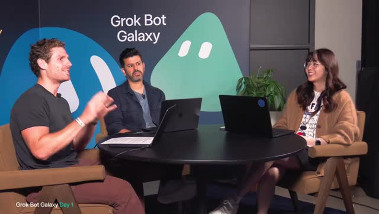

**この場面**: 円卓スタジオに3人。背景は Grok Bot Galaxy のロゴと緑のボット。左下に「Grok Bot Galaxy Day 1」。

ホスト側が言いたかったのは、「機能デモの配信」ではなく **72時間で会社そのものを作る実験** だということ。場所はサンフランシスコのスタジオ（Moscone Center 近く、Dreamforce 開催中）。道具は Grok Bot と xAI 系ツール。ミスも隠さない。

自己紹介の意図は役割分担の提示である。**Lauren** は Grok Bot 周り（聞き取りはやや不明瞭だが、AI / プロダクト寄り）。**Motion** はプロダクト。**Matt** は Developer Experience（当初は聞き取りゆれ、後で Matt Palmer と名乗る）。

**決まったこと**: 3日間この部屋からライブする。まだ何を作るかは決まっていない、と最初から言っている。

**残ったこと**: アイデアはこれから。会社の定義も後回し。

### 配信の組み立てと、101 を先に見る理由

3日間ほぼ同室なのでカオスになりうる、と前置きしたうえで、最初のセッションを **Grok Bot 101**（Roman と Amrita。音声では Rita / Emerita）に置いた。狙いは、初めてだと intimidate されがちな製品を、エンジニア／プロダクト／セールスの日常ワークフローで見せること。

Matt の自己開示は、「自分は個人オートメーションとエンジニアリングでは使ってきたが、チームやマーケットリサーチではまだ弱い。他人の使い方を見たい」という学習目標。複数人が「他人の使い方を見るたびに、その発想は思いつかなかった」と同意した。

**決まったこと**: 本日の最初の中身は 101。スタジオの会社づくりはその前後で進める。

### コンテスト：ボットの使い方を提出する

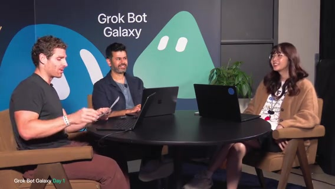

Matt が紙を持って「超重要」と言ったのは、製品説明ではなく **参加賞付きチャレンジの開始** である。名前は Grok Bot Galaxy live stream challenge。

主張している参加条件の骨子は次のとおり。`@grok` と `@bot` をフォローする。公式ポストを quote し、ボットの説明と共有テンプレートのリンクを添える。締切は **September 29**。詳細は公式投稿。

賞品の主張: 優勝は本人＋ゲストで **Starbase の Starship 打ち上げ観覧**（Austin / Starbase の言及あり、音声ゆれ）。準優勝は Bay Area から行ける **Hawthorne の SpaceX ロケット工場ツアー**。ジョークとして「彼女が一番喜びそうなのは打ち上げに連れて行くこと」も言った。x.com/grok の打ち上げ映像も見ろ、と促した。

**決まったこと**: チャレンジはライブ開始時点で始まっている。提出物は「ボットを仕事にどう入れたか」の共有。

### 趣旨：暇な仕事から時間を取り戻す

レイアウト説明のあと、ホスト側が事業のゴールを先に置いた。AI で「もっと終わらせる」ことより、**時間を取り戻す**ことの方が大きい、という主張。Excel 掘り、昨夜のメッセージ探し、手作業のコード、スライド／デザインなど、ずっとやってきた退屈な仕事から解放する。キーフレーズは **「AI frees you up to do the stuff you care about」**。

「company とは何か」は後で定義すると言った。ネット上ではスタートアップから数十億ビジネスまで意味がバラバラ、という冗談。誰かに「SpaceX を作れ」と言われたがロケットはもうある、とも笑った。つまり、この配信の会社はロケット企業のコピーではない。

### 3人が、自分の仕事の延長で何を見たいか

**Matt Palmer**（Developer Experience / Developer Relations。チームに Rob, Eric, Milo 等、聞き取り）が示した日常は、ユーザー教育、新技術の教え方、コンテンツ、軽いエンジニアリング、ドキュメント、ライブ配信、X でプロダクトを理解すること。お気に入りデモの主張は、「X のブックマークを Grok Bot が見て、気になった npm パッケージ等を拾い、Cursor cloud agent で試作し、プレビュー配備（Cloudflare 等、聞き取りやや不明）し、毎朝その結果をメッセージで受け取る」というループ。手順は Twitter 上のウォークスルーを見ろ、と案内した。

**Motion** が言いたかったのは、ここ数ヶ月〜1年で「誰もがビルダー」になった感覚と、今回が **既存プロダクトの延長ではなくゼロから事業／エンティティを作る** 点で珍しい、ということ。普段の仕事は顧客フィードバックの取り込み、Grok Bot marketplace のコネクタ拡充、次の frontier。今回はデータ探し、世間のアイデア、ユーザーリサーチ、インタビュー設定まで、プロダクト開発のプレイブック一式を回したい。designer bot / marketing bot の協調も楽しみ、と付けた。

**Lauren**（@potato）が示した自己像は、「クレイジーでランダム」な自動化をする人、かつエンジニアリングも多く持つ人。例: X で「potato」を4回言うと召喚されるジョークを、メンション過多のため Grok Bot で自動化した。普段は家の「goblin cave」でコーディングし、**パフォーマンスobsession** でアプリを速くする。Grok Bot のコードベースを、PM やデザイナーでも「デフォルトで良いコード」が出るように整えたい。今回の会社でも同じセットアップをしたい、というのが意図。

Matt の補足は、外から見ると Grok Bot のデバッグ文化が分かりやすい、という観察。Issue をチャンネルに置くと、どこかで cloud agent が動き出す。今日も同じ道具で始める: 友達3人、会話場所、ノート、好きなツール。**Cursor** でコード、**Grok Bot** で手作業の難しい部分。売るならまずアイデアが必要、と締めた。

### 「ビジネス」の仮定義は、欲しいものを作り、人間に触れ、いくらか稼ぐ

昨日、視聴者と xAI 社員に「何を作るべきか」を聞いて **数千件** 返ってきた。最初の一手として、それを Grok Bot に読ませてマーケットリサーチする、とホスト側は言った。Day 1 でアイデアを決めたい、という希望も出した（後のラップでは未達）。

各人の定義の意図:

- **Motion**: YC の「Build something people want」。自分たちも使うものだと共感しやすい。
- **Lauren**: Grok Bot を自分の改善に dog food するのが好き。ビジネスも同じループが欲しい。ついでに「少しはお金を稼ぐ」のもビジネスの一部、という冗談。
- **Matt**: 「銀行口座にドルが入るまで本物のビジネスじゃない」と書き出すノリ。dogfooding / testing / something people want を列挙。本質は **serve humans**。エージェントに頼むのも人間。Tシャツ通販でも Grok Bot 開発でも、最終的には人間の体験。

Lauren は、Grok Bot に Stripe / カード連携でクレジットを渡せるなら、人間もボットも買えるものを作るのは面白いかも、と広げた。デジタルか、コーヒー豆配送のような物理か、対面か、は未決。

Matt の個人ゴールは、**デジタルをリアルワールドに出す**こと（視聴者も触れられるもの）。ただし可能かは未知、と自分で留保した。Dreamforce で街に約5万人が追加され、通り封鎖で到着も難しかった、という現場感も共有した。カジュアルにハイもローも見せ、エンターテイニングであってほしい、というのが配信トーンの合意。

**この時点の結論**: ビジネスの仮定義は「人が欲しいもの／価値／人間の手触り／いくらかの売上」。何を売るかは未決。リサーチの入力は数千件の回答。

### 当面の道具は Slack と Notion。peestack は無料の現場スキル集

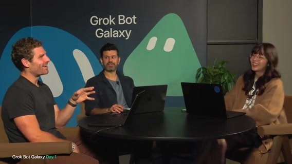

Motion が提案したチーム道具は、人間とボットが入れる **Slack**、ハンドブック用 **Notion**、チケットは Linear かどうか。Lauren の反論／修正は、「バグは Issue を開くより Slack に投げて自動修正した方が速い。バックログが溜まったら別途」という運用主張。Slack をコントロールプレーンにし、issues チャンネルへ factory を配線する、というのが Lauren のイメージ。

Matt が視聴者向けに説明を求めた **peestack**（音声: peace stack / peace packet）について、Lauren が主張した定義は次のとおり。百万ドルのプラグインではなく **無料オープンソース**。自分が厳しいエンジニアリングで使う skills / workflows を再利用可能にしたもの。長い反復の末、先月 **約 2,500 PR** を本番に入れた（バグはほぼ無い…はず、という冗談）。Grok Bot marketplace で検索して試してほしい。

Matt の計算: 2500 PR/月 ≈ 83 PR/日。3日なら 250 PR。メーターを付けよう、と盛り上がった。Lauren は PR を開かず **main にマージする** と宣言し、commit meter 案が出た。Matt は「2000 PR」は誇張ではなく肩越しに見たことがある、と保証した。要するに、Grok Bot アプリ自体が社内でこの種の道具により高速イテレーションされている、という主張。

**決まったこと（当面）**: スタック感は Slack + Notion（必要なら Linear）。支払い系は Stripe / Link との親密度に触れただけ。ホワイトボードとカプチーノと大量トークンが欲しい、という現場トーク。

### 空の GitHub org と、ボットを雇う計画

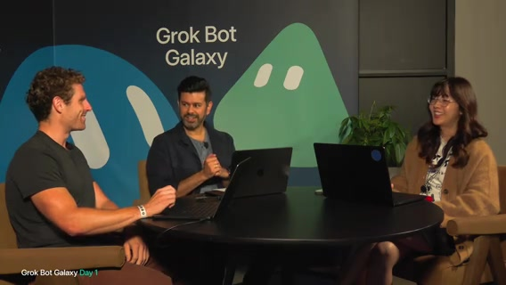

Motion の計画は、すべてを Grok Bot で駆動すること。**この3日専用の新しい Grok Bot チーム**は作成済み。各自がボットチームを持ち、画面共有で見せる。別事業／エンティティとして扱う。

Matt が用意したのは **完全に空の GitHub org**。名前は **「ship by Thursday」**。今は何もない。後でオープンソースやイースターエッグもありうる、という含み。ブランクスレートは、GitHub org + ボットゼロの新規 Grok Bot アカウント。peestack インストールから開発セットアップを見せ、マーケットリサーチ用ボットや marketplace テンプレートも使う。**founding engineer bot** / intern bot をまた雇う、というのがメタな計画。Lauren は、Matt の毎日プロトタイプ案のように、捨てプロトタイプをボットに作らせて可視化したい。

より具体的な案: 会社ドキュメント（原則・プロセス）を書き、**onboarding / bot factory** がその文書を読ませて社員ボットを生成する。**state of the company** をボットが更新する。共有ナレッジベース。休憩後の予定は、プロトタイピングとマーケットリサーチ、まず **45分で hiring plan**（ボット雇用計画）。画面共有はまだだが環境は接続済み。会社を始める前にやった唯一のこととして、**Grok Bot をダウンロードした**（冗談めかし）。

ハウスキーピングの再掲: 72時間で会社、まだほぼ何もしていない（この20分は雑談だった、と自虐）。Galaxy challenge 再案内。ビジネス定義の要約は people want / create value / **human touch**。ゲストは好きな会社の人、ネット上の人、xAI 社員。クラウドの知恵も借りる。時々ただタイピングして沈黙する時間もある（Primeagen 系配信へのオマージュ）。X とチャットのフィードバックをリアルタイムの舵に使う。同時視聴は約8万人（音声: 80,000）。未導入ならインストールを。無料トライアルあり。プラグイン・テンプレートも配る。連続ライブはおおよそ **8:30–6:00**（時刻表記ゆれ）。有料コースは不要、このストリームがコース。誰かの上司が「30時間全部見ろ」と命じた、という逸話。

**決まったこと**: 空の org 名は Ship by Thursday。ボット雇用から入る。101 へカット。

**残ったこと**: 何を作るか、社名の確定、Linear を使うか。

### Roman：チャットではなく、同僚として仕事を任せる

**Roman と Amrita** へパス。Grok Bot を実際に作っている人たち。カット／接続待ち（無音〜つなぎ、約30秒）。

Roman が主張した歴史は3段階。**(1) Chat** — 質問して答えが返る。**(2) Copilot** — 隣でタスクを委任する。**(3) Teammate / colleague** — 会社の同僚のように振る舞う（今が端境期）。その先は、タスクの A→B 委任ではなく、**outcomes と responsibilities を持つ**こと。会社の discrete な領域を信頼して任せる。Grok Bot はその発想から生まれた、とつなぐ。

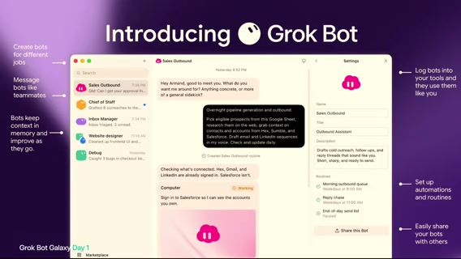

画面の UI は、左に Sales Outbound / Chief of Staff / Inbox Manager 等。「Create bots for different jobs」「Message bots like teammates」「Bots keep context in memory」「Log bots into your tools」「Set up automations and routines」「Easily share your bots」。

Roman が他ツールと違うと言った設計は3柱。

1. **Teammate paradigm** — タスクごとチャットではなく、仕事単位・役割ごとにボットを作り、何度も戻る。数週間前の「スライドはこのフォーマットが好き」を覚えて次のデッキに反映する、同僚に期待すること。
2. **Own computer** — MCP / API だけでは100%終わらないことが多い。ボットは自分のコンピュータを持ち、動画視聴・ポッドキャスト・古い政府ソフトのクリック等、人間が PC でできることを実行する。「ほぼできた」ではなく **終わった** 感覚。
3. **Cloud** — ローカル PC 依存だとスリープ／蓋閉め／電話からのキックオフが破綻する。クラウドの同僚ならどこからでも。

コーディングでは過去2年で開発者の仕事が激変した、という対比も置いた。手書き1行から、xAI 内では outcomes / direction を持ちエージェント群を steer する姿へ。ナレッジワークは 2024/2025 比でまだ大差ない。Grok Bot で会社内の実仕事にモデルを最大化したい、というのが製品意図。**delightfully simple** — 簡単に始め、徐々に複雑な能力へ引き込む。モデルは賢くなるので安全な実行環境を。always on。次はチームでの共有 AI 同僚。Amrita へパス。

### Amrita：Form → スライド → メールを、3体のボットで見せる

**Amrita** の位置づけは、今週はエンタープライズ向けセッションが多数（GTM / engineering / marketing / admins）あるなかで、今日はライブデモで Roman の3点（同僚・自前コンピュータ・メモリ学習）を見せること。登録は **x.ai/galaxy**（音声）でセッション確認を。会場に「使ったことある人？」と聞き、初めての人もいる想定。

今日の3ボットは **Data Dan** / **Slide Sonya** / **Email Ethan**。流れの主張: ユーザーデータ収集 → スライド／チャート → 外部ステークホルダーへメール。ネイティブ MCP/API が無いツールも、コンピュータ利用でアウトソースできる、と見せる。

Grok Bot の見た目はメッセージングツールに近い。Email Ethan / Slide Sonya は既に準備。今日はゼロから Data Dan を作る。ボット名から用途を推測してくれ、「What do you mainly want me for?」が出る。Google Form を選んだ理由は、Form 作りは嫌われがちだが、従業員／顧客／ユーザーリサーチの定番だから。Qualtrics 等でも同様に頼める。**Voice mode** で「1日何杯コーヒー飲むか」「SF のお気に入りコーヒーショップは？」と指示。選択肢例は Ritual、Sightglass、Blue Bottle（音声ゆれ）。Voice mode の双方向（ボットが話し返す）は社内デプロイ中で、一般公開は「来週頃」希望。今見せているのは speech-to-text。Google Form ではボット自身のコンピュータ（Linux VM）を使う。Google Slides / Forms / Docs 等にログイン可能。

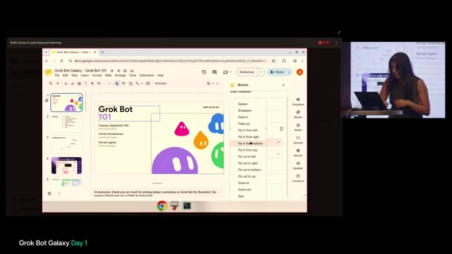

組み込み MCP / plugins を見せ、無いものはボットにセットアップ依頼も可、と説明。ボットが承認を求める例で「Allow」。後でルール（メール送信前に必ず許可、外部 Slack 前に承認等）を説明する予定。エンタープライズの制御に重要、というのが意図。

Slide Sonya は、既に編集対象スライドがコンピュータ上にある。**Teach a task** は、人間がボットのコンピュータを操作してアニメーション追加（Fly in 等）を実演し、録画が **skill** になる、という主張。画面は Google Slides「Grok Bot 101」、通知「Slide Sonya is watching and learning」、発表者 Amrita /（スライド表記）Rianna Ugarte 等。

計画のデモ筋: Data Dan の Form を **QR コード化**して会場にスキャンさせ、回答を Sonya → Email Ethan へ渡す。トップコーヒーショップのオーナーに分析メール、という筋。応用例として、1万人オンサイトの食事制限を集めるイベントプランナー、顧客調査のリサーチャーを挙げた。Settings のルール例: 「明示許可なしにメール返信するな」「スライド作成は自動許可」。各ボットのコンピュータは**隔離**。Data Dan の Form 作業が Slide Sonya のスライドに干渉しない。同じデッキを人とボットが同時編集しても衝突しにくい（スライド1–2をボット、10–11を自分、等）。Routines の例: 毎朝、スライド変更の要約と誰が変えたかを報告。複数ボット横断では、週1で変更サマリを上司へメール（Sonya + Ethan）。

Email Ethan は、Dan / Sonya のデータをまとめて外部へ送る役。既存メールを読ませてトーンをスキル化する。例は Jason D’Amour（画面表記）へコーヒー習慣データの下書き。Drive からノート取得、Gmail 再接続が必要な表示など。ルール追加: メール送信／応募系は必ず先に聞く → Auto-review でブロック可能。

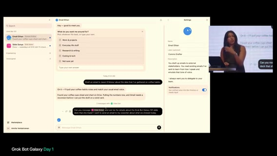

エージェント同士の会話デモ。description で「常にチームへ delegate」（Chief of Staff パターン）も可。Ethan に「**@Slide Sonya** にデッキの詳細を聞いて、同僚へメールしたい」と明示メンション。Ethan はコーヒー関連では自発的に Data Dan へ、スライド詳細は明示指示で Sonya へ。長期ペルソナ＋メモリ: Ethan を1年使い続ければ全メール文脈を学習し、Sonya は「スライド一般」の専門家としてスコープ変更可能、という主張。

Amrita の Grok Bot 観: **自分の会社＝エージェントチームを作り、プロジェクト分割か専門性分割かを自分でオーケストレーションする**。人間はマネージャー／監督に回り、細部に入らなくても仕事が終わる。Roman の言う「finished work」（スライド・下書き・Form）。速度はモデルと **computer use** の改善次第。今後数週間で Grok Bot / Cursor / xAI 周りで computer use がホットトピックになる、と予告。飛行機の悪い Wi-Fi でも、ボット側 VM のネットが速いので computer use をアウトソースする、というのが実用上の主張。外部サービス接続は常に許可確認。個人の auto review ルールでブロックし、「Allow once」で下書きへ。下書きを見せてから送れる。同じ話の途中で **1:00:00 区切り**。

**101 前半の結論**: 製品は「役割ごとの同僚＋自前コンピュータ＋クラウド常時」。デモは Form / スライド / メールの3体協調。危険な操作は承認で止める。一般公開の双方向 Voice は未了。

---

## 101 後半・スタジオ復帰・Marky／Pop-up OS

seg02 · ストリーム 1:00–2:00

- **範囲**: ストリーム時刻 1:00:00–2:00:00
- **画面**: 前半＝Amrita の 101 続き、中盤「Be right back」、後半＝スタジオ（Matt / Motion / Lauren + ゲスト Peter Yang）

### 複製・テンプレ・Marketplace で、チームの「同じ同僚」を配る

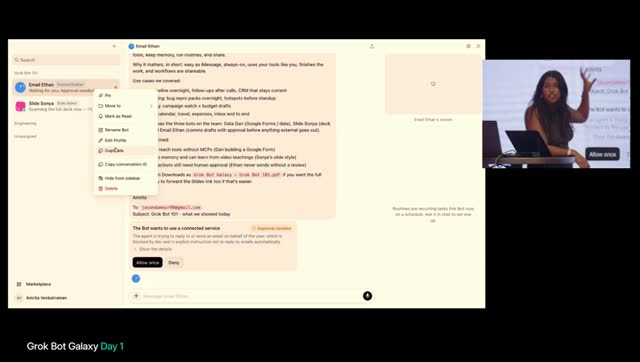

Amrita が続けて主張した運用は、Email エージェントを**複製**して5〜6体持ち、ステークホルダー別にトーンを変えること。幹部／CTO／CFO、一般ユーザー、社内チーム。**Share as template** は、ボットをテンプレとしてチームに共有する multiplayer 側面。各自がユースケース向けにカスタムできる。

Marketplace の featured / public ボット例として、Cursor 出身の **Lauren**、**Clare**（聞き取り: Clarevo）、**Lenny**、**Eric** を挙げた。自社向けにボットを publish して一貫性を保つ、というのが意図。例: デザインチームの **brand design bot** を1つ公開し、色・フォントを揃え、更新は最新版が伝播する。Email 下書きのモーダル UI で、宛先変更・削除・言い換えを Grok Bot 内で完結させる。Cursor ではアウトバウンドメールの多くを Grok Bot 経由、と述べた。

### QR が通らず、デバッグそのものを製品文化として見せる

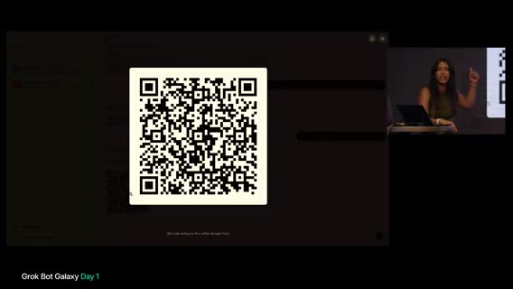

Data Dan のコピー Form が完成し、「QRコードにして」と依頼。残り約10分で回答→美しいスライドに入れて 101 デッキへ、という予告。**Sections** でボットを分類し、セッション用と日常用を分離する。グループチャットの主張: 1対1との違いは主に**可視性**。Email Ethan / Data Dan / Slide Sonya を同じグループに入れて「hello」デモ。ボットが拒否・質問してくるときは **teach / guide** のサイン。「姓名ではなくファーストネームだけ使え」→ memory に永続、という例。

QR を出したが「No access」でスキャン不可。Data Dan に「リンクを public にして」と依頼した。ここで Amrita が言いたかったのは失敗の隠蔽ではなく、**うまくいかない理由と、うまくデバッグできたときの検証フィードバックを与えるほど精度が上がる** というデバッグ文化。後続セッションで field engineer としての Grok Bot デバッグを話す予定、と予告。

グループ内では各エージェントがスイムレーンを保ちつつ互いの能力を理解する、と説明。指示例: Sonya がテストスプレッドシートからチャートを最終スライドへ → 完了後 Ethan が Jason へメール。Ethan はサンプルデータ把握済み、Sonya のスライド待ち、と依存関係を理解。エンジニアリングでも依存把握は merge conflict 回避に効く、とコメント。トラブル時は「望むアウトカム」から逆算して伝える。詳細不足だと失敗から学べない、というのが教え方の主張。

**Orchestrator / Chief of Staff / Manager** 案: Ethan・Sonya・Dan から進捗を集め、人間が監視しなくてもよい。Manager に「2時間おきにチームへ更新を求め、ブロッカーを確認」するルーチン。Data Dan が Form 共有で詰まったら Manager が検知し Sonya 等へ周知する、という層。

### 会場 Q&A：危険操作は分類器で止め、信頼は memory で育てる

会場の質問は、メール送信・支払い・外部へのデリゲートなど、危険なアクションをどう考えるか。Amrita の答え: **Auto-review** — 裏で分類器がリスク判定。ベースライン＋ユーザー定義ルール（例: デスクトップにフォルダを作るだけでも毎回聞け）。デモ中は Form 作成でも PHI/PII を確認するなど、過剰に慎重なこともある。フォロー「どう信頼して止めさせないか」への答えは、**memory** で「この文面は今後聞かなくてよい」と学習させられる、通常は毎回 Form 許可を求めない、という補足。

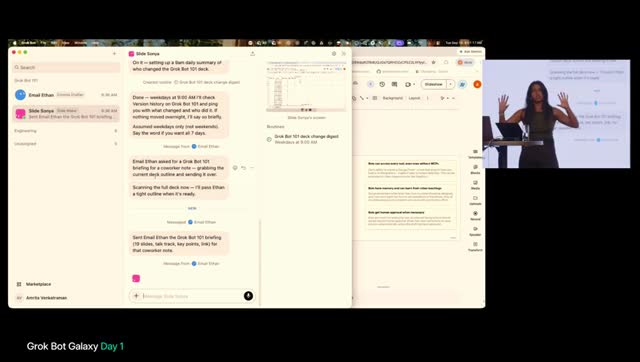

グループチャットに人間も入れられるか、への答え: 類似機能開発中。現状は **Slack で @bot** し、スレッドに複数人が追記できるイメージ。Grok Bot 内のマルチプレイ UI は近日。エンタープライズで VM から社内ツールへ、への答え: ボットのコンピュータはロックダウンも開放も可。例: MongoDB 資格情報、**社内 VPN**。**1Password** 連携を最近リリース。Teach / ビデオ学習はスクショか、への答え: 各エージェントが自分のコンピュータを持ち、スクショ・Form・スライド・PDF 等を作成。クラウドなのでノート PC を閉じても継続。Teach a task は動画を見て手順を学習し **skill** として保存。

1Password はボット VM 上でサインインするか、への答え: モーダルが上がり、API / 環境シークレットは Grok Bot 側で安全保管（外部に露出しない）。Memory の編集・忘却は、Memory が **S3** 上の長期永続であり、忘れてほしいことは指示で更新。削除済みボットへの委任などは手動で memory 更新が必要。ボット**複製**は同じペルソナでも **fresh context / fresh memory**（ゼロ記憶の新人）。

まとめスライドの最大の助言は「まず試せ」。「一日で一番面倒な仕事」を渡せ。Form・アウトバウンド・feature flag 掃除・サポートチケット等。まとめ3点（音声）: (1) ボットは **MCP 外のツール**にもコンピュータ経由で届く — アウトカムから逆算 (2) **Memory**（Teach→skill、長期ドメイン専門家） (3) **人間承認**（危険行為を防ぐ）。Amrita 終了。短い休憩（Be right back）。

**101 全体の結論**: 役割分割、テンプレ共有、承認、memory、computer use が製品の中心。人間をグループチャットに入れる UI と双方向 Voice は未了。QR 公開はデモ中に詰まった。

### スタジオ復帰：Peter Yang を入れ、社員＝ボットを雇い始める

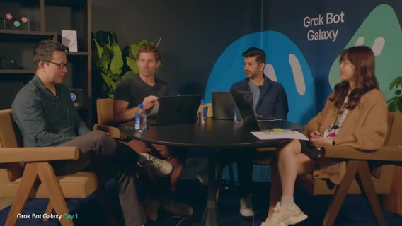

「And we're back」。Matt の位置づけ: さっきは 101。今日はセッション＋対面ビルドのミックス。予定として **Grok Bot for Engineering**（12:30 PST 帯、「無料で配ってる」ジョーク）、**Grok Bot for PMs**（2:30、Kevin）、**Grok Bot for Founders**（5:30 夕方）を案内。

**Peter Yang** の紹介意図: 元 PM 十数年 → 実質リタイアして YouTube / 実践的 AI インタビュー・チュートリアル。Grok Bot で**一人会社**を運営し、「一日中ボットと話す」。ニュースレターは音声ゆれ Behind the crap → 文脈上 **Behind the Craft**。読者は多いがボットではない、と冗談。これからの流れ: ゲストと雑談しつつプロダクト構築。まず「社員＝ボット」を雇う話へ。

### Marky McMarkface：最初の社員はマーケットリサーチ

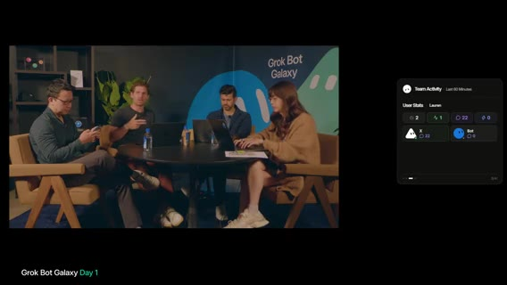

Motion が 101 中に進めた実作業: GitHub org **ship by Thursday**（まだリポなし）、**Slack**（人間＋ボット。xAI Slack での日常に近い）、**Notion**（ハンドブック／オンボーディング案）。Lauren の反対意見: ノートはあまり取らない。スクラッピーに速く動く方が良く、docs はすぐ陳腐化する。

ボット雇用へ。Motion の Grok Bot はほぼ空で、Marketplace から **X MCP** だけ接続済み。Peter とオフカメラで話したユーザーリサーチ／VOC から入る案。**Market research bot** を雇う、というのが第一手。AV 問題あり、画面共有復旧中とアナウンス。「Market Research Bot」という名前は Peter が却下し、面白い名前を付けろ、と。チャットに名前募集。昨日の数千メッセージをボットに読ませるのが第一歩、と再掲。チャット案 **Marky Mark / Marky Markface** を採用（後に画面表記 **Marky McMarkface (Product Research)**）。

会社名は現状 **Ship by Thursday**。Potato lab 案。ミーム向きの名前をボットに提案させる案も出た。画面共有復旧後、空白の Grok Bot＋ Marky＋X プラグイン認証済みを再掲。Lauren の **Dr. Eggbot**（音声ゆれ: Eichlott）登場予告。Marky に「最近の投稿への返信からビジネス案をまとめろ」と依頼（インフィニティミラー／自分の配信が自分の画面に映るジョーク）。

Peter に PM としてのリサーチの考え方を聞いた答えは、Amazon 風に **顧客は誰か / pain / value**。「視聴者みんなのために作る」。Matt 側が同時に見せたいのは、クールな技術デモと、Slack 作成・画面共有修正など**事務作業の自動化**の両方。難解すぎず「人を助ける本物のビジネス」に接地したい、というのがホストの意図。

### X の声：別の SaaS デモは不要。フィジカル／ローカル／非テック

Lauren の顧客像の主張: AI コーディングに詳しくない人（例: メールも怪しい母）でも理解できるビジネスが面白い。「母が見てたら分かる会社を」。Peter の自作アイデア投稿（Grok Bot 風フィジカル／グローアイ等のジョーク）を画面で紹介。「いくら払う？」と茶化し、中国工場ネタ・中でポテトを焼くネタ。エージェントがスレッド探索中。コツとして「3分ごとにステータス更新」を指示／割り込みで方向転換。nudging が効いた、と実況。

Marky が読み上げたテーマの骨子:

- **Not another SaaS demo** — フィジカル／ローカル／非テック顧客（塗装会社など）
- コンシューマで楽しいもの・**pets** 多め
- チャットのクリプト／ミームコインは却下
- **Neopets / Club Penguin** 的レトロ復活は好評
- 「会社を作る会社」として、エージェントで人のゴール達成を助けるメタ案

Motion はプラットフォーム／クリエイター支援が好き、とも言った。スモールビジネス・レストラン・非テック層。事前登録約 **7万人**＋現視聴者向けに「退屈な週次作業」を自動化する案も。具体ピッチ例: インディー作家のブックマーケティング、造園／樹木サービス marketplace、ポケモンカード marketplace、気候、ディナー配達、M&A advisory 等。チャットで Club Penguin 再熱。

**この時点の結論**: クリプトは作らない。SaaS デモの焼き直しは避ける。フィジカル／ローカル／非テックに寄せる声が強い。何を作るかはまだ未決。

### ゲーム談義は、オーケストレーション好き、という自己診断

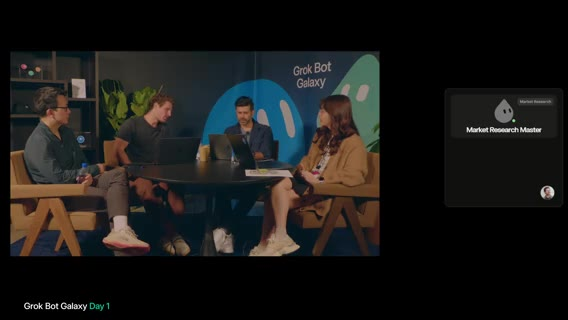

Peter が子供の頃好きなゲームを聞いたのは雑談だが、各自の答えは後の役割観につながる。Lauren は **FF14** の小さな種族キャラがポテトっぽく、ハンドル **potato**（通常拼字は取れず E 付き）の由来。Motion は **Age of Empires** 等ストラテジーで、オーケストレーション好き。AoE / Factorio / Starcraft 好きはエージェント使いが上手い、という話。Matt は PS2 / GameCube / Wii、Smash、Battlefront、Tony Hawk 等コンソール寄り。Peter は Starcraft 派 — ボット操作はゲーム感覚、という同意。

Motion の仕事観の変化: 昔の長い PRD／Notion ブリーフから、今はボットをプロンプトして書く・作る側に回し、自分はオーケストレータ — **仕事がゲーム化**。Lauren はプロダクト仕様をほとんど読まない／書かない文化。エージェント時代の挑戦として、xAI Slack ステータス常時 **「why not today」** — 入力欄に呪文のように打てばボットが作る。Issue より PR、詳細 PRD より**触れるプロトタイプ**で議論、というのが Lauren の主張。

### レストラン案から、Pop-up OS へ寄せる

Motion が方向性をボットに渡し、案として **Neighborhood restaurant ops assistant** が出た。コードが安い今こそ **user stories** をシャープに、というのが意図。ボットが自発提案した day-one デモ例: 朝の予約・メニュー状況ブリーフ、オーナーのレビュー管理、家事／週次の痛み、コントラクター手配、ボランティア調整など。

Lauren の留保: ローカル／Bay Area のフィジカルとテックの橋渡しが欲しいが、配信ブースから実店舗支援は難しい。ハート（いいね）リアクションをメッセージに付けるとボットが「Matt がそれを気に入った」とフォローに取り込むデモ。Matt も別途 market research bot を作成。ライブではタイピングが大変なので **Voice** で「レストラン案を深掘り、対面要素とブースからの橋渡し（ポップアップ等）」と口述。セグメント: これから店を始めたい人（まずポップアップで検証） vs 既存店の効率運営。

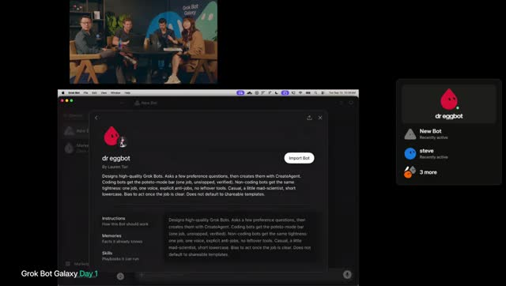

Matt も X コネクタをその場で追加（プラグインほぼ未接続からのライブセットアップ）。案は **Pop-up OS for restaurants** — 期間限定コンセプトを回す OS をライブ構築し、実シェフが顧客。苦戦中の SF 店支援、体験型ディナーシアター、チケット制 supper club。チケット／予約／参加者テーブル確保が面白そう。ボット提案の「ベストコンボ」: Pop-up OS＋実際の SF レストラン1店舗。

解釈としてホスト側が言ったのは、バックエンド（イベント管理・支払い・サインアップ）を作り、場所・シェフ・店と組んでポップアップ開催すること。プロダクト出荷＋オーナー支援＋試食体験。Lauren（エンジニア視点）は、イベント管理・決済・予約は技術的に面白い（時間枠・座席・人数・電話／オンライン予約）。

「プロトタイピング開始」。**peestack** 導入、ランディング（Dreamforce 近辺の SF お気に入り店ポップアップ等）。分業案: 地元店への GTM／**prospecting bot**、Notion にブレインダンプ、peestack プロト、Peter が方向づけ。必要作業の骨子: 料理できる人を見つける＋食べたい人を見つける＋ポップアップ物流。ボットが実人にリーチする。Motion は **prototyping bot** を新規作成し、「Cursor でランディングページプロト」へ。Lauren: **Dr. Eggbot** を入れる？ — peestack ベースで高品質ボットを作るための自作ボット、と説明。画面に Dr. Eggbot / Steve bot 等が見え始め、**2:00:00 区切り**。

**この時間の結論**: 当面の寄せはレストラン pop-up / Pop-up OS。自分たちも運営し、ソフトも作る。社名もメニューも未決。Dr. Eggbot でボットを量産する方向。

---

## Pop-up 構築・Peter／Cody・デプロイ

seg03 · ストリーム 2:00–3:00

- **範囲**: ストリーム時刻 2:00:00–3:00:00
- **画面**: スタジオ4人（Matt / Motion / Lauren + Peter Yang → 後半 Cody）＋ Grok Bot 画面共有

### 分業：prospecting と building。プラットフォーム案に寄せる

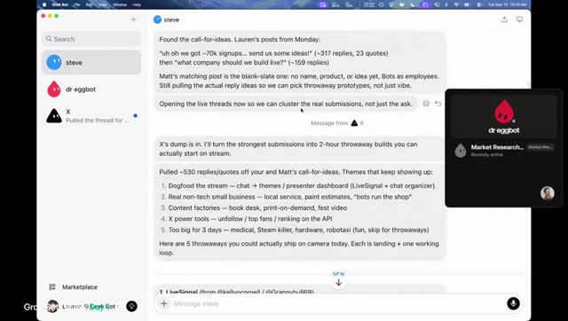

Lauren 側: Steve が call-for-ideas を整理。他案もあるが、**レストラン／Pop-up でプロト開始したい**。Motion が大量ワークフローを回すなら別、とも。Motion は対面ビジネス案でフィルタ。ポテト／チップス／フライ系レストランのリサーチも冗談交じり。

合意した分業は **prospecting（見込み開拓）** と **building（構築）**。Divide and conquer。デザイナー bot を入れ、プロトをレビューさせる案。チャット視聴者のボットを雇う案も。Lauren のサイドバーは X プラグイン bot、**Steve**（メイン／デフォルト）、**Dr. Eggbot**（剛導入）。Steve の対面会社案: paint shop、local service、**piano tuning**、AI＋建設／trades、billboard／屋外サイン。3日では難しいもの: hardware、recycling、festival 系、robotaxi 等。

**決まったこと**: **pop-up idea（プラットフォーム）** に寄せる。GitHub・Notion は空。Lauren がビジョンのシェルをプロト。

### 口頭で方針を流し、まず LP。Steve を CoS にする

Lauren は **dictation** で方針を Steve に流し込んだ。「pop-up platform startup」を口頭で定義。Dr. Eggbot と小さなエンジニアリングチームで、loose／scrappy な検証プロト。最初は DB 不要 → **Google Sheet** でも可。まず **landing page**＋サインアップ。Motion は並行で Dr. Eggbot を導入し、「**prospecting bot** が必要」と口述 — 店と来客の両方を探す。ソースは X／視聴者の知人シェフ、提出用サイト、電話・メール等。

Steve はテンプレではなく**デフォルト bot**。Dr. Eggbot の強みは、既存ボットを横断して**改変**できること。Lauren は Dr. Eggbot に「Steve を **chief of staff / executive assistant** に」依頼。普段は Steve 経由で話す想定。同時に「プロトタイプ bot を作れ」として、loose な **vanilla HTML/CSS**、楽しいフード系の名前。Motion は公開 GitHub リポ作成（画面文脈 **popup**）。ライブ後に PR 整理。Dr. Eggbot は must-have、と複数人。

チャット「Dr. Eggbot は自分でインストール可？」への答え: **Marketplace** で追加可能。「名前が気に入らない」→ **話すだけで全部変えられる**（chat-first／malleable）。

### 社名案 Potato Lab、プロト名 Grokpot。Prioritizer で頭を整理する

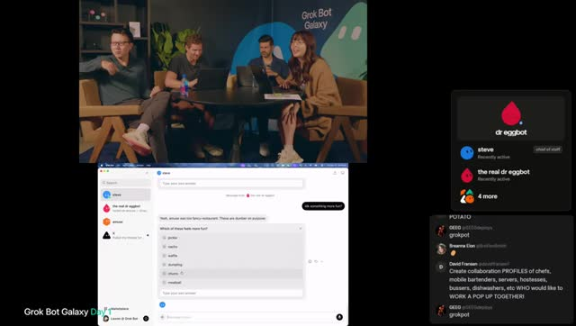

Motion のチャネル設計: シェフ／スペース連絡手段、スペース調査、メール。会社メール未整備なので、**社名→ドメイン→メール**の順。社名案 **Potato Lab**（フード文脈）。SF のレストラン pop-up、「pop-up as a service」。空きドメインも Grok Bot で調べる案。

Lauren はプロト bot 名をチャット投票（Pickle / waffle / dumpling / meatball 等）。**Potato** 票多数。**Grokpot** が好評 → 採用方向。どんな restaurantier が pop-up 向きかはオープンで、Grokpot／ボットに聞く。Motion は Dr. Eggbot で **Prioritizer（優先順位 bot）** 作成中。配信・来客・思考が多すぎるので、AI に「頭の中を整理・減速」させる使い方。ボット提案例: ideal restaurantier brief、出荷スパイク、リードマップ、outreach、ゲスト獲得パス。Lauren は Grokpot 起動に不具合気味だが自力で続行。プロト前に良質な LP デザイン参照を集め、ほぼ mood board を組む。

### 自社でも pop-up をやる。LP は一面にしない

Motion はデザイン bot 準備済み。LP は「特定店」か「レストラン登録」か、が分岐。Lauren の主張: プラットフォームを作るが、**自社でも pop-up を運営して dogfood** したい。Motion: 野心的だが「好きな会社は野心的」。ピボットもありうる。

Lauren が Steve へ長い stream-of-consciousness で伝えたのは、pop-up プラットフォーム＋自社 dogfood → **LP は複数面**（プラットフォーム／オペレーター向け、自社イベント向け、来客向け）。料理内容は未定。まずは場所・作り手・来客の接続。全部のソフトを先に作らず、メール収集など**手動から**でもよい。プロンプト技: マイクで数分しゃべったあと「自分の言葉で言い直せ」と確認させる。

Steve の要約（Lauren が採用した整理）: 都市でフード pop-up を立ち上げるソフトウェア＋ops。自社でも同じスタックで運営。メガ1ページではなく複数の公開面。Steve の助言: ボトルネックは LP 乱造ではなく **first loop** — 場所・オペレーター／作り手、来客はその後。

Motion は、そのループ用ソフトが会社になる、と受けた。テーブル予約前提 vs カウンター／並びの低リフト案。Lauren: シェフ＋倉庫＋体験型イベント寄りも検討中だが、フライ売りカウンターの方が予約不要で楽、とも。早期プロトをデプロイしてネット上に出す瞬間が欲しい。**3方向**のデザイン案（暗いプロダクト風／コーポレート寄り／もう1つ）。Grok Bot 内で HTML/CSS をそのまま描画 — 外部デプロイ不要。

**この時点の結論**: 製品は「pop-up を回すソフト」かつ「自分たちも1回やる」。LP は複数面。料理は未定。first loop は場所と作り手。

### Peter の助言：楽しいことを増やせ。早く市場に当て、最初の1ドルまで見ろ

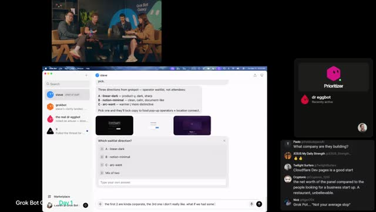

Motion がソロプレナーへの良い助言を聞いた。Peter の主張は3点にまとまる。

1. **自分が楽しいことを増やす設計**にせよ。儲けるが嫌いな仕事ばかりだと起業の意味が薄れる。
2. アイデア選びは、PM 時代の長い社内議論・文書より、**できるだけ早く市場／顧客に当てる**。口では良いと言っても実際に**払うか**で見る。アイデアは安い、チームが重要。
3. 今は誰でも作れるが、**純粋ソフトウェアだけでは稼ぎにくい** — 物理／サービス要素がないと「LP＋DB になぜ金を払う？」になる。**最初の1ドル**まで検証。

ハードな仕事（レストラン探し・調理等）には金が払われる、という合意。次のゲスト前にロックインしたい、とホスト。Peter への parting: 製品が「人格のある人／チームと話している感じ」で好き。Tips: ボットを**プロアクティブ**に — LP 指標追跡、レストラン prospecting、**週次 cron／スケジュール**で更新を送らせる。番号付きリストで返信しやすい形式。毎週金曜に全ボットがチェックイン。自動化したい作業を任せ、こちらから聞きに行かずボットが押してくる形へ。

Feature request: なぜ Slack？ **人間が Grok Bot 内のチャネルでボットと協働**したい。一人でボットと話すのは寂しい — Lauren や他者とコラボしたい。ホスト: 近日／需要あり、今日は各自が別ボットチームで調理。Peter 退席。「フライを買う」ジョーク。感謝。

**Peter が残した未決**: Grok Bot 内マルチプレイは未出荷。何を売るかの lock-in は次ゲスト前にやりたい、と言ったが、この時点では未了。

### 役職を決め、社名は仮の Ship by Thursday。Tater がエンジニア

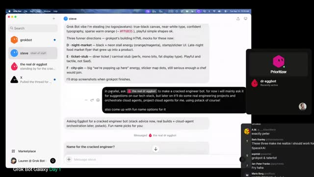

Lauren は Steve にプロトが bland／boring とフィードバックし、Grokpot に新プロト依頼。並行で Dr. Eggbot に **correct engineer bot**（本格エンジニア）作成 → プロト用 Grokpot と分離。チャットでエンジニア bot 名 — **Tater(s)** 採用（potato オーバーライド）。

Motion の技術整理: **Grok＝モデル**、その上の **harness（実行コード）**。Grok Bot は軽量（coding harness 例: Grok Build 等とは別）。本格コードは **Cursor**（特に **Cursor cloud agents**）へ寄せ、低→高 fidelity へ進化する、と予告。Lauren→Steve→Tater: **Vercel + PlanetScale** を意識（両社からゲスト予定のネタバレ）。Endless tech debate は避け PMF 優先。

Motion は Notion に合意内容を文書化（Lauren は Notion 嫌いだが自分は計画に有用）。暫定社名 **Ship by Thursday**（より良い名が出るまで）。役職: Lauren＝**CTO**、Motion＝**CPO**（Chief Product／ジョークで Chief Potato ではない）、Lauren＝**Chief Potato Officer**、Matt＝**CEO**（grown-up）。やることは、SF でフード pop-up をやり、その経験で **pop-up 運営 OS**（メタ製品）を作る。楽しさ＝人を集めること。文脈を短く一貫させ、ゲストにもボットにも同じ説明を渡す。紙のネームプレート遊び。チャットが Grok Bot アプリのアップデート可用に気づく — 配信中は怖いので休憩で、と。

**決まったこと（暫定）**: 役職と仮社名。製品は「自分たちが pop-up をやり、その OS を売る」。エンジニア bot 名は Tater。スタックの寄せは Vercel + PlanetScale。PR より main。社名・製品名の本決めは未了。

### ピンク LP を即決し、Vercel に載せる。ドメインは後

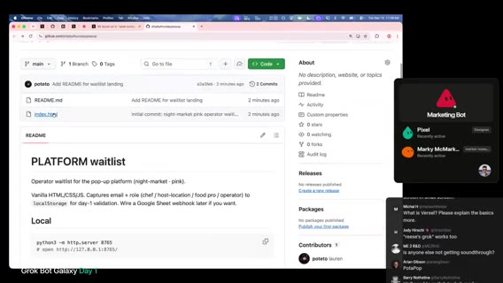

Lauren はプロト色を**ピンク**寄り／night market 方向で即決。細部より速さ。後で Cursor cloud＋デザイナー bot。既にリポ作成 → Slack に **popup.git**（聞き取り）共有。Slack 表示名を **Lauren, Chief Potato Officer** に。ドメイン即買いは保留 — まず Vercel テスト、名前確定後にドメイン。マーケ／ブランディング bot 雇用案。リポにコードが入ればボットが **PR** を出せる、と Motion。

ドメイン案（音声）: cleanstall.com、stall.run、nightmarket.app、popup.plates、openstall.co、peanut popup、popetto.com、host the popup.com 等 — しっくり来ない。Notion 会社 doc を共有しボットに文脈投入。Motion の入力原則: AI への入力は**簡潔で良い情報だけ**。悪い文脈は悪い出力。Cursor bot を Slack に。Lauren を **Vercel org の owner** に追加。`index.html`（インライン CSS）がリポに — 開始時より前進。Vercel をリポ接続し Deploy。Motion は **Ops bot** と **Creative Director** bot 作成中。Vercel 招待メール確認のため画面共有を一時カット → 共有トラブル／「technical difficulty」。〜2:39 頃復帰。

デプロイ稼働。main に push で deploy。現状はただの HTML — サインアップ保存先が必要。Google Sheet vs **Notion DB**（Notion MCP あり）。Lauren は Steve に「LP はデプロイ済み → **Notion にサインアップ用 DB** を繋げ」と依頼。計画修正: **PlanetScale**（Postgres）希望。Payments は後回し。PlanetScale チーム shout-out／数日中にゲストの可能性。口頭リキャップ: Matt＝ops／会社プレイブック；早期 HTML LP；方向＝pop-up 事業／プラットフォーム＋自社運営；DB 統合作業中。ドメイン未決。**shipbythursday.com** が空いてるか確認。次ゲストは来られず — ビルド時間が増える。

### Cursor はコード、Grok Bot はオーケストレーション。PR 禁止

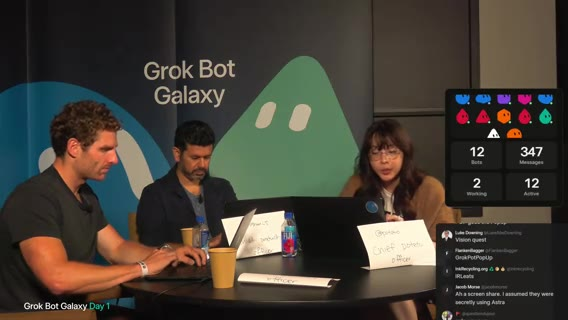

Lauren の役割分担の主張: Grok Bot＝オーケストレーションに強い。**Cursor の harness**＝コーディングに強い。Grok Bot から **cloud agents** を spawn — クラウド VM でアプリ起動・クリック・CPU トレース等。Tater に cloud agents／プロジェクト用エージェントを使わせ、長期の技術文脈を保持。PlanetScale 資格待ちの間はローカル or cloud agent マシンで開発し、動画／スクショで報告 → デプロイは後。

Motion は **ship by thursday** ドメイン取得済み。会社 lander 用に配線。製品は別ドメイン。Ship by Thursday＝「会社の会社」。製品の仮タイトルはこれから。Dr. Eggbot で Cursor team kit／skills／**peestack** 等を入れ cloud agents 接続。Steve が PR を開いた → 新ルール: **当面 PR 禁止、main に直接 ship**（誰かに怒られるまで）。巨大 diff は読まない方針。Lauren は Tater に加え **reviewer bot** も Steve 経由で検討。その後 **技術的都合でフル画面カット／BRB**。

**決まったこと**: 会社ドメイン ship by thursday 取得。製品ドメインは別。当面 main 直 push。PR 運用は後で変わりうる（実際、後半では PR レビュー bot を組む）。

### Cody：決める前に3人に売れ。Distribution に執着せよ

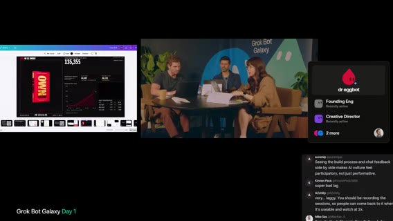

復帰。会社 lander 着手、Cursor 上で他エージェントも見える、と。ゲスト **Cody** 参加。ビジネス売買マーケットプレイス＋アドバイザリー。オンライン約 **1500万**フォロワー規模の話（音声どおり）。チームで Grok Bot 利用中。画面共有: 今週発売の**本のローンチダッシュボード**（〜13.5万ユーザー表示）— Grok 等ミックスで構築、**Vercel** 上。リアルタイム参加者、paid vs organic、チャネル、平均注文単価等。別画面 **Pulse**: 事業の見方／ピッチ／低利益レバレッジに基づく計画、など AI でライブ構築したツール群。

ホスト「最大の課題は？」へのチーム側の自己認識: アイデアはあるが**検証**したい。方向: レストラン pop-up（店とゲスト接続・場所）→ そのプロセスをソフトウェア化し販売。Ops 優先、legal／リース等は後。

Cody の主張:

- 事業を決める前に**3人に売れ**。
- レストラン pop-up は VC 前提にしない（VC はごく少数）。
- **Distribution に執着**。配信の数万人は不公平な優位だが、それがなくても考える。
- Controversy は時に有効 — 自身の「controversial tweets」例（Austin 移住を勧める AI 生成動画等）を見せ始める。

セグメント区切り（Cody の distribution／論争ネタ解説の途中）。

**Cody が残した宿題**: 検証（実際に売る）が先。ソフトの完成度ではない。後のスタジオ議論で「ドメイン専門家ではないので運営の手触りを先に」と参照される。

---

## Amrita Q&A・Jenny・いったんのラップ

seg04 · ストリーム 3:00–約3:37

- **範囲**: ストリーム時刻 3:00:00–約3:37:46。実尺約2276秒。この時間帯で一度締めの言葉があり、4:00:00 までの切れ目がある。配信自体は後続セグメントで続く。
- **画面**: 前半＝ステージ Q&A（Amrita）、〜3:11 BRB／AV切替、後半＝スタジオ＋リモートゲスト **Jenny**

### Q&A で Amrita が主張した運用ルール

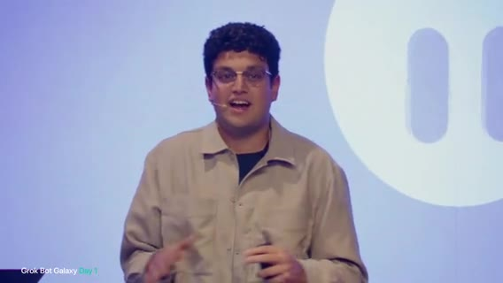

質問「このツール認証がうまくいかない／たくさん聞かれる」への答え: セットアップ次第。**Grok Bot に自分で調べさせ**、ツールを過度に指定しないのが有効。Amrita が最終的に **Granola** に着地した理由はファンだからではなく、**オンデバイスの文字起こしを Grok Bot が取りやすく**、必要な洞察が得られたから。他ボットを最適化するボットが、将来「これはファーストパーティ統合になった」と気づいて乗り換えうる。自前ボックスで接続が詰まるのは本当にストレス、と共感。目標（聞き取り: gap／goal）は Marketplace のプラグイン増で需要をカバーすること。

レガシーは API 無し／API が UI より高い、への答え: (1) **ヘッドレスブラウザ**で DOM をクリック指示し、スクショ→判断ループを減らす。(2) **computer use** 向けにモデルを速く・上手くする作業中。API より速くなる約束は層が増えるほど難しいが、可能な限り近づけるのが方向性。

複数ボット最適化・干渉・トークン、への答え: **グループチャット**は複雑なタスクで協力できるが、**みんな喋りたがる**／被り／プロアクティブすぎて**コストが膨らむ**。今はグループより、ボットが他ボットに**一度だけタグして別会話で進める**方がよいケースが多い。モデル選定は継続改善。出荷時のモデル制御は **Cursor** や Grok build の **cloud agents** で自分で指定できる。あまり知られていない技: ボットに「**forget**」と伝えられる。コンテキスト掃除とトークン効率。

Marketplace の評価、への答え: 内部 Marketplace（音声: **x.ai slash bot slash marketplace**）は現状**人手監査**。価値あるものを選別し、同意があれば最適化して掲載。最も簡単な確認は自分で試すこと。初期セットアップで「何をするか／どうやるか」だけ聞き、フル実行前に自己選別。人間レビューに加え、**ボットがボットをレビュー**する仕組みも。

人と人・アカウント横断でボット同士が会話できるか、への答え: **未対応**。フォームファクタ検討中。ローカルとボットのコンピュータを同時に使うには Settings で **local execution** をオン。それでも多くをボットのコンピュータに寄せる理由: (1) 作業中にウィンドウが前面に出てきて並列しづらい (2) 自分のマシン資源を食う。全ボットは同じメモリか、への答え: **メモリは共有しない**。ただし**同じファイルシステム**を共有。1 VM 上にボットごとのインスタンス。必要なら互いのファイルを読む。コンテキストウィンドウは同一ではない。

Cursor cloud agents との関係、への答え: **ファーストクラス統合**。Grok Bot が関連コンテキストだけ渡して cloud agent を起動 → 独立作業 → 結果帰還。使い分け: 複雑タスク・出荷・モデル完全制御・深く触りたいとき → Cursor cloud agent。オーケストレーションは Grok Bot。Q&A 終了時に Starbase チャレンジを再案内。画面は **「Grok Bot Galaxy / Be right back」**。

**Q&A の結論**: ツールは指定しすぎない。グループチャットは高い。メモリは分離。アカウント横断会話は未対応。危険操作は承認。forget で掃除できる。

### Jenny：22体で7事業。会場は条件を厚くしてから探せ

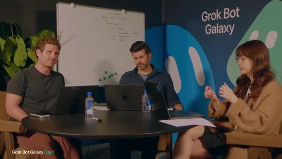

音声トラブルのあと、スタジオ側が Jenny を紹介した意図: 女性向け AI コミュニティをリードし、VC／テック／コミュニティ、メディア事業を横断で構築しているアクティブユーザーから、今の pop-up 案への助言をもらうこと。特別ゲスト（赤ちゃん）も登場 — 「first Grok baby」ジョーク。

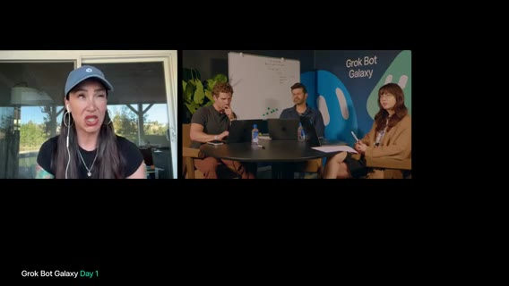

Jenny が主張した自己状況: VC フルタイムクリエイター／メディアに加え育児中。Grok Bot のおかげで会社づくりを続けられる。最近ブランディング／メディア代理店を構築。**Grok Bot 従業員が22体**。不動産〜VC ファンド〜メディア〜代理店など**7事業**。Chief of Staff モデルは当初嫌いだったが結局採用。夫命名の **Master Chief** が CoS。横断で統括（賃貸のテナント／ゲスト管理、代理店、インバウンドブランド提携等）。個別タスク例: **Boxy**＝受信箱監視、**Scribe**＝Whisper Flow 等の会議ノートを取りサブエージェントへ委任、**CFO**＝簿記・財務・レシート整理。CoS がグループ会話でプロジェクトを立ち上げる。

Matt が共有した現状: 終日リッフ／ピボット。現案は**対面 pop-up**＋ローカルビジネス接続、遠隔参加の仮想案も探索。ソフトウェア化する方向。イベント事業の知見・注意点が欲しい。Jenny は、直前ゲスト（音声では **Eric**。前時間の Cody 誤認の可能性あり、と元ノート注記）のグッズ在庫の話を見ていた、と。実行状況を確認し、チームは **かなり遅れ** と答えた。候補リストはあるがアウトリーチ未実施。会場候補はあるがロジ未整理。

Jenny の専門性の提示: VC ファンドに加え世界有数級のピッチ競技を運営しており、**会場選定に精通**。SF フォーカスでよいか確認 → Yes。ボットで会場要件をまとめたか、へのチーム答え: 緩く「約100人、倉庫系、ギャラリー的なオープン空間」。もう少し多い可能性。詳細不足、と Jenny。

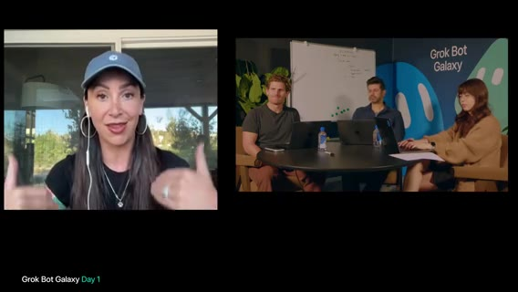

Jenny がイベント制作の視点で要求した具体化:

- **時期**は？ → 来月前後、パーミット次第。カリフォルニア／SF は**パーミットが大量**（十数種もありうる）。
- アルコールは？ → 単純化のため**無し**。
- 食事は？ → あり。ホットサーブ。→ 会場検索ボットの条件に入れる。
- 夕方開催か（9–5のみの会場もある）、厨房要否、オンサイト調理 vs ケータリング持ち込み。ケータリングなら会場の**推奨ベンダー制約**が多い。

チームの優先: まず**空間の楽しさ**を優先し、制約に合わせる。細部は Grok Bot にリサーチさせてもよい。条件を具体化するほど空き状況まで速く到達。SF は会場争奪＋法規制がキツい。**会場スカウティング専用ボット**が次ステップ。Event planner ボットはまだない。pop-up はまず**1回**から。

会場への実接触は電話かメールか。Jenny: **メール統合**推奨。例: Poshmark／Depop／Mercari 等で服を転売し**入札交渉**するボットを運用中 — 交渉フレームワークを設定済み。会場へ RFP／空き確認だけでなく、予算パラメータで**交渉往復**も可能。その前提として、まず**イベント予算を立てる**必要。ベースライン（会場・食事相場）の市場調査を。SF は高め。Event planner ボットに**初版プロダクション予算**を作らせる: F&B、マーケ、スタッフ。受付・セキュリティは人間が必要、と。プロンプト例: 「あなたは SF のシニアイベントプランナー。次の条件のイベント予算を…」。

Lauren／チームがライブ口述: シニアイベントプランナー／SF／**100〜200人**の pop-up イベント予算（後で変更可）。Jenny: 「pop-up」だけでなく **event** と明示（屋外想定の誤解回避）。項目: venue、F&B。マーケ予算は当面**ロジ特化**で後回し。マイクで観客に話す必要（ローンチ説明）→ **基本 AV（マイク＋スピーカー）**は入れる。フルステージは不要かも。目標は**1会場にベンダーをできるだけ集約**（さもなくばベンダー用スカウトボットが増える）。

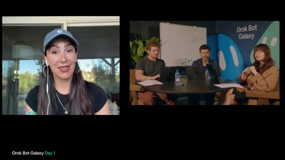

Jenny が「初めて言うかも」として追加した必須ボット:

1. **permit / red tape Grok Bot** — SF でイベント実行に法的に必要なものを調査。都市ごとに違うので、実行地のポリシーを見るボットは有用。社内ポリシー／雇用ポリシーの source of truth にも。
2. 契約の一次読み。弁護士友人の言い方 — AI は**2年次ロースクール学生**レベル。文言は読めるが業界の「going rate／実務ニュアンス」は弱い → **一次パス**に留め、経験者のオーバービューが必要。

Jenny の代理店をリーンにできた理由の主張: **人間がやる手順を先に設計し、それを逆算して AI 化**。チームの方向は良い、と。

Day1 締めに向け、ホストが今夜回す **long-running agents** を決めたい、と聞いた。予算エージェントはメールやり取りで進捗しうる。Jenny の答え: (1) **Scout** — 検索・特定・**朝にレビューできるアウトバウンド下書き**まで（朝は Send だけ）。(2) 集客 — Meta／Instagram にエージェントをログインさせ、**同市のフォロワー上位50**等で招待リスト→下書き。配信の大きなオーディエンスもソースになりうる、とホスト。Jenny に感謝。サイドバーのスクショ共有は画面共有失敗 — どこかで投稿予定、と。この pop-up は「やるしかない／merge しろ」勢い。残り約48時間でロジを、と別れ。

### この時点の自己評価：セットアップは進んだが、焦点がない

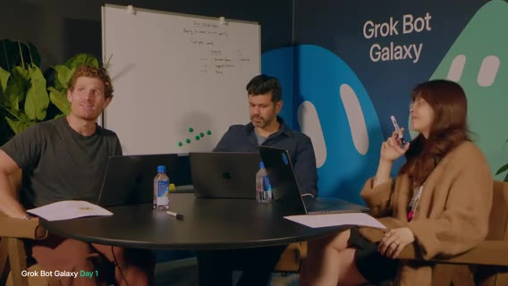

残り約10分（〜5:30 締め予定、と口頭）。アイデア出し・方向転換・ホワイトボードはあったが道のりは長い。学び: アイデア生成は難しい。クラウドの知恵（ゲスト視点）は有用。夜通しエージェントを回しつつ、**1〜2個にロックイン**したい。セットアップは進んだ: スライド、接続、Notion、lander／ダッシュボード的な開始から反復。ただし **ロックインが必要** — 今夜から。Jenny 対話後の実感: **SF で実 pop-up はかなり難しい**。「正しい課題か」再考の余地。明日リフレッシュしてロックイン／何をビルドするか決める。

忙しい一日。続く2日は Dreamforce 併設の **Grok Bot Galaxy**。締め前にチャレンジ再案内（テンプレ作成・提出。音声: at rock 等）。**映像ロスト**の言及ありつつ提出先案内。Thanks／See you tomorrow。以降ほぼ無音。元ノートはこの付近でストリーム終了と書いたが、後続セグメントで復帰する。

**このラップの結論**: 未 lock-in。SF 実 pop-up の難度を再認識。宿題は1〜2焦点。事実としての進捗はセットアップまで。

---

## 復帰・potato factory・AI Maturity

seg04b · ストリーム 3:37–4:00

- **範囲**: ストリーム時刻 3:37:00–4:00:00。実尺約796秒
- **画面**: BRB → スタジオ速報ラップ → Lauren の potato factory → ステージ「Grok Bot for Engineering」

### BRB のあと、フォーカスはビルドだと言い直す

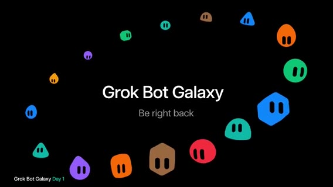

画面は **「Grok Bot Galaxy / Be right back」**。Whisper は断続的な "You" のみ。実質 AV／スタジオ復帰待ち。

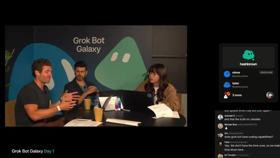

「We're ready to start」→ スタジオ復帰。ホストの短い recap: ここまでハッキング中。次セッションまで約5分 — **Grok Bot for engineering**。朝の振り返り: マーケットリサーチ、X 上のレストラン案、アイデア整合。ゲスト **Peter** と **Cody** から go-to-market の学び。以降のフォーカスは**ビルド**。エンジニアリングセッション後は Lauren が potato 周りで構築する様子を見せる予定。

この時点でホストが口にした合意アイデア: **SF のレストラン pop-up／体験**。レストランと来場者をつなぎ、体験づくりを通じてソフトウェアも生む。3日間の理想アウトプット: (1) 体験創出の **operating system／プロダクト** (2) **体験そのもの**。野心的だが挑戦、と。予約体験を従来型より楽しく、などクレイジー案は Day2 に回す、と。

**言い直した結論**: まだレストラン pop-up に寄せている。ビルド優先。crazy 案は明日。

### Lauren：hashbrown が Tater の PR を見る。生き延びる程度の factory

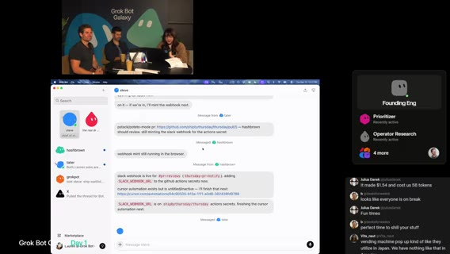

Lauren の進捗主張: まだ構築中だが **potato factory** セットアップ中。オフストリーム中に新 bot **hashbrown**（音声: hashground）を作成。役割は **Tater** が開く **PR のレビュー**。自分だけでなく Matt ら（音声: Russian and Matt — 名前は聞き取りゆれ）にも同様のセットアップを検討中。リポジトリに **Piece Stack**（音声: piece stack。前文脈の peestack）を追加中。**Cursor plugins** はローカルだけでなく **repo plugin** としても入れられ、bot／agent が容易に設定可能、と。

並行して bot に **Cursor automation** を設定中。例: PR を開いたら **Slack チャンネルに投稿** → automation が拾ってレビュー、場合によってはマージまで（方針は未確定）。理想フロー: bot が PR を Slack に投下 → reviewer bot がレビュー → 良ければマージ。貢献しやすいコードベースにしたい。

Lauren が避けたいのは過調理。スタートアップなので「翌日まで生き延びる」程度の**基本で拡張可能な**仕組み。ホスト「SpaceX で使っていた factory に似ている？」→ Lauren: 似ているが今回は一から。元セットアップの再考・改善のチャンス。lander のビジュアルデザインも担当検討。普段のフロー: Piece Stack、**Grok Bot** で IDE／設計 → **Cursor cloud agents** で実装。約1分後に切替 — **Grok Bot for Engineering**。切って戻ったら構築継続、と。

**決まったこと（Lauren 側）**: hashbrown＝PR レビュー。Slack #pr-reviews 方向。マージ自動化は未確定。過調理しない。

### Lynxie：成熟度曲線の先が、プロンプトすら書く必要のない同僚

ステージ: 「Good afternoon and welcome to **Grok Bot Galaxy**」。本日のワークショップは **Grok Bot for engineers**。発表者（音声: Lynxie）は xAI のソフトウェアエンジニア。Cursor に参画し現在 xAI — 約9ヶ月で2プロダクト出荷、と。以前 **Cursor 3 agent window**（音声ゆれ）を構築、現在 **Grok Bot** を構築中。直近2ヶ月はエンジニアリング作業をほぼ Grok Bot のみで実施。Grok Bot で **Grok Bot mobile** 初版を一人で約3週間。学習速度向上・first principles での試行。このスーパーパワーを共有するのが本日の趣旨。

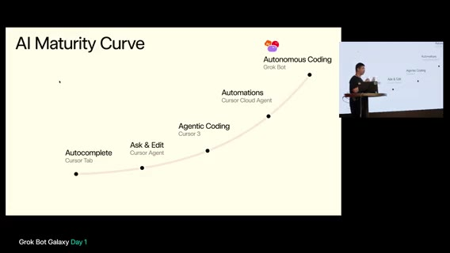

Lynxie が主張した曲線:

1. 2024年初頭以前 — シンタックス系 autocomplete
2. **Tab completion**（Cursor Tab）
3. **Ask & Edit** — コードベース把握が速くなり反復作業も可能。大規模タスク一括はまだ弱い
4. **Agentic coding**（Cursor 2／Cursor 3）— コンピュータ操作で E2E テスト、より長い horizon。slash goal／slash loop 等で最後まで走らせやすく、nudging が減った。それでもプロンプト作成・起動は人間側が必要
5. **Automations**＝**Cursor cloud agents** — Slack 受信などのトリガーで起動。24/7。クラウドで多数マシン並列。Cursor チーム内でもほぼ **10x** 以上
6. その先 — 自分は **15 Cursor cloud agents** を管理し、コンテキストスイッチが大変だった。フォローアップ起動・キュー・割り込みを代行する別エージェントが欲しかった → **Grok Bot**

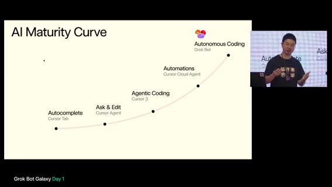

モデルは既に必要なシグナルを取れる、と考え部品を組み合わせ → **自律エージェントのチーム＝同僚級**。タグして直接協働でき、共に成長する。紹介の冒頭: フル自律 AI エージェントのチーム。(1) **24/7**・完全自律。PC スリープや手元ノート PC 不要でも動く。(2) エンジニア最大のアンロックは、**コーディングエージェントを管理**できる。Cursor に限らずほぼ任意の coding agents を管理できる、と（クリップは「And the best thing is it has.」で 4:00:00 付近に到達し分断）。

**Lynxie の主張**: Grok Bot はコーディングそのものより、多数の coding agent をオーケストレーションする層。

---

## Engineering デモ・スタジオ構築

seg05 · ストリーム 4:00–5:00

- **範囲**: ストリーム時刻 4:00:00–5:00:00
- **画面**: ステージ「Grok Bot for Engineering」続き → スタジオ復帰（Matt／Lauren の potato／Thursday 構築）

### 4柱：Cloud Agents 統合、MCP、Memory & Routines、常時稼働 PC

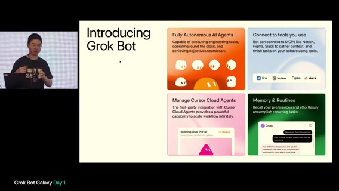

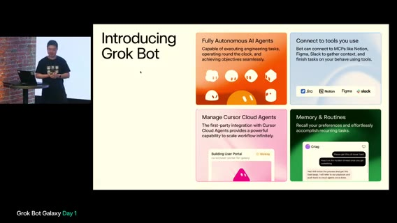

前時間からの続きで Lynxie が強調した最大の強み: **Cursor cloud agents とのファーストパーティ統合**。トランスクリプト読取・cloud agent 起動・プライベートワーカー（自分の Mac など）起動までツール経由。Cursor ウィンドウでできることは Grok Bot がツールで代行。完了後に「証明」（スクショ、前後パフォーマンス比較など）が足りなければ **フォローアップ返信**を自動作成し、自分が PC 前にいなくても継続。

第二柱: **日常ツール接続**。例: Vercel へデプロイするなら **Vercel MCP**。**24/7** でビルド失敗シグナルを見て修復開始、指定時刻（例: 翌朝6時）デプロイも可能。**Memories & Routines** が大きなアンロック。長期に選好を保持。**名前付き Grok Bot**ごと別メモリ → 無関係メモリで溢れない。一度伝えた改善方針を次回の cloud agent／レビューに自動適用。なぜ必要か: OpenClaw／Hermes 等（音声）はエンジニアリングまで弱い — **Grok Bot／Cursor 一次統合が無い**ため、と。画面の4ボックス: Fully Autonomous／Connect to tools (MCP: Jira Notion Figma Slack)／Manage Cursor Cloud Agents／Memory & Routines。

差別化の言い方: (1) **カフェインでノート PC を起こし続けなくてよい**。送信後はノートを閉じてよい。(2) **全プラットフォーム** — 最近 iPad／Android 出荷、既存 iOS／Windows／Linux／macOS。例: Golden Gate Park の芝生で横になりつつ bot が作業（音声ゆれ）。(3) **必要時にコンピュータを操作できる**。他製品はログイン／クリックが要る局面で人間依存。Grok Bot はモバイル／デスクトップからリモート PC を直接クリック（パスワードを渡したくないログイン等）。(4) Cursor cloud agent 一次統合の再確認。

### 不在時に終わらせる。境界を書け。夜に掃除し、CI が赤なら直す

「Away でも進める」ユースケース: 睡眠中／フライト中に唯一のコードオーナーが必要なとき、bot が Slack を監視し基準に沿ってアンブロック／レビュー／ACK。監督が要る件はスマホで確認 → Grok Bot に approve → 相手へ通知。メンション以外の一般 Slack も監視し、レビュー基準（スクショ必須、本物のテスト等）を適用する方向。プロダクト境界: bot は親切で何でも受け入れがち → **何をすべき／すべきでない＋理由**を明示。メモリが将来判断に適用され、毎回「シンプルに」等を繰り返さなくてよい。認証で詰まったとき、人間が短時間でアンブロックできる体験が重要、と。

お気に入り: **nightly code cleanup**。エージェント出荷の「slop」掃除を夜間（コンフリクト少・低リスク）に。実セットアップ例: **毎朝3時**にリサーチ cloud agent が monorepo 横断で品質・モジュール化・コメント・セキュリティ監査。起床時に PR セットが揃う。内部ツール: TestFlight 招待 — Slack で bot をメンション＋メール → webhook／routine で追加。**Auto-fix everything** は、CI 赤で毎回 on-call を叩かず、bot が調査→cloud agent 修復→マージ判断指示。**約10分未解決なら on-call**。多くの場合 Grok Bot が10分以内、と。

ボット編成: **Engineer bot を3体**にする理由は、同じモデルでも**コンテキストと艦隊管理**が違うから。パイプライン／コンテキスト上限が別 → 分離してメモリを専門化。個人 bot に全部話しかけなくてよい。**Chief of Staff** が誰が何をしているか把握してルーティング。CoS は詳細エンジニアリング手順を全部覚えなくてよい。

### ライブデモ：新メンバーを人間が教えず、既存ボットにオンボードさせる

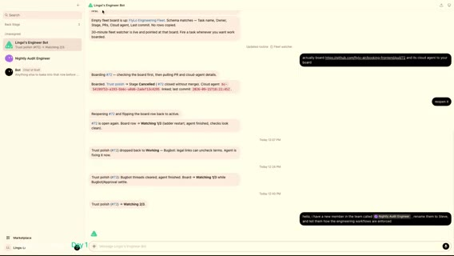

ライブデモ開始（本人も初回セットアップ気味）。Marketplace から **Linga's Engineer Bot**（音声ゆれ）を取得、リポ／Notion 接続済み。**Nightly Audit Engineer** も Marketplace から。人間が手順を再説明せず、**既存 Engineer bot に新メンバー（Nightly）をオンボードさせる**のが見せたい点。Craig（音声ゆれ: correct）が **Steve** にクリーン定義・ステージ梯子・パイプライン要件をメッセージ。Steve がメモリに吸収。ボット間確認のみで人間は「confirmed」報告を受ける。通常は午前4時の nightly を、デモのため今すぐ Steve に開始指示。画面: Linga's Engineer Bot チャット、FlyLo Engineering Fleet、PR #72 Trust polish、Nightly Audit→Steve リネーム指示など。

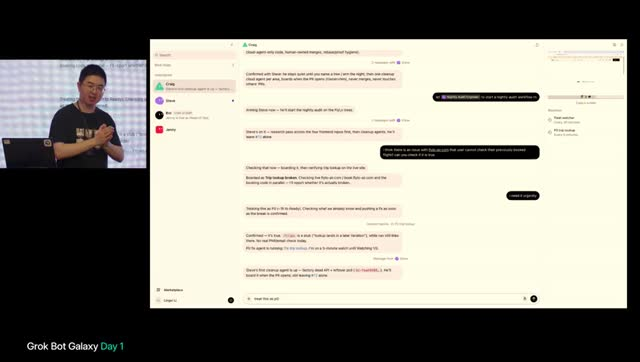

緊急: **FlyLo／flyair** 系で過去予約確認できない問題報告 → bot に急ぎ対応させるデモ。「urgently」を毎回言いたくない → 自律の要点は繰り返し禁止。CoS に **Jenny**（Head of Operations）をオンボードし、**engineering playbook** を Notion 等で管理・更新させる。「urgently」の意味を定義し直す必要 — 長時間 horizon で迷走する coding agent 対策。**P0 定義**: Grok Bot が cloud agent を**5分ごと**監視し、長スリープやゴール逸脱なら割り込み・新プロンプト。人間はプロンプトを書かず **P0 の定義だけ**書く。画面: Routines（Fleet watcher 30秒、Trip lookup 5分）、P0-101、Craig／Steve／Jenny サイドバー。

Jenny が全 engineer bot にアナウンス。ボット同士の会話が主で、人間は EM／メンター視点。PR に **proof**（UI ならスクショ、perf ならメトリクス）必須を playbook へ。Craig は事実上の head of eng。クラウド agent 本体より**結果と証明**を見る運用。Steve が cleanup PR を用意 — チャット中も既存タスク継続（人間のマルチタスクに近い）。約20 cloud agent 管理時は、全状態をコンテキストに載せず **DB／ボードを都度参照**して次タスクを取る、という例。デモ続き／まとめは Whisper ゆれが大きい。ステージ側のエンジニアリング・ワークショップが終わり、AV 切替でスタジオへ戻る。

**Engineering セッションの結論**: Grok Bot は「コードを書く単体」ではなく、多数の Cursor cloud agents を同僚として編成する層。P0 やレビュー基準は毎回催促せず定義として置く。証明付き PR が品質の見方。OpenClaw／Hermes 等との差は Cursor 一次統合、というのが発表者の比較（他製品の詳細検証はノートにない）。

### スタジオ：Thursday リポ、PR→Slack、検証 skill、メール収集

ホストの自己位置: レストラン事業構築中、自分は CEO 役。リポは主に **ship by Thursday／Thursday**（会社用）。ドメインあり、Grok Bot からアクセス可。作成中 bot: **Prioritizer**、**Operator Research**（Cody 対話を受け、類似 pop-up 事業者リサーチ — Flower and Water 等の良い店も）。bot 作成は Marketplace の **Dr. Eggbot**（Lauren 作・bot factory）。

AV を Lauren 画面へ。Lauren の主張: Slack に **#pr-reviews**。自分／bot が PR リンク投稿 → 剛セットの **Cursor automation**（現状は簡易プロンプト）がレビュー。**Piece Stack**（音声: pieceknack）で correctness／risk／missing tests 等を見る想定、これから反復。検証（verification）が bot 活用の鍵。アプリ実行・トレース・ヒープ等を bot 自身が回せるようにしないと「あなたがクリックして結果教えて」往復で遅い。Steve に Piece Stack の **create verification skill** を依頼 → **Tater** に委任。並行でホスト側: lander デザイン磨き（make design／interfaces feel better 系 skill、ミニマル優先）。Lauren のプロトタイプをプロ寄せし、ウェイトリスト系と接続予定。画面共有の AV トラブルありつつ再開。

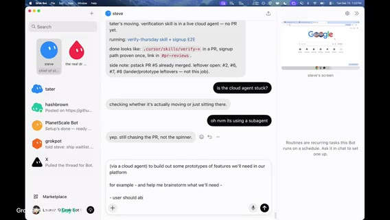

Verification skill の二要素（経験則）: (1) 再現可能な **CLI／標準ツール**（毎回その場スクリプトはトークン浪費・ボットごとバラバラ）(2) **feature map**（機能名・到達方法・ショートカット等 — 今は機能が少ないが将来用）。ホスト: ウェイトリストはメール収集が当面必要。**Loops** も好きだがまず **Resend** が簡単、Thursday リポに Resend プラグインあり、とエージェント指示。ドメイン接続済み。提出フォームは試作で throwaway — 視聴者に「まだ本提出しないで」と。PlanetScale で裏を見る話。DB／収集項目は未整理と自己ツッコミ。UI を大幅にミニマル化。主目的: pop-up 参加希望の**ゲスト email**、右上にレストラン／提供者向け導線。予約・ゲスト情報を主に収集。イベント／体験の他フィールドや次タスクの雑談・実装指示が続く（Whisper 末尾は断片多め）。クリップは約 4:59:45 でほぼ時間切れ。

**この時間のスタジオ結論**: 会社ドメインと lander はある。メール収集が当面の製品。検証 skill と PR→Slack を工場として組んでいる。DB 項目と「本提出」は未整備。視聴者にはまだサインアップするな、と明示。

---

## 会場探し・アート展ピボット・PM トーク開始

seg06 · ストリーム 5:00–6:00

- **範囲**: ストリーム時刻 5:00:00–6:00:00
- **画面**: スタジオ（Matt / Motion / Lauren）＋画面共有。後半〜5:54 からステージ **Grok Bot for PMs**（Kevin／Ruth）

### スコープが大きすぎる。先に自分たちで運営し、必要になった道具だけ作る

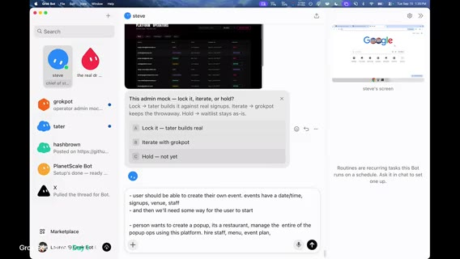

画面は Grok Bot チャット（steve）に admin mock ポーリング「lock it / iterate / hold」と popup ops 要件メモ（イベント作成・会場・スタッフ・メニュー等）。音声の懸念: 招待・参加者管理・チケット有無まで含むとスコープが大きい。各項目が単独プロダクト級。**コアフローの最小**に絞りたい — イベント名／日時（開始・終了）程度でよいのでは、と。ポップアップ種別・タイムスロット（30分／1時間／自由入場）も論点だが、まずは単純化。

自分たちもポップアップを運営する予定なので、**先に運営し、必要になったツールを後から組む**方がよいのでは、と合意方向。会場探し／メニュー／レストラン探し／集客 — 何から？ 現状はサイトのメール収集がブロッカー気味。ランディングはメール収集済みだが、**開催日時の宣伝がない**。

次の一手の主張: SF で予約／ホスト可能なレストラン調査。X アカウントで「SF／Bay Area のレストラン／シェフ向け」募集ツイートも案。market research というより **outreach bot**。**Dr. Eggbot** にいくつか立ち上げさせる。エンジニア（Lauren）が全部ビルドしなくてよい。重要なのは「何を最初に作るか」。自前の会場／運営探索に接地させる。**エージェント skill も手動を先にやってから自動化**する、と同型。Cody の指摘どおりドメイン専門家ではないので、運営の手触りを先に。

いきなり大量ビルドは効果が不明。コールドコール案。Matt の「Grok を音声エージェントに繋いで電話」デモを想起 — 番号リストを用意し、人間が引き継ぐ形でもよい。メール配線（DNS／ドメイン shipbythursday）を今すぐ。Google Workspace か転送か — 当面は個人メールでも可、ただし差出人はマトモに。物流の端到端: (1) 食事を作れる主体 (2) 場所 — この2つと日付と人。**まず日付**があると電話で「この日にやる」と言える。保守的に **10月15日** を仮置き。Notion に事業メモとして記録。Bay Area のレストラン／ケータリング候補リストを Notion／Drive に。場所リサーチは並列で bot に。

**決まったこと（仮）**: 日付は 10月15日。先に運営、後からツール。outreach をリサーチより優先。メール配線を今やる。

### venue-finder を作りつつ、認証は Vercel 保護で十分

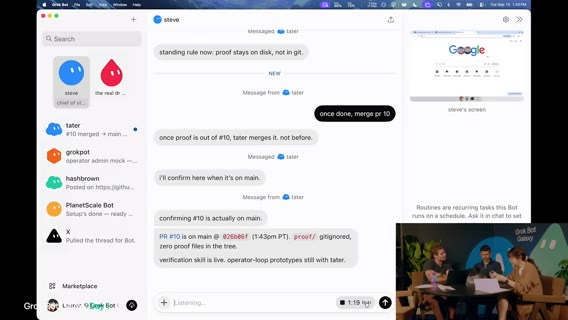

Lauren は Dr. Eggbot まわりでリポジトリアクセスのフレーク。再認証／GitHub CLI のスペル確認など。Steve 向け文脈: スタートアップ案は **ドッグフード** — 実際にポップアップを立ち上げ、楽になったところだけツール化。第一歩は場所。**Tater** に cloud agent を spawn させ、**レストラン／会場探しプロトタイプ**群を作るよう指示。地図＋検索＋すぐ電話、LinkedIn 等で責任者特定、見た目は後回し。プロンプトが非常に長い。いつものように「実行前に言い直し」を要求。電話プロト: **Bland MCP** をビジネス電話で使った経験あり（Whisper: potatoes＝Tater 関連のゆれ）。並行で Dropbox からキッチン／ケータリング候補約15件のショートリスト。

Google Maps API キー要否。UI に場所情報を出す用途。**OpenStreetMap** は無料代替として有望、キー取得も楽、と。places directory／評価レイヤは後で。Lauren は速攻ハック。Matt／Motion 側は手動で候補電話。admin dashboard のロック（認証）は必要、と。Motion は、ソフト先行ではなくプロダクト側 — bot に20社のメール／電話を集めさせ手動リーチ。ケータリングは1ヶ月先なら現実的、会場は難しめ。メール設定でサイト signup 連携。WorkOS／Google サインイン／自前 OAuth は過剰では、と議論。

Clerk（または WorkOS）。Hobby 枠で十分なら Clerk で開始。結局プロト段階では **Vercel deployment protection** で十分、と収束（dogfood 地図ツール向け）。Motion は、SF でチラシを貼れそうな通り角トップ50を調べる bot＋デザイン bot でフライヤー。ゲリラマーケ。Lauren はランディング磨き・API キー作成など環境セットアップ中。API キー手動作成はまだ残る作業。verification PR も並列でレビュー開始。次セッション接近で会場の人が増え始める、と。

Notion 投稿でボットに事業コンテキストを渡している話。**Knowledge Base Manager** bot を作成 — 他会話を監視するが、呼ばれない限り動かない／まず確認してから Notion を選択更新（スパム防止）。デザインシステムは未確立。超ミニマル。途中参加者向けラップ: SF フード pop-up 案、朝からアイデア出し、bot 群がデザイン／LP／アーキで稼働。早く検証したい。ゲリラマーケ＋ビジネス候補リスト＋lander 公開が当面目標。Lauren＝主にエンジニアリング、他はアドホック立ち上げ。

コード品質の議論: デザインの SoT はリポ寄り。lint ルールは早すぎるかも。スタートアップでは予測オーバーエンジニアが無駄になりやすい。ピボットもありうる。明日以降 PR レビューでエージェントのミスを見る。**コードベースはメモリの一種** — アーキ／制約でエージェントがデフォルトで賢くなる、と（X 上でもよく話すテーマ、と口頭）。「全部 Rust？」冗談 → コンパイルが遅くスピード阻害。TS はエージェント向き。Go も候補だが当面 TS。

**決まったこと**: プロトの認証は Vercel deployment protection。言語は TypeScript。Knowledge Base Manager は確認してから Notion 更新。Maps は OSM も候補。Clerk / WorkOS 本採用は見送り。

### フライヤーは「何を売るか」。検証は動画を必須に

フライヤー見出しポーリング案: One night Oct 15 / SF Pop-Up Oct 15 / Dinner finds you / 自分で書く。機能より「何を売るか」。ライブで AI と作っている体験は売りだが、顧客はそれを聞きたくないかも。**「最近いつ初めてのことをした？」** 系の感情フック案。Slack に通り角マップ初版。限定 merch ドロップ案 — プラットフォームに組み込みうる。pop-up の魅力は時間制約と希少性。Grok Bot／Grokpot merch、ソーシャルゲーム、現地体験を事前に匂わせる案。Slack に marketing チャンネル作成。TypeScript で進めると再確認。

フライヤー動画: Cloud agents が動画を作れ、PR description に載せられるのが強い。verification skill が動画必須をまだ強制していない → **常にビジュアル／動画を含める**よう skill 更新。ドメイン検証／Resend 等でメール送信準備。ミニマル LP がまもなく live。GitHub CLI device code 周りでつまずきつつも vanilla HTML/JS プロトで前進。次トーク〜2:30。接続作業のあと、カメラ外で手動電話して予約の難易度を体感 → 自動化要件の材料に。venue-finder プロトは後で試せる。ゲリラマーケ計画・フライヤー。チラシ貼り要員を雇う／知り合いに頼む案。体験・限定アイテムの企画も Notion マーケ節に蓄積。

会場選びの観点: ゲストにどう感じてもらうか。まず **約100人**。収容＋環境をコントロールできる空間。人間知識から: **The Pearl**、Dogpatch 近辺の **Dogpatch Studios** 等。類似会場をパターンマッチ。bot 推薦も参照して skill／コンテキスト化。予算は未確定（電話するまで）。Host Finder が Notion にリサーチ投入。**パーミット**: 道路閉鎖・酒類が重い。数週間〜1ヶ月。10/15 はタイト → **6週間後ろ倒し**も検討。Four Mason 例: 初回レビュー数営業日＋工事、公園サービス管轄の可能性。口頭ブレインストームが消える問題 → Notion 会社ナレッジへ。Knowledge Base Manager に **5分ごと**アクティブ bot から要点抽出→Notion（スパム注意）。Host Finder へ: Pearl／Dogpatch Studios 類似を優先。政府／NPS 施設は許可が重いので回避。酒類ライセンスは会場／ケータ側に寄せる。

**残ったこと**: 予算未確定。10/15 はタイトで後ろ倒し検討。パーミットが重い。何を売るか（体験／merch／食）は次のピボット対象。

### 第三の柱「良い食事」から、アート展へ寄せる

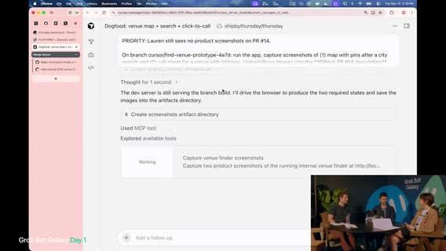

体験ゲーム／merch に続く第三の柱として、Matt が **良い食事** を出した。限定メニュー／カクテルをレストランと共同で。**menu bot** を spin up。その直後、レストラン前提を再考。ケータは複雑。**アート展**ならクラウドソース／チケット増／bot が作品レビューも、と浮上。ピボット合意寄り: **art exhibition**。地元アーティスト展示＋コミュニティ投稿。レストラン支払いモデルとの違い（ギャラ支払い vs スペース提供）。**Grok Bot アバター／シェイプ**を題材にした作品。Web でデジタルギャラリー→現地で実物、の導線。食・酒ライセンスのハードルを下げられる、と。Matt は、次が自分が登壇する **Grok Bot for PMs** のため退席準備。

アート展なら倉庫／ミックスユースの大空間が向く。Steve に方針変更を伝達。venue-finder は継続しフィードバックへ。PR が積み上がる。**PR #16** verification skill。**PR #14** は動画待ち。**PR #13** 等、プロト依頼で PR が大量オープン。Knowledge Base／Slack マーケ: SF Top 50 Flyer Corner 等。方針は **art pop-up**、会場は大型倉庫最適化。ツールが人間リサーチと同じ候補を出すかが検証。検索は Maps API 再利用＋サイズ等フィルタは独自データが必要 → 電話後のデータ入力で venue-finder が学習。docs 更新が本業化。エンジニア／verifier bot が PR レビュー中だが **動画・スクショ不足** → Steve に完成を促す。メール: waitlist サインアップから hello@shipbythursday… 系の確認メール送信が技術的に可能に。コピー更新後マージ予定。

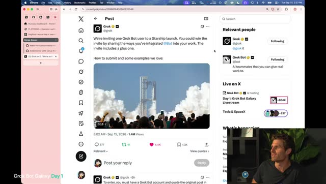

残り数分。**Grok Bot Galaxy チャレンジ**の shout-out。テンプレ提出、勝者＋パートナーを **Starbase Texas** の Starship 打ち上げ見学へ、と案内。次は隣にいた登壇者がそのまま **Grok Bot for product managers**。Lauren と残りはビルド継続。PR エージェントのステータス確認。ステージ挨拶開始へ遷移。

**このピボットの結論**: フード pop-up から **art exhibition / art pop-up** へ寄せた（合意寄り、ロックインではない）。理由はケータ／許可の複雑さ。会場は大型倉庫。日付・予算・アウトリーチは未了。Matt は PM セッションへ。

### Kevin／Ruth：エージェントを同僚として扱え

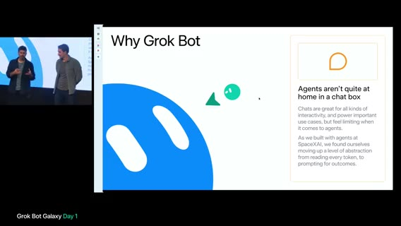

Kevin（Whisper: Kevin DeParko）xAI product は、「Grok Bot for product managers」歓迎。Ruth（Whisper: Root Shin Zazani）も同チーム。自組織で Grok Bot を使いながらビルドした tips／bots を共有する回。PM／ソフトの作り方が急速に変化。DHH（Ruby on Rails）引用の趣旨: ソフトウェア＝プロダクトマネジメントの問い（誰に何をどう優先か）。エンジニア／デザイナ／創業者／PM すべてが向き合う。Grok Bot 自体の動機: 社内でチャットボックスを超えてエージェントに成果を出させたい流れ（コーディング以外も含む）。

スライド **「Agents as colleagues」**: 同僚のように扱う — Linear／Jira、Notion、Figma、Slack 等。同僚定義から4点: (1) **複数ツールをまたいで成果** (2) **長期コンテキスト／仕事で学ぶ** (3) **独立性（自分のコンピュータ／サービスアクセス）** — これが Grok Bot にコンピュータを持たせる動機 (4) **メッセージング**（ターン待ちなし、と次時間へ続く）。

---

## PM デモ・BRB・merch／IRL 議論

seg07 · ストリーム 6:00–7:00

- **範囲**: ストリーム時刻 6:00:00–7:00:00
- **画面**: 前半＝ステージ **Grok Bot for PMs**。中盤〜6:33 Q&A後 BRB（約6:33–6:43 ほぼ無音）。後半＝スタジオで pop-up／merch ピボット

### 同僚にテキストすると、質問ではなく成果物が返る

スライド **Agents as colleagues** の続き。チャットボックス制約を舌足らずに言った、と補足 — 同僚との Slack のように割り込み・並列・高速メッセージが欲しい。4原則は「優秀な同僚」をエンコード: 組織コンテキスト、仕事で学ぶ、独立判断、待ち続けない。Grok Bot＝**コンピュータを持つエージェント**で、同僚にテキストしている感覚。テイクアウェイ: (A) 本物の仕事を任せ **テキストや質問ではなく成果物**を返す (B) ジョブを完了する（承認待ちで止まらない方向）。

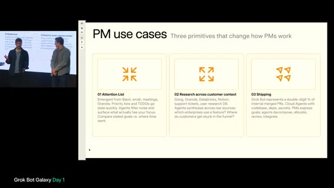

PM向け3用途: (1) **attention list** — 今週／今月の注意と優先のギャップ (2) **リサーチ／顧客コンテキスト** — ボトルネック合成 (3) **shipping** — 2026 の PM はデリバリー必須。社内で Grok Bot 経由の **マージ PR が二桁％**。プロダクト組織の人間も本番 PR を出せる、と。

チーム紹介の意図はインスピレーションであり、必須編成ではない。**Cora**＝Chief of Staff（メール／カレンダー／Slack から PM の働き方モデル）。**Emily**＝EM。自分はコードせず、配下のエンジニア同僚（複数）に委任・検証ループ。**Ashley**＝データサイエンス／分析。SQL や信頼ソース探しの代わりに即答・チャート。**PMP**（Pete）＝プロダクト側キック。PRD 下書き、顧客インサイト、日常プロダクト作業。**Pixel**＝デザイナー。S 級 AI デザインの助言で訓練、最新コンテキスト大量投入。**Rae**＝リクルーター。ソーシング／採用パイプライン。

多エージェントの理由: (1) **参照しやすさ** — 役割＝誰に聞くか (2) ボット同士が会話・チャンネル協調可 (3) **スコープしたメモリ**で学習ループが効く (4) **並列** — 6体に一斉投げて戻って合成、会議の action items と同型。会場の約80%が既に Grok Bot 利用経験（挙手）。未経験者向け超短縮ツアー: 左にボット一覧、ピン／セクション（leadership／engineering: Einstein, Igor, Nova, Larry, Ilene 等）、非表示可。**Marketplace** で Notion／Slack／Figma MCP／Gmail 等を接続。グループ例: eng ポッドのスタンドアップ、EPD（Eng/Product/Design）、war room（インシデント）。デモ環境ビジネス: **Flylo Airlines**（音声: Flylow）。以降全員が同社の PM 設定。

### Ashley → 誤読訂正 → PRD → Pixel／Emily。人間レビューは残す

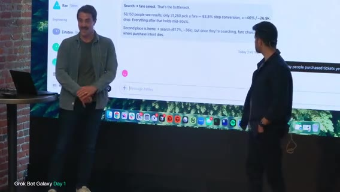

Ashley に「昨日のチケット購買数、モバイル vs Web」を依頼。裏で Databricks／Snowflake 等のウェアハウスにクエリ。結果例: 約 **1,400** 件、Web ~58%／Mobile ~42%、家族搭乗など。タイポ許容でチャート可視化依頼。**Routines** は、毎朝ダッシュボード巡回の代わりにプッシュ。大型ローンチでは **時間次レポート**も。チャート: ソロ／カップル／家族／グループ分布、家族シェア約25%。**毎朝6am** の購買パルスをルーチン化可能、と。

モバイル購買ファネル。座席選択で落ちているように見える → 改善機会、と一旦解釈。スレッド返信で PMP をタグ: 座席選択の落ち込み向けモバイル最適化スペックを、と依頼（ボット間連携）。**Ashley が訂正**: 大きなリークは座席ではなく **search → fare selection**。誤読をキャッチし PMP に洞察転送、というのが見せたい点。Pete が Notion PRD（P0／P1）を生成。PRD skill は、長い文書より **コード／プロトに効く crisp 要件**。人間レビュー層の重要性。デモでは one-shot だが実運用は反復。Notion コメントをボットが読むワークフロー。Pete→**Emily** にプロト依頼、**Pixel** もデザイン投入。

Grok Bot の **自前 VM／コンピュータ**。Web ナビ、資格情報利用。右上 **Teach a task** で操作録画→再現（Salesforce 等の複雑フロー向け）。Pixel は、デザインシステム（Figma）＋航空ブランド参照。フォント／色／アンチパターン（例: 左上に X ボタン禁止）を埋め込み。Option A／B モックを会場クラップで選択 → Emily にプロト更新。非同期・アウトオブバンド操作がチャット単体より楽しい、と。Emily が優先度を分解し各 IC に直接指示＋文脈付与。エージェント同士のプロンプト組み立てが人間より上手いケースあり。IC が **cloud agents** を起動（リポのローカルコピーで変更／テスト）。Nova が PR 作成確認 → 監視 → EM／QA の追加検証ループ。人間介入量は選択可。低リスクは自律、デザイン実装はデモ要求。一連の流れ: 事業質問→Ashley→PMP PRD→Pixel→Emily／cloud agents。要件深い組織や多リポ同期など、別ワークフローにも柔軟対応、と。

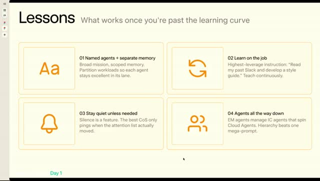

Lessons: (1) **名前付きエージェント＋分離メモリ** — Day0 は弱い、オンボーディングで skill／コンテキスト (2) **静かに** — ルーチンで noop なら通知しない（inbox ノイズ削減） (3) **Agents all the way down** — EM が IC を、IC が cloud agents を。バーチャル視聴者へ: Matt／Lauren／Roshan（Whisper: Roche）が3日間スタートアップを Grok Bot で構築中、と紹介。Starbase Texas／Starship チャレンジ再プラグ。Hawthorne ツアーの runner-up 賞も言及。

Q&A（メモリ）: ボット間のコンテキスト重複／チーム横断。回答: 各ボットに **個別メモリ**＋必要時に書き込む **共有メモリプール**。ロール分離が強い記憶を作りやすい。グループチャットで統合も可。単一ビルダー vs 役割分離は用途次第。初期エージェント時代の「コンテキスト汚染不安」を減らすのが目標 — メタ作業なしで使えるように。画面は **Grok Bot Galaxy / Be right back**。Whisper は断続 "You" のみ。実質休憩／切替。

**PM セッションの結論**: 同僚のように役割分割し、成果物を返せ。データボットが誤読を自分で訂正する層が重要。人間レビューは残す。noop なら黙れ。メモリは分離が基本。

### スタジオ復帰：誰向けかを狭め、merch pop-up に寄せる

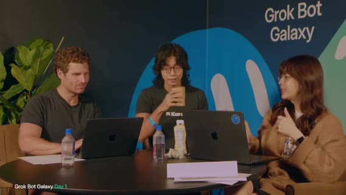

スタジオ復帰後の主張は、限定体験／merch が pop-up 経由でのみ、という希少性。自分たちで **Grok／Grokpot pop-up** を作り、ツール→プラットフォーム一般化、と。ゲスト押し: AI が食う世界では **IRL がより重要**。Uber Eats／DoorDash でコモディティ化しないブランド体験としての pop-up。ステッカー量産時代に「何を代表するか」を示す場。プッシュ: **誰のためか**を明確に。自分たち向け（未経験）と、既に店を持つ層の attention 用ではデモが違う。最初は前者に狭めよ、と。テックブランドの IRL merch／ぬいぐるみはメタだが候補。

分岐: テックブランド向けメタ merch vs レストラン等ブリック＆モルタル。チャット遅延・AV 音量ネタあり。汎用すぎると誰にも刺さらない恐れ。定数: 日付・時刻・会場・人を集める。Lauren がプロト。特化は merch 寄り。「小さく始めて全員向け」皮肉 → まず **テック企業向け merch／IRL**、プリミティブが固まってから拡張。チャットは約3分遅延でブラインド進行。PM フレーム: (1) 何を売るか (2) どこで (3) 日時調整 (4) チケット／ソーシャル（友人が来る感覚）。

合意寄り: **merch pop-up**＋登録／チケット＋venue finder。タイムスロットは当面不要。UI 想像: P1 何を作るか（merch pop-up）、P2 日付／予約、P3 場所。ボット分割は機能別（merch／ticket／venue）か eng／design か — Lauren／Matt に聞く。

Matt のボット観: ボット＝別従業員（Founding Eng／Growth Eng／画像生成／Creative Director／CoS）。タスク単位でドキュメント更新 bot 等も。Lauren は視覚派なので **prototype bot に tldraw** で低フィデリティを描かせている（ブラウザ操作）。批判・発散用。チャット「merch just merch」へ: 風刺帽子をかぶるなら **community as a service** — AI 時代にブランドの対面バイブを取り戻す。merch はトロイの木馬。ユニーク merch: tater／potato、炎放射器ジョーク（48時間では無理）。自分用に作る良い帽子の話。ぬいぐるみ／感情接続。効用（良い帽子）vs ノベルティ。TikTok の **tungsten cubes** 逸話。Grok Bot ロゴ付き／球体は高い（~$500）→ 抽選1個など。まず基本から、cloud agents は裏で稼働。

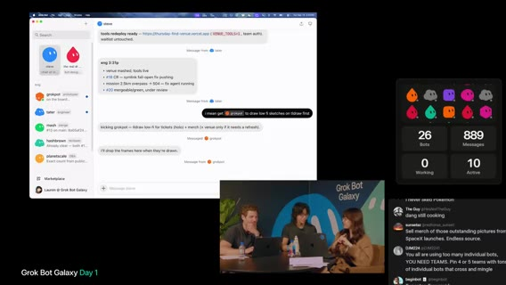

サイト／メール基盤も継続。チャット質問: 友人がボットを使うと訓練を継承？ → **テンプレ共有**はメモリ／指示／プラグイン等をコピーし、チャットやパスワードは含めない。secure entry。受け取側は自分の版として洗練。スコープ過多のサイン: 人間同様に混乱・的外れ出力。品質が落ちたらコンテキスト範囲を狭めよ。Lauren（Whisper: Warren）のボット挙動に気づきつつセグメント終了。

**この時間のスタジオ結論**: アート展／フードから、さらに **テック向け merch + IRL + チケット** へ寄せた（合意寄り）。最初の顧客は「自分たち／未経験側」に狭める。汎用プラットフォームは後。タイムスロットは当面不要。

---

## Eric／Karat・Founders（Close／Prod／Stalk）

seg08 · ストリーム 7:00–8:00

- **範囲**: ストリーム時刻 7:00:00–8:00:00
- **画面**: 前半〜7:23＝スタジオ＋ゲスト **Eric／Karat**。7:23以降＝ステージ **Grok Bot for Founders**（Shubh）

### チケットをコレクタブルにし、merch は 2〜3点に厳選する

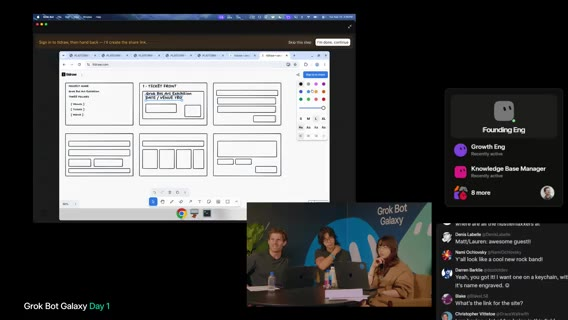

Lauren のボットが tldraw 上で **Grok Bot Art Exhibition** チケット案をスケッチ中（DATE／VENUE TBD、pillars: Words／Tickets／World）。チケット自体を **コレクタブル**に（ポケモンカード的な艶）。会場で追加 merch を見る導線。pop-up は「特別」であることが理由なのでチケット品質が体験の一部、というのが意図。

ゲストは、チケット設計ボットに加え、merch 側を任せるボットは？ ぬいぐるみ／高品質フーディ以外の新奇案を。既出: **tungsten cube** → Grok Bot 形だと約 **$3,000** で非現実。ボットに同系統の新規アイデアを依頼。チャット案: potato plushies、SpaceX 打ち上げ写真、ストレスボール（Grok Bot 形状）、球体ハットに目、等。

経緯再掲: 他社向けツール→自分たちの pop-up→将来プラットフォーム。今やるなら **merch／venue／ticketing** の3点。merch の二軸（Matt）: **utility／craft**（良いフーディ・ハット）と **novelty**。ぬいぐるみ→プログラム可能 plushie（例: Slack 更新読み上げ）への発散。Lauren は、録画をボットに渡し **merch bot** を起動。画像生成連携。アイデア過多 → **2〜3点に厳選**（意図的・よく作り込む）。PM ハットをゲストに: 登録時に merch ギャラリー選択、将来は 3D プレビューも。

合意寄りフレーミング: 登録体験で **自分の IRL Grok Bot** をカスタム／可視化／機能割り当て（天気など）＝ **Build-a-Grok-Bot**。チャットも同調。ワークショップ全体がメタ（ボットで会社を作り、物理ボットを売る）。merch 画像プレビュー。チケット案も別ボット。会場で物理チケット交換の話。venue もボット／Notion リストへ。テンプレ共有の話。merch drop ボット名が双方とも **drop** 系で被るジョーク。テーマ付きボット軍（potato ダジャレ／ソニック系）への妄想。チャットは、Drop ぬいぐるみ買いたい、等。サンフランシスコで実物 Grok Bot を持ち歩くブランド効果。次セッション予告: 約5分後 **Grok Bot for Founders**。

**決まったこと（寄せ）**: 今やる3点は merch／venue／ticketing。merch は 2〜3点。Build-a-Grok-Bot が登録体験の仮フレーミング。日付・会場は TBD。

### Eric（Karat）：自分たちで dogfood し、検証可能なループに振れ

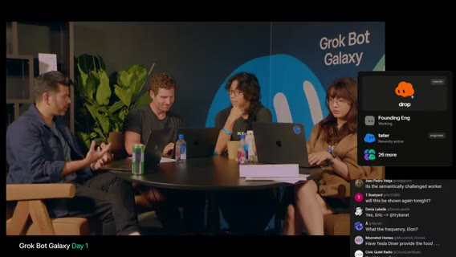

Matt が pop-up 成果の一般化＝プラットフォームへの意見を Eric に聞いた。Eric／**Karat** の主張: 当初はクリエイター向け銀行・クレジット（YouTuber／ストリーマー等）。プリミティブが固まると他ファウンダー／SMB へ拡張。銀行＝預かり＋AI でキャッシュフロー洞察→成長支援（翌年リリース方向）。ビルボード／イベント等の成長支援も。Cody Sanchez トークへのコールバック: ビジネス成長支援。イベント運営者向けにも同じレンズ。Grok Bot はまず SF の AI 層だが、目標は **Joe Plumber** 級の SMB が使える UI。自社 dogfood → プリミティブ正しければ人口拡大（Karat と同型）。

クリエイター用途: AI は **正しくかつ検証可能な**出力で有用（ChatGPT 由来の信念）。クリエイティブ本体より **マネタイズ**側（ブランド選定／Outreach／契約／コンテンツ案）を複数ボットで。検証可能ループ（コーディング等）に振る。クロージング。会社は try karat。楽しい、興奮がテイクアウェイ、と退席。

**Eric が残した結論**: 最初の顧客は狭い層でよい。検証可能な仕事に AI を使え。プラットフォーム化はプリミティブが正しいと分かってから。

### Shubh：ファウンダーの3軸は focus、velocity、意思決定の質

ステージ切替。発表者（Shubh）の位置づけ: ファウンダー向けセットアップ最適化の学びとライブデモ。アジェンダ: 文脈→デモ→パワーユーザー tips→Q&A。終了時にボット共有。非ファウンダー／Head of X も有用。AI maturity は、chatbot → ephemeral agents → **長く残る bots**（コンパウンド）→ スタッフ機能の自動化。挙手で大半が既利用者。Grok Bot＝同僚にテキストする感覚。**自前コンピュータ**で MCP／API がなくても作業可。E2E 委任が理想。

ファウンダーの3実行軸: **focus 保護**／**velocity 維持**／**洞察・意思決定の質**。邪魔ものを委任、タスクを部分ではなく E2E＋検証まで、情報洪水の整理。「スケールしないこと」の顧客クローズをボットが大半処理。プロダクト変更の追従ミスを減らす、とユースケース導入。

デモ用ボット群: **Close**（顧客）／**Prod**（出荷把握）／**Stalk**（競合）／**Proto**（デザイン＋FB→PR）＋ゲスト枠。

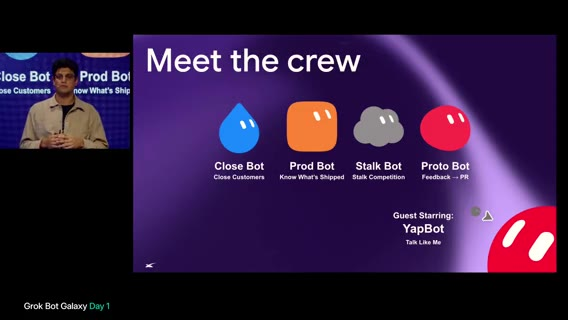

**Close Bot** のポイント: (1) 洞察を食わせて **コンパウンド** (2) 自コンピュータでツール操作。コール準備: テレメトリ／相手リサーチ／サイト walkthrough。デモ顧客 **Northwind**。無料トライアル行動把握が重要。15–20分のコールで刺さる準備を自動化。日次の HTML コールプレップ例: 相手・プロダクト・サイトSS、**バグ／UX問題の見つけ出し**（Cookie バナーが Submit を塞ぐ等）で会話の入りを作る。利用グラフで加速／低下を判断。レコメンド／リスク。カレンダー連動ルーチンで毎朝準備。コール後: **Granola** 文字起こしを見て刺さった／刺さらなかった機能を学習→次回プレップ改善（2–3週で効く）。サポート自動化: データ＋課金など「渡すのが怖い」接続まで渡すと効く。**Activation** は、wow モーメント到達をクレジット等で後押し（デモ例: テンプレ共有で高額クレジット自動メール）。契約往復／アウトバウンド／カレンダーも。楽しさのある顧客対話は意図的に人間が取り戻すことも。

**Prod Bot** は、出荷／取り下げの把握。デモは **Flylo** 日次 rundown。PR／Linear に加え、ログインしてサイトを自分で辿り変更を体験マッピング。メトリクス接続で効果も。スクリーンショット＋操作動画で検証高速化。「Worth a decision」的な微決定も浮上（画面: search／cabin CTA／QA）。

**Stalk Bot**（競合ストーカー）は、競合を見つけ自律サインアップ→プロダクト通し→rundown。ルーチンでパルス。無音なら通知しない ambient。例: ノートアプリ **Craft** のオンボーディング teardown（HTML／動画、捨てメアド）。churn 先へのメールは「責任ある範囲で洞察」と注記。Notion も同様（採用情報多め）。終了後テンプレ共有予定。

**Proto Bot** は、頭の中のアイデアや顧客 FB をプロト化。自前の Grok Bot アカウントで QA／試作。FB チャネル（サポート等）をパイプライン化し PR 起動まで。ボトルネックは意思決定。例: テンプレ共有ボタンが地味→改善作業開始。**Yap Bot** は、メール／Slack／iMessage 等から話し方を学習し「自分として話す」。他ボットがプロアクティブに呼び込み。機微は下書き。下書きと実送信の差分で改善。**Misc Bot** は、ランダム要求のゴミ箱（例: アルバム発売チェック）→他ボットのコンテキスト汚染防止。必要なら Prod 等へ転送。ボット連携: Close→Proto、Prod→Close 等。フレームワーク: **自分をプロダクト化**し、楽しい作業も含めレゴを渡して最高レバレッジに集中。

学び: Let bots run free（可能な範囲でアクセス）。エージェントと違い捨てず **投資**。スキル／ツールに意図を。1–2時間で一日を棚卸しし委任先を決める。Tips: **browser use** は強力だが高コスト→API／既存 IF 優先。一度ブラウザで network を見て API 直叩きへ。最適化もボットに聞け。**Routines** は頻度を監査（15分ごと＝日100回は高い）。webhook／インバウンド信号寄りに。More Rapid-Fire Tips（スライド）: voice bot／cookies import／expertise でグループ化／skills／**他ボット最適化専用ボット**。**Stalk Bot** の QR を残すので盗んで試して、とクローズ。セグメント境界で切れる。

**Founders デモの結論**: 長く残るボットに投資し、顧客クローズ・出荷把握・競合調査を E2E で委任する。browser use は高いので API 優先。ルーチン頻度を監査。Misc で汚染を防ぐ。意思決定は人間のボトルネック、と明示。

---

## Founders Q&A・Jenny・Day1 終了

seg09 · ストリーム 8:00–終了

- **範囲**: ストリーム時刻 8:00:00–終了。終端フレーム ≈**8:45:57**
- **画面**: Founders トーク締め → 会場 Q&A → スタジオ＋リモートゲスト **Jenny** → Day1 ラップ → Galaxy タイトルカード

### Shubh Q&A：セットアップは棚卸し、決定論はコードに置け

Shubh は、ボット組み合わせの創造性が限界未到達。ファウンダーからのシグナル歓迎。ライブ視聴者は Matt／Lauren／Roshan の cooking へ戻す。会場向けに約15分 Q&A。

人間同様に1–2時間セットアップするなら役割の作り方は？ 回答: やることの棚卸し→ドメイン別にグループ（finance／customers／marketing）。専門家ボットを好み、CoS 一本化は好み次第（抽象化したい人向け）。XP バー欲しいジョーク。複数コンピュータでのボット管理は、以前は混乱しやすかったが改善中。Mac mini 積み上げ勢向けに投資中。ダメなら個別相談を。

エンタープライズで決定をモデル外の決定論的ポリシーに載せられるか？ 回答: モデル自体は非決定論。回避策は **コード化**（cloud agents で決定木／関数を書き、毎回それを呼ぶ）。ボット間パーミッションも可だが、ルール＋検証可能コードがベター。

他ツールからの移行: (1) 近日共有予定の移行ボット (2) MCP／API を単一 SoT に。1Password MCP、Chrome cookies インポート。認証は未解決箇所あり。一部サービスはボット拒否→エコシステム全体の課題。認証で詰まるときは、ツールを過度に指定せずボットに解決させる。例: 文字起こしは **Granola** が取り込みやすさで選んだ。オプティマイザボットが将来 first-party に乗り換え可。Marketplace プラグイン拡充が目標。API 高コスト／無しのレガシーで UI 操作は API 並みに速くなるか？ headless／DOM クリックでスクショ判断ループを減らす。computer use モデル改善中。API 超えは難しいが近づけるのが目標。

多数ボット＋積極運用での意思決定／トークン: グループチャットは協調に強いが全員が喋りコスト増。多くは一度タグして別スレの方が良い。モデル選択は cloud agents 側で指定可。「forget X」でコンテキスト掃除も有効。Marketplace ボットの評価: 手作業監査＋ボットによるボット監査。試用と「何をするか」のセットアップ質問で早期選別。人／アカウント横断でボット同士は会話できるか？ **現状なし**、検討中。ローカル実行とボット PC の併用: Settings で local execution。将来はボット PC 側が本命（並列・リソース）。ローカルは画面ポップや負荷のジレンマ。全ボット同一メモリ？ **メモリは共有しない**。同一 VM 上でインスタンス分離、ファイルシステムは共有（必要なら互いのファイルを読む）。Cursor cloud agents との関係: first-class 連携。関連コンテキストだけ渡して独立作業→結果復帰。複雑出荷・モデル厳密制御は cloud agents。オーケストレーションは一度指定すれば上手い。

Q&A 終了。Starbase チャレンジ再プラグ（ぬいぐるみ賞も）。音声切替トラブルのあとスタジオへ。

**Q&A の結論（製品側、この時間）**: 移行ボットは近日予定で未出荷。アカウント横断会話は未対応。決定論はモデルに期待せずコードへ。グループチャットは高い。メモリは分離。認証の詰まりは未解決箇所あり。

### Jenny 再登場：会場条件を厚くし、夜通し Scout を回せ

元ノートはこの時間帯にも Jenny 対話を記録している（会場要件、Scout、permit、夜通し下書き）。昼間のラップ付近にも同趣旨の記録がある。ここでは終盤の記録として、主張と結論だけを固定する。

Jenny 紹介: AI を探る女性コミュニティ、VC／テック／コミュニティ、メディア事業。特別ゲスト（赤ちゃん）も。Jenny は、VC・フルタイムクリエイター・メディアに加え育児。**約22体**の Grok Bot 従業員でエージェンシー（Whisper: Jamil and Media＝幹部ブランド構築、名称は不確実）等を並行。事業は不動産／VC ファンド／メディア／エージェンシー等 **約7**。**Master Chief**＝Chief of Staff が横断。例: **Boxy**＝inbox 監視、scribe 系＝会議メモ→サブエージェント委任、CFO 系＝簿記・レシート。

チーム: 72時間で事業。IRL pop-up／ローカル接続／仮想参加なども検討中。イベント知見が欲しい。Jenny は、Eric 回の merch 在庫議論を見た。実行スケジュールの進捗は？ → アイデアと候補リストはあるが **アウトリーチ未着手**、物流未整理。

Jenny の要求: 大規模ピッチ大会の会場経験あり。SF 前提でボット検索前に **criteria** を厚く。現状: ~100人、倉庫的ギャラリー空間、時期は来月前後（許可次第で延びうる）。CA は許可好き。酒なしで簡略化。食事はホット提供希望。キッチン有無／ケータリング持ち込み可否（SF は preferred vendor 多い）→空間優先なら制約に合わせる。昼夜未決（夜間クローズ会場あり）。詳細をボットに入れるほど可用性検索が速い。**Scout** 型 venue ボット推奨。SF は狭く法務も多い。

まず1回の pop-up。人間の event producer を逆エンジニア: planner の下に coordinator 相当ボット。メールで RFP／空き確認。Jenny は衣類リセールボットで入札交渉パラメータ運用中→予算枠を渡せば venue 交渉も可。予算未策定 → 相場のベースライン調査が先。event planner に **本番バジェット雛形**（F&B、マーケティング、スタッフ。登録／警備は人間必須）。ライブでボットに指示: SF シニア event planner、100–200人 pop-up、venue／F&B／staffing、基本 AV（マイク・スピーカー）。マーケティングは一旦外して単純化。可能なら同一会場にベンダーを寄せ、別スカウトを減らす。

追加2ボット提案: (1) **Permit／red tape ボット**（SF の法的要件調査。都市ごとに違うので汎用ポリシーボットにも発展）(2) 契約の一次レビュー。弁護士友人談: AI は **二年目ロースクール**水準—条文は読めるが現地・業界の「今の通例」は弱い。一次パスに使い人間が上書き。人間でやり方を作り、AI に逆エンジニア。夜通し向け: **Scout** が検索・特定・翌朝送信用下書き；招待リスト（例: Meta／Instagram で都市内高フォロワー抽出→下書き）。当日の大規模視聴者もソース候補。Jenny 退席。サイドバー構成のスクショを後で共有予定。「merch 作れ、これは起きる」と激励。残り約48時間で物流、と。

**Jenny が残した結論**: 検索の前に条件を厚くせよ。予算を先に作れ。許可ボットを置け。契約 AI は一次パスまで。夜通し回すなら Scout の下書きまで。アウトリーチはまだ手を付けていない、というのがチーム側の現状認識。

### 締め：発散はした。明日 lock-in する

残り約10分（現地 ~5:30）。ホスト側の自己評価: Day1 はアイデア発散・ピボット複数・ホワイトボード記入。セットアップは進んだ（スライド、Notion、GitHub、Vercel、V1 ランダー等）が **ロックイン不足**。学び: ideation の難しさ、ゲストの知恵。今夜エージェント稼働中に1–2焦点へ。Jenny 後は SF pop-up の難度を再認識し「正しい問題か」も再考。明日リフレッシュして lock-in。

締め: SF で3日間事業構築（Dreamforce 連動の Galaxy）。**Grok Bot Galaxy チャレンジ**再告知（テンプレ作成・提出）。映像一瞬ロストしつつ「See you tomorrow」。画面は **Grok Bot Galaxy** タイトルカード。クリップ終端 ≈**8:45:57**。ストリーム公称総尺 ~31518s（8:45:18）をカバーして終了。

---

## 読み返し用：誰が何を結論づけたか

製品側（Roman / Amrita / Lynxie / Kevin・Ruth / Shubh）が一日を通して繰り返した主張は、ほぼ同じである。Grok Bot はチャットボックスではなく **役割を持った同僚** である。自前コンピュータとクラウド常時で仕事を終わらせる。メモリはボットごとに分ける。危険な操作は人間が承認する。グループチャットは便利だが高く、普段は一度タグして別会話の方がよい。Cursor cloud agents はコードと厳密なモデル制御、Grok Bot はオーケストレーション。アカウント横断のボット会話と、Grok Bot 内の人間マルチプレイは未出荷。

スタジオ側（Matt / Motion / Lauren）が一日で実際に進めたのは、空の会社基盤とボット工場である。Ship by Thursday という仮社名とドメイン、Slack / Notion、Vercel 上の V1 ランダー、メール収集、venue-finder、PR→Slack、verification skill。役職の仮置きは Matt＝CEO、Motion＝CPO、Lauren＝CTO / Chief Potato Officer。

スタジオ側が一日で決めきれなかったのは、何を売るかである。リサーチ bot のテーマ読みから入り、レストラン pop-up OS、自社 dogfood、アート展、merch / IRL / Build-a-Grok-Bot へと寄せた。日付 10月15日は仮。許可次第で6週間後ろ倒しも検討。予算・会場・アウトリーチは未着手。ゲストの結論は交差している。Peter は楽しいことを増やし、早く市場に当て、最初の1ドルまで見ろ。Cody は決める前に3人に売れ、distribution に執着せよ。Eric は狭い層で dogfood し、検証可能なループに振れ。Jenny は会場条件と許可と予算を先に厚くしろ。ホスト自身の締めは、それらを受けても **まだ lock-in していない**、明日決める、である。
