# Grok Bot builds a Game Studio LIVE — Day 2 Recap（日本語記事）

タイトルどおり Day 2 はゲームスタジオ構築が軸です。厚めノートを時刻印なしの読み物にし、スクリーンショットは話題の近くに少数だけ差し込みます（末尾ギャラリーはありません）。0:00–0:10 の無音/BRBは埋めず、本編は約 0:10 から。

**ソース情報（REPORT.md）**
- ソース: [https://x.com/i/broadcasts/1PKqrNyvmYwGb](https://x.com/i/broadcasts/1PKqrNyvmYwGb)
- 長さ: 約 8:23:19（最終発話おおよそ 8:20／〜8:23 アウトロ）。0:00–0:10 は無音/BRB（真の開始は約 0:10）
- 方法: yt-dlp replay → faster-whisper tiny int8 → 日本語厚めメモ＋ffmpeg スクショ
- 欠測方針: 音声が取れない区間は推測で埋めない。BRB 等の無音は無音と書く。

## ピボット宣言とゲーム骨格・SEデモ

seg01 · ストリーム 0:00–1:00

- **範囲**: ストリーム時刻 0:00:00–1:00:00（クリップ時刻＝ストリーム時刻）
- **音声**: （収録クリップ）（約3600秒）成功。**0:00–0:10 は無音/BRB**（mean ≈ −91 dB）。本編音声は **0:10:04〜**（以降 mean ≈ −30 dB）
- **字幕**: `seg01/seg01.vtt` / `seg01/seg01.txt`（faster-whisper tiny int8 / en）成功・732 cues。最初の発話は 00:10:04
- **画面**: 円卓スタジオ「Grok Bot Galaxy Day 2」→ Excalidraw ホワイトボード（ゲーム設計）→ メインステージ「Grok Bot for Sales Engineers」（Amrita）
- **注**: Whisper は Grok Bot を rock-bought / graph / Grockbot / Rockpot / Rothbots / Dropbot 等と誤認。画面表記に合わせて **Grok Bot** に正規化。社名「SpaceX AI」混同あり → 文脈・画面では **xAI**。Motion を Roachon と誤認。Dr. Eggbot はチャット実名のまま。不明箇所は「聞き取り不明」。

### 無音 / BRB（欠測扱い）

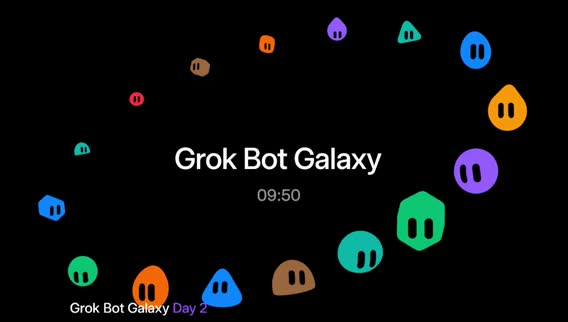

*0:00:00 · brb silence*

**無音**。AAC トラックはあるが mean ≈ −91 dB。発言なし。推測で埋めない。

画面では、スタジオ待機／BRB 相当。スクショ `t000000_brb_silence.jpg`。

**方針** は、真一さん訂正どおり、実質スタートは **0:10:00**。

### Day2 オープニング＆自己紹介＆ピボット宣言

「Come in / Hey everybody」「**Day two, Galaxy Live Stream**」。新規チャット向けにクイック自己紹介ラウンド。

**Matt**（Developer Experience）。音声は「SpaceX」だが文脈は xAI / Grok Bot チーム。**Motion**（Whisper: Roachon）— Product。

**potato / Lauren** — 「potato things」、いまは Grok Bot（Whisper: graph）周り。

画面では、円卓3人＋ノートPC。右下に founding bots パネル（tater=engineer, steve=chief of staff, planetscale=DBA 等）。チャット「All day show」「grok bot galaxy」。オーバーレイ「Grok Bot Galaxy Day 2」。`t001004_day2_open_intros.jpg`。

昨日の振り返り: アカウント準備・ブレインストーム・アイデア合意。**体験型ポップアップ事業**を目指してビジョン／プロト／デモまで進めた。「一晩で気が変わったかも」。

Lauren は、ポップアップは噛みすぎ。ゲストから **SF の規制・ライセンス**の厳しさの助言。ストリーム映えしない作業になりそう。エージェントにも Overnight で調査させ、**2日では完走できない**フィードバック。視聴者も参加できる・一緒に使えるものへ。

「**pivoting**」。情熱があり既にやったことがあるものに寄せるのが事業づくりの一部。

### 新方針：ゲームスタジオ＋ Grok Bot テンプレ

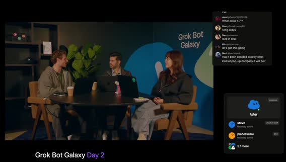

*0:11:45 · pivot to game*

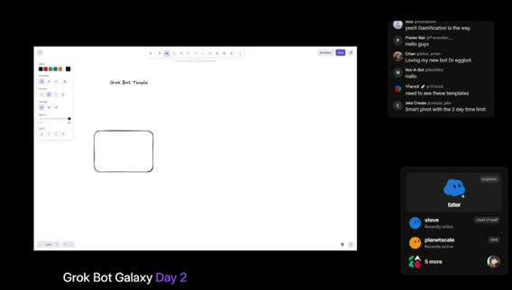

*0:13:00 · game studio pitch*

新アイデア: 視聴者／現地参加者も **自分の Grok Bot テンプレート**を作り、それで遊べる仕組み。「一番楽しいのは **gaming company**」。ゲーム／ゲーム事業を今日の新ビジネスに。最初のビジョンは **みんなの Grok Bot で一緒に遊べるゲーム**。

午前は 20–30 分ライブホワイトボードでビジョン整理 → Lauren が MVP 計画 → トーク挟みつつビルド継続、が今日のフォーカス。画面共有要求。Excalidraw 系ホワイトボード起動。「Grok Bot Templates!!」`t001230_live_whiteboard_start.jpg` / `t001300_game_studio_pitch.jpg`。

（画面共有中）Grok アプリ内でボット共有 は、skills / routines / 選択的メモリ等。PM 向けに育てた賢いボットを他人に渡せる、というテンプレ共有の話。**チャット反応** は、「Smart pivot with the 2 day time limit」「Gamification is the way」「Loving my new bot Dr eggbot」。

### コアゲームデザイン（キャラ化・ステ・レアリティ）

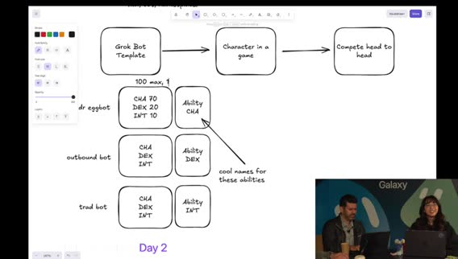

*0:18:30 · stat pool 100*

コアアイデア: 各自がアップロード／作成したキャラで **みんなで軽く対戦・共有**。楽しく軽量にイテレーション。初期プラン: **Grok Bot テンプレ → ゲーム内キャラ**への変換を簡単に。ボットのチームを組む。

**ホワイトボード流れ** は、`Grok Bot Template → Character in a game → Compete head to head`。ステ CHA / DEX / INT と Ability 対応。`t001600_screen_share.jpg`。各ボットに **stats**（例: CHA / DEX / INT＝カリスマ・器用さ・知力）。お気に入りゲームから着想。加えて **ability（アビリティ）**。

シンプル版: メインボット＋追加ドラフトで **チーム3体**スタート。例は、**Dr. Eggbot** をチームに入れる想像。チャットでも Dr eggbot 言及あり。

テンプレからキャラへ「ミント」すると似たステが出る、という発想。**総ステータスプール 100** を3ステに分割。ボット説明文を LLM に食わせて配分（社交的→CHA 高め、多サービス接続→DEX 高め等）。合計は常に100。

ステ0は変 → 最低値議論（10 → 最終的に **最低1** 方向）。Diablo 系アクションRPGのアイテムレアリティ着想。**Dr. Eggbot は Legendary 必須**（ジョーク合意）。

レアリティで総ステ上限をブースト: base=100、rare / ultra / legendary 等で分割。数字は後で詰める。`t001830_stat_pool_100.jpg` `t001920_rarity_legendary.jpg`。

### マネタイズ（Pay-to-win 回避）とスタジアム広告

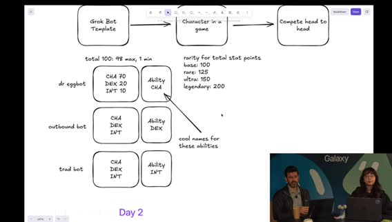

*0:21:00 · monetization cosmetics*

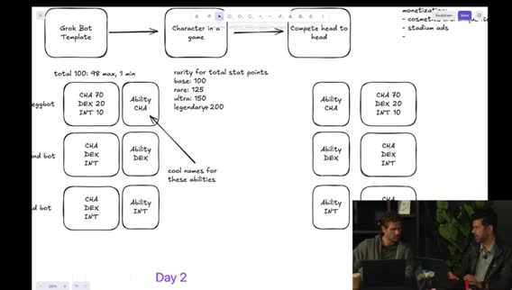

*0:23:30 · prototype matchup*

ゲームスタジオとして現実味を残すなら収益も必要。ただし **pay-to-win は嫌**（ゲーマー視点で同意）。パワー課金ではなく **楽しいアップグレード／コスメ**。チームを SNS 共有・ドラフトのバイラリティ。戦場／アリーナアクセス課金の可能性。

「かっこいい帽子に1ドル払う」として、Flux / Imagine API（Whisper: rock Imagine）でユニーク見た目のアイテム。ホワイトボードに cosmetics / unique items をメモ。

対戦の場 = アリーナ／**スタジアム**。スポーツのようにスタジアム内 **広告**（ゲームバランス非干渉）でマネタイズ＋視聴フライホイール。リプレイ／共有リンクも検討。`t002100_monetization_cosmetics.jpg`。まずプロト。ゼロイチは成長優先、マネタイズは後からレイヤー。

### 対戦プロト・運営バケツ・MVP 方針

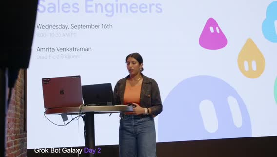

*0:30:40 · sales eng session start*

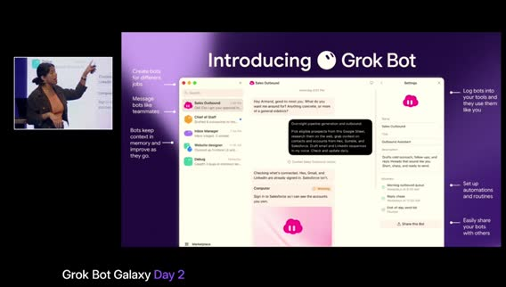

*0:34:00 · bots have computers*

チーム編成 → 相手チームとアビリティ対決。サンプルステで CHA 対 INT などのヘッドトゥヘッド。`t002330_prototype_matchup.jpg`。作成時の特殊ブースト・ロール、毎回違う対戦感、リプレイ視聴。

超シンプルMVP: チーム編成＋軽いマッチメイキング（相手は事前ラインナップ）。ディストリビューション: ランディングページ、発見性、広告、次の休憩後のゲスト、シード資金の話は後回し。

CS は、電話番号／**X チャット API でコミュニティ対話**。古典的事業オペ（サポート等）も Grok Bot 群で回すアングル。`t002520_ops_distribution.jpg`。将来拡張: スタート配列、アビリティ変更、アリーナ特性。まず **タイトな初期版**を作り、進化余地を残す。

（画面／エージェント側）申請検証チェックリストや疑似コード等の詳細ドキュメント言及。「最初のトークがセールス＆シェアでライブ中」→ **メインステージへカット**。`t002940_cut_to_main_stage.jpg`。

### トーク: Grok Bot for Sales Engineers（Amrita）

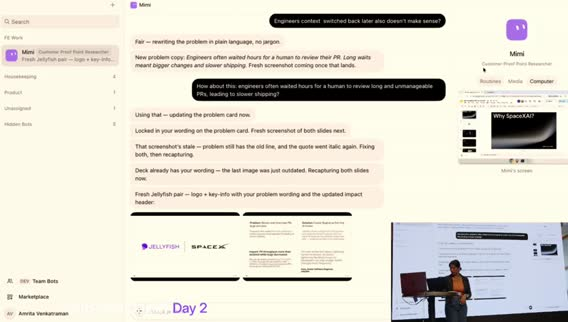

*0:41:50 · three bots intro*

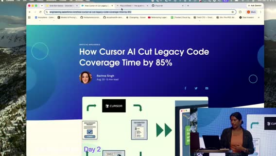

*0:45:30 · flylow demo intro*

画面では、レンガ壁＋ステージ、オレンジトップの登壇者。`t003000_midhour.jpg` `t003040_sales_eng_session_start.jpg`。

セッション題: **Grok Bot for sales engineers**。日常使いの **3ボット**デモ（うち2はサンドボックス、1は実顧客向けケーススタディ資料作成）。初見向け概要 → 他製品との違い → ユースケース → デモ → 終盤Q&A／現地ビルド時間。テーブルのコースターに QR → マーケットプレイスのテンプレ。

スライド: タスク一発チャットから **チームの同僚ボット**へ。完成した成果物を返すのが価値。ダウンロード案内: Android / iOS / Mac。

**ボットは自分のコンピュータを持つ**。各サービスを全部手で繋がなくてよい。例: 昨日の Google Form 自作、MongoDB ログイン分析。PC画面を監視・テイクオーバー可。エンタープライズでアクセス制限。`t003400_bots_have_computers.jpg`。**Automations / Routines** は、毎朝ニュースレターをメールから拾い Slack ダイジェスト。分散チームの force multiplier。ボット共有（チーム／マーケットプレイス）で一貫性。

使いやすさ: 起動すると用途を聞いてくる。今日はボットに「自分のチームを雇うなら？」と聞けるデモ予告。ゴールは待ち続けではなく **finished work** に戻ってくること。`t003800_finished_work_pitch.jpg`。

SEユースケース紹介。セキュリティ／メモリ／Linux VM 等の技術質問対応。**Sherlock** は、リポジトリにアクセスする技術エキスパート。顧客質問に答えつつ IP 漏洩しないようステア。平易な言い回し。

**Serena Williams**（テニスファン命名） は、競合インテル。**競合製品を自分のコンピュータで実際に触り**差分・ロードマップ示唆。**Echo**（後続セッションで Chris/Mark 等） は、顧客コール中にデッキをライブ編集。Amrita はコール前にマスターデッキから顧客向けにキュレートする使い方が多い。

### デモ1: Mimi（Customer Proof Point Researcher）

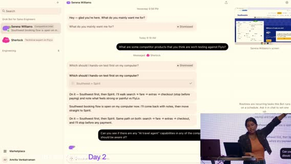

*0:52:00 · southwest booking flow*

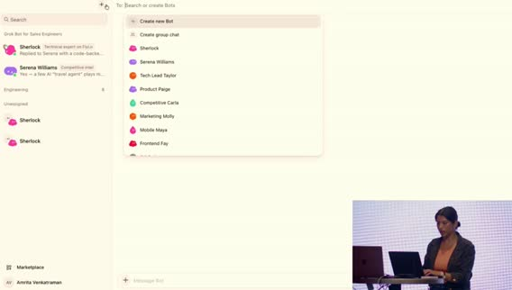

*0:57:00 · group chat bots*

今日の3体: **Mimi**（スライド／顧客プルーフポイント研究）、**Sherlock**（技術）、**Serena Williams**（競合）。`t004150_three_bots_intro.jpg`。

画面では、Amrita Venkatraman アカウント。サイドバーに FE Work / Marketplace。Mimi の Computer タブで「Mimi's screen」。`t004320_mimi_case_study.jpg`（※ファイル名は時刻ベース、中身は Mimi 作業画面）。

ケーススタディテンプレ統一: **Problem / Solution / Impact / Quote**。例: Starlink 公開ブログ、Jellyfish（Cursor でコードレビュー）スライド。ロゴはブランドページから取得。ライブ課題: Salesforce Engineering ブログ「Cursor AI がレガシーコードカバレッジを大幅改善」（音声: 855% — 数字は聞き取り／誇張の可能性、画面URL優先）を渡し「Salesforce 用スライドもう1枚」。`t004400_salesforce_blog_task.jpg`。

Mimi のコンピュータを開くとボット自身のカーソルでスライド編集。完了後に提示。作業中に Sherlock / Serena へ切替。

### デモ2: FlyLow × Sherlock × Serena

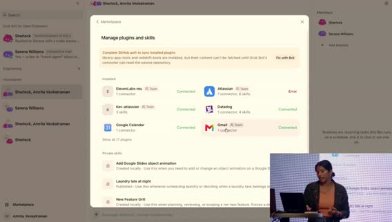

*0:59:00 · mcp not blocker close*

デモ企業 **FlyLow**（音声: Fly-Low）— Expedia / Google Flights 風のフライト予約デモ。フロント／バック／社内ツール一式。Sherlock が repos と flylowair.com にアクセス。`t004530_flylow_demo_intro.jpg`。例は、同時予約／同一座席のレースコンディション。Sherlock が **Cursor Cloud Agents** を裏で起動（ノートPC閉じても継続）。

顧客向け説明案: チェックアウト開始で最後の座席を **10分ホールド**、先に始めた人が優先、等。メール／Slack 送信も承認付きで可能。Serena は、競合の changelog / リリース / ブログ監視。週次ルーチンで Expedia / Kayak 等を要約可能。

AI トラベルエージェント機能の有無を競合で調査し、Sherlock に FlyLow 実装コストを聞くタスク。「FlyLow と比較すべき競合は？」→ Serena が Sherlock にベースライン確認メッセージ（検索・運賃・座席・荷物等のギャップ）。

ステア: 予約フローだけでなく **AI travel agent 能力**も見て、と追加指示。メモリで複数依頼を同時保持。Serena が **Southwest の予約フローを自コンピュータで実行中**（画面右上）。人手で競合を一歩ずつ触る時間をアウトソース。`t005100_serena_competitor.jpg` `t005200_southwest_booking_flow.jpg`。

マルチタスク: 予約フロー検証と AI agent 調査を並行。`t005450_multitask_steer.jpg`。Sherlock 側で Cursor cloud agents が backend / frontend に起動。Grok Bot ↔ Cursor 連携。`t005530_cursor_cloud_agents.jpg`。

### ボット同士のグループチャット＆「MCP不要」メッセージ

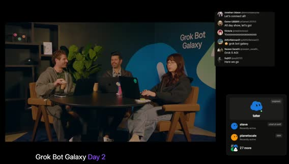

*0:10:04 · day2 open intros*

ボット間のやりとりをグループチャットで可視化（昨日も紹介）。Sherlock ＋ Serena Williams を同じチャットへ。`t005700_group_chat_bots.jpg`。「競合のキー差別化で、低工数で自社に入れられるものは？」と質問 → 両ボットが既存コンテキストを共有して議論。

結論寄り: Southwest / Expedia に無い **AI travel agent** がモートになりうる → Google Docs / Atlassian / Confluence 等へすぐ接続。プラグインが無いツールでも **コンピュータにログイン**すれば可。重要メッセージは、**MCP や API が無いことはブロッカーではない**。ボットは自前PCを持つ。例: **Power BI**、**MongoDB**（マーケットプレイスにプラグインが無くても利用可）。`t005900_mcp_not_blocker_close.jpg`。

「マーケットプレイスにボット／プラグインが無くても…」（セグメント境界、続きは seg02）。

## Teach／spin-up・Q&A・スタジオ再開とBRB

seg02 · ストリーム 1:00–2:00

- **範囲**: ストリーム時刻 1:00:00–2:00:00（クリップ 0:00＝ストリーム 1:00:00）
- **音声**: `clips/seg02.mp4`（約3600秒）成功・mean ≈ −31 dB
- **字幕**: `seg02/seg02.vtt` / `.txt`（faster-whisper tiny int8）816 cues
- **画面**: Amrita SEデモ続き → 会場Q&A → スタジオ（Matt/Motion/Lauren）ゲームビルド → **1:41–1:48 BRB（技術トラブル）** → Cursor でプロトタイプ再開
- **注**: Grok Bot / peestack / potato mode / Dr. Eggbot / Sherlock / Serena / Mimi は画面・文脈で正規化。xAI。不明は「聞き取り不明」。

### Teach a Task（画面録画でスキル学習）

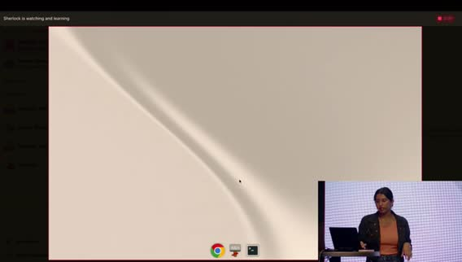

*1:01:08 · teach via recording*

Amrita続き: Sherlock / Serena にタスクを教えられる。Serena は Southwest 予約をコンピュータで継続中。Sherlock の画面をテイクオーバーし、競合の Hub changelog 等で技術ポストを探す手順を教える。

**最大のレバーの一つ = ビデオ録画で教える（Teach a task）**。Google を開いて操作を録画→一時停止で完了。録画からスキル学習完了。Southwest / Spirit / Skyscanner / Google Flights 等へ同じスキル適用可。AI関連ブログを重点監視、とボイスで注釈。

スキルは作成したボットに限らず、**マーケットプレイス経由で他ボットも利用**可能。

### グループチャット協調＆ボット間タグ

Sherlock×Serena グループチャット: 管理予約は競合のテーブルステークス、フレキシブル日付カレンダーはFEに既にある／低工数、往復・荷物は大だが低工数ではない、等を議論。ボット同士が **@タグ**で特定ボットに質問できる（人間がタグしてもよい）。

### ボットがボットを spin up

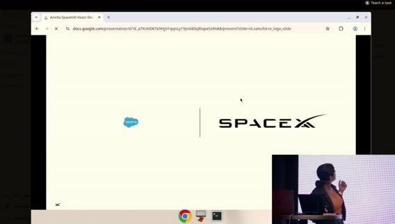

*1:08:00 · mimi salesforce done*

Sherlock（＋Serena）に「競合差別化／SE向けで役立つボットを spin up して」と依頼。**リトルノーン: ボットは他ボットを起動できる**。例: Chief of Staff に日常向け3体（inbox / scheduler / calendar）を作らせる。

初見SE向け: 顧客POCデモ用に「役立つ3体を作って」と頼め、と推奨。

### Mimi: Salesforce スライド完成 → Grab 追加

Mimi は、Salesforce ペア作業中。ログイン詰まり → Amrita がコンピュータをテイクオーバーして支援。**2枚のスライド完成**（正しいロゴ、Problem/Solution/Impact/Quote）。所要おおよそ10–15分。

追加: Grab の公開ブログ（Cursor 利用事例）でも同様に依頼。複数顧客を一度に投げても可。Echo 連携イメージ: コール中にスマホから「このスライド隠せ」等。ノートPC不要でケーススタディ量産。

週15–20顧客分のスライドがボトルネックだった仕事をテンプレ＋メモリで加速。公開ブログは Cursor 公式ではなく顧客側投稿をクロール。

### Spin-up 結果: Battle Card Blair / Demo Drake / AI Radar

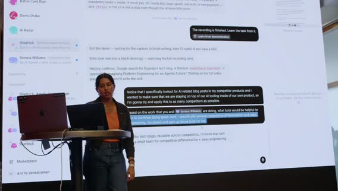

*1:12:50 · battle card blair*

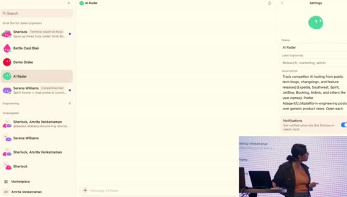

*1:14:20 · ai radar*

Sherlock が3体を起動。**Battle Card Blair** は、Serena の競合実機調査＋Sherlock のコードベース → SE向けバトルカード（claims / pilot reality 等）。

**Demo Drake** は、デモ／トークトラック。主張は Sherlock にグラウンド。必要なら Serena / Blair から対比を取得。**AI Radar** は、競合テックブログの AI 記述を追跡。先に教えたスキルを使用。真実源は Sherlock、実機フローは Serena。

社内ジョーク: 「できる？ → Ask Grok Bot」。モデルが **No と言える／押し返す**のも利点、と。

### Q&A（Captcha・MCP・本番安全・トークン）

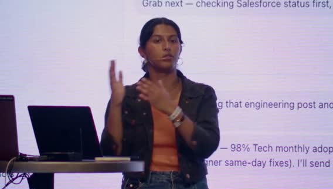

*1:18:40 · mcp vs computeruse*

ラップアップ → 会場Q&A。質問：ボットが他サイトでログインするとBANされないか。A: CAPTCHAで止まるサイトあり。エンタープライズは **ボットPCでサイトブロック**推奨（業務不要な Facebook 等）。

質問：Computer use vs MCP。A: 現状 Google Docs 等は MCP の方が速いことが多いが、computer use は高速化見込み。**監視・ガードレールは今は MCP が有利**（whitelist/blacklist）。将来 computer use にもガードが増える想定。質問：本番変更／マルウェア。A: ハードニング継続中。Skills のルールで本番デプロイ禁止等。Settings の **Auto review** に言及（聞き取りやや不明）。

トークン課金: 会話＋コンピュータ使用が消費。**Grok（音声: graphbott 6）**は安価で高効率を狙ったモデル、と。スライド一式のコスト感: **約 $20–30**（手作業なら4–5時間相当）で再利用可能。冗長トークンは「短く話せ」と指示で削減可。

### スタジオ再開: ランディング＆ peestack / potato mode

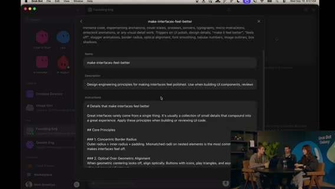

*1:26:50 · potato mode*

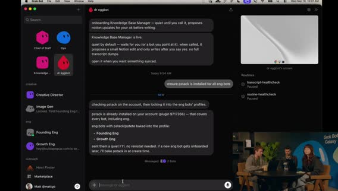

*1:31:00 · dr eggbot engineer*

Lauren オフライン気味 → Matt が break 中の Cloud Agents セットアップを画面共有で説明（「backseat driver」）。**Dr. Eggbot**（エンジニアボット作成役）＋ founding engineer がランディング作業。Lauren の計画ドキュメント／モノレポを共有コンテキストに。

Lauren方針: **ゆるいプロト**（ログイン不要・DB不要・ハードコード可）で見た目の遊びを先に。Matt は、ランディングが第一ゴール。個人スキル **project planning**（T3 / TanStack / Expo / Vite 等のスキャフォールド嗜好）＋ **make interfaces feel better**（Twitter発のUI磨きスキル）。

MVP は、Bun ベース lander（create-next-app 系）。OG メタタグ／サイトメタを必ず入れるポリッシュ。Grok Bot が「引き算してから足す」方向へ自己修正 → Cursor Cloud Agent へキック。**slash potato mode** / 「use potato mode」（peestack）。

余談: オープンソースのフラットSVGトークンスライダーでアセット遊び場。Matt はゲームデザイン初心者で調査依頼中。Phaser 経験あり。

### エンジニアボット指示・ビジュアル遊び場・Bufo・Notion

Lauren は、Dr. Eggbot（または Chief of Staff **Steve**）経由でインフラ／プロト用エンジニアボットを作成。Steve が資格情報・ゲーム文脈のハブ。エンジニアの仕事: cottages（agents）をオーケストレーション／監督。まず軽量プロトで「遊び感」→本格工は後。永続的に使える設計に。

パターン: 大きな指示の後に **「自分の言葉で言い直せ」**（能動的傾聴）。Matt は、ビジュアル playground がローカル起動。色に意味を持たせる議論。Lauren: まず最基本プロトを上げて全員がコードベースに入れる方が先。

「**time to fun を短く**」。定数スライダーでメカニクス試験。Founding engineer = Preview to Play。Growth engineer。余興: **Bufo mode** 用 GIF パック（約1200？）を Slack 用に—DevRel あるある。

Knowledge base ボットが Notion の会社ドキュメント更新、ピボット記録、GTM、プロダクト計画取り込み。次は AEO/SEO、A/B、広告。視聴者向け再掲: Day2 ライブでゲームスタジオ＆第1作をビルド中。ホワイトボード図も Notion へ。

### BRB / 技術トラブル（欠測）

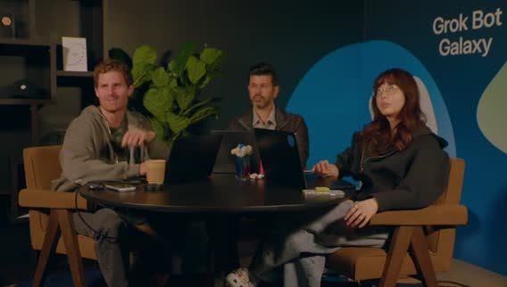

*1:41:30 · brb tech issues*

「technical difficulties」「be right back」。**実質 BRB**。この間の詳細発言は字幕にほぼ無し／信頼性低 → **欠測扱い。内容を捏造しない**。

### 復帰: Cursor でゲームプロト（ELO・3人ロスター）

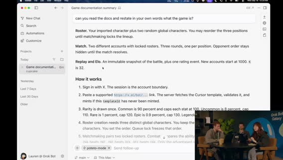

*1:50:00 · elo matchmaking*

Welcome back。72時間でゲームスタジオ＆ゲーム構築、と再掲。PC問題は解消。Lauren は、知識仕事は Grok Bot、深いエンジニアリング反復は **Cursor**。ローカルエージェントを再起動（文脈不足でやり直し）。

リポジトリの docs を読ませ「ゲームを自分の言葉で」再掲確認: 短い対戦ループ、ボットの import、**3人ロスター**、相手にはラインナップ秘匿、**ELO** マッチメイキング。ELO は未経験だが Marvel Rivals 等の論文を参考にできる、と。

プロトでは **サインイン省略**、ローカル完結・**DB不要**、複数プロト候補、**デバッグパネル（スライダーで定数変更）**。

### potato mode prototyping / Architect 多モデル / vanilla HTML 設計

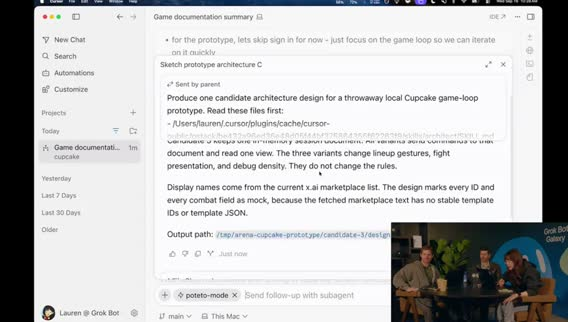

*1:58:00 · vanilla html design*

「use potato mode prototyping」で peestack のプロト節が効く。ゲームは **楽しいことが最優先**。他は後。スライダーで即リプレイし「楽しいか」を検証。

Motion は、プロンプト往復なしで MVP をライブ調整できる playground になる、と評価。peestack 思想: user delight、機能は正当化、少なく上手く出す、**HTMLでデザイン決定は安い**。

**Architect スキル** は、複数モデル（Fable / Sol / Grok / Composer 等）にアーキ案を競わせマージ。プロト段階ではアーキより速さ優先 → **最初のプロトは Grok** 指定。Cursor 内蔵ブラウザでローカル再生。待ち時間に Subway Surfers ジョーク。

Grok 案完成: **vanilla HTML/CSS/JS**、インメモリ、**3 UI バリアント切替**、Marketplace から一覧取得、データ駆動、**状態遷移（ステートマシン）**まで含む長めの設計＋代替案。続きは seg03。

## プロトプレイ・Icon Coffee・Karen新聞

seg03 · ストリーム 2:00–3:00

- **範囲**: ストリーム 2:00:00–3:00:00（クリップ 0:00＝ストリーム 2:00）
- **音声**: `clips/seg03.mp4`（3600秒）成功・mean ≈ −32 dB
- **字幕**: `seg03/seg03.txt` 916 cues（faster-whisper tiny int8）
- **画面**: ゲームプロト遊び／ビジュアル → Icon Coffee（Marcel）挿入 → プロト継続 → **2:29–2:39 休憩/BRB** → ゲスト **Karen Chang**
- **注**: Grok Bot / Dr. Eggbot / Icon Coffee / Karen Chang / newspaper.carenext.com 等は文脈正規化。

### プロトプレイ: シードボット・ステ合計バグ・戦闘ロジック

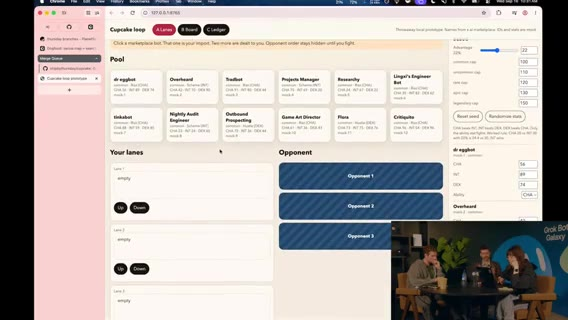

*2:01:30 · seed bots roster*

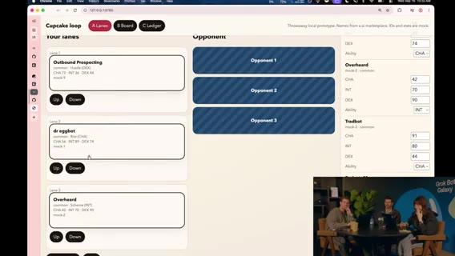

*2:02:30 · stat bug 200*

独立ページプロト／戦闘結果など実装詳細は今は気にしない（ゼロイチ優先で出力を読む）。シードボット例: **Dr. Eggbot** 他。コモン3体抽選（レア運なし）。並び替えUI。誰を先頭に？

Motion（営業気質） は、**Album Prospecting** を先頭に（CHA 72）。アビリティ Hustle。Dr. Eggbot は別アビリティ。バグ発見: ステ合計が **100超（例: 200）** — レアリティ意図か実装ミスか議論。

戦闘デモ: Round1 で Dr. Eggbot が不利（DEX vs INT 等）でもラウンドで逆転。**コアロジックループは筋が通る**、と合意。次は「遊べる自然なプロト」へ。

### ビジュアル参照・画像生成・ラインナップUI

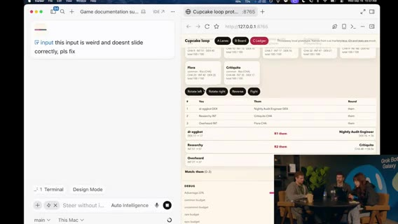

*2:07:30 · combat scores*

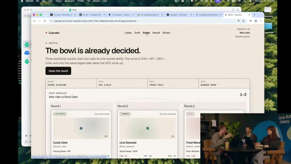

*2:13:00 · marcel intro*

画像生成で画面モック案。コンソール見た目のままではダメ。Motion は、背景でドット系の vibe-coded ビジュアル実験中。Matt もスタイル検討。

Motion画面: ボット順序スライド、将来ドラッグ＆ドロップ。チームはまず **3体固定**。対戦並び／スコア計算／リプレイID（フェイク）／カードバインダー案。

### 挿入: Icon Coffee（Marcel）ユーザーストーリー

SF **Potrero Hill** の **Icon Coffee**。オーナー **Marcel** が Grok Bot ヘビーユーザー。息子の学校開始で親ポータルメールが殺到 → ボットが整理（noise→signal）。

仕事では **Chief of Staff** 的利用。**POS API** で売上メトリクス。メニュー写真を上げて売れ筋分析→メニュー最適化。反復作業を自動化し時間を取り戻す。「未来に住んでいる感じ」。おすすめドリンク: カプチーノ／エスプレッソ。

### アートスタイル・ガチャ発想・Cursor Design Mode

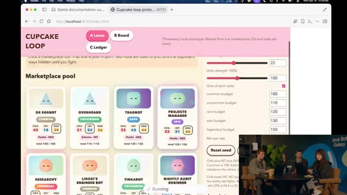

*2:29:00 · cursor design mode*

再開: デバッグツールでメカニクス影響を可視化済み。アートスタイル画像生成を継続。モックはカラフルだがテキスト過多・圧倒的。ガチャ風アニメ（キャラ排出レアリティ）着想。

CSSライブラリでビジュアル効果。コンテナを固めてからデザイン変更可。レアリティメタ: 同じ Dr. Eggbot でも Legendary ロールでステ差 → ベストボット狩り。

フルスクリーン・ブラウザ表示のビジュアル改善。カードスケール調整。チーム画面分離。**Cursor Design Mode** は、ページ要素をボックス／円で囲んでその領域をエージェントに指示。フィード行を別ページへ、等。

デバッグ用に全プール表示は可だが、本番感は「自分の3体から開始」を優先。回転エフェクト追加で見た目がリアルに。ゲスト前に **2–3分オフストリーム休憩**宣言。

### 休憩 / BRB（欠測）

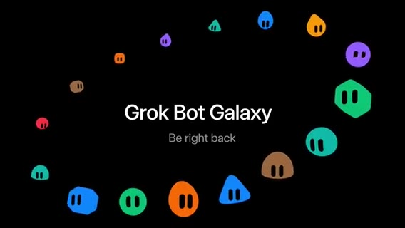

*2:35:00 · brb or gap*

休憩。詳細発言なし／信頼性低 → **欠測。捏造しない**。

### ゲスト Karen Chang（クリエイティブ・テクノロジスト）

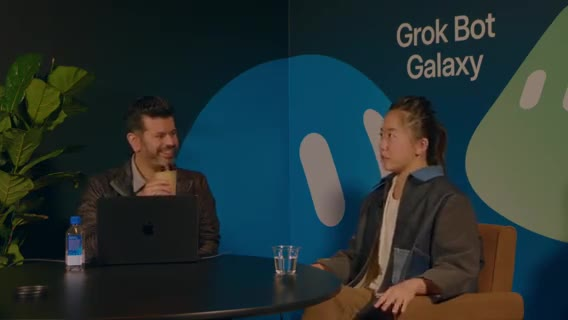

*2:41:00 · newspaper layout*

復帰。Lauren/Matt はビルド継続、スタジオはゲスト対応。**Karen Chang** は、Cursor & Grok Bot パワーユーザー。クリエイティブ・テクノロジスト／映画制作者。フォロワー約 **430万**（音声: 4.3 million）。初期からのヘビーユーザー。

フィジカル連携: カスタム新聞など。チーム構成: タスク別ボット（創造的でない命名）。Chief of Staff、荷物トラッカー、リアリティ番組トラッカー、朝刊ボットをテンプレ試験で **約30体**。非エンジニアなので Cursor のコードで「自分がバカに感じる」ことがあり、**Grok Bot UI が複雑さを隠してくれる**のが好き。Grok Bot 内から Cursor agents も起動。

### パーソナル新聞プロジェクト（overnight print）

先週 Twitter 投稿のプロジェクト: **あなた専用新聞を夜中に印刷** → 朝スマホなしで一日開始。**中身** は、カレンダー／メール由来の予定・荷物到着・天気・やること、Substack 等購読の読書欄、その日のコミック、人生ヒントのクロスワード。

テンプレ公開: **newspaper.carenext.com**（音声ゆれあり）→ Grok Bot に追加。購読はボットがメール購読を列挙しユーザーが選ぶ。本文verbatim＋編集者要約でページ肥大を防止。

お気に入り: 自分の一日コミック（当日イベントにちなんだ絵が出た例）。レイアウト試験、天気質問、メール日2回チェック、Best Buy 等 API キー接続、新聞サイズの描画プロット等（詳細は聞き取りゆれあり）。朝イチスマホチェック習慣を新聞が置き換える狙い。

### スマホ依存・その他自動化tips

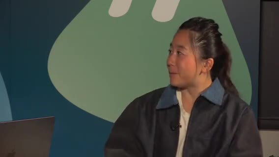

*2:57:00 · backinstock tracker*

問題意識: 朝イチでスマホを見るな、と分かっていても緊急メール／予定変更が気になり抵抗できない → 新聞で情報を先に得る。Motion は、視聴者向けtips — 問題を Grok Bot に渡す（スマホ依存、外出増、スケジュール、荷物追跡等）。AIエージェントで可能だと知らない日常課題が多い。

Karen 追加: 欲しいTシャツの **在庫復帰トラッカー**（日次で色・サイズ確認→アラート）。自動購入も可能だが旅行中は手動に。続き seg04。

## Karen続き・TLDraw／Imagine・ランダー磨き

seg04 · ストリーム 3:00–4:00

- **範囲**: ストリーム 3:00–4:00（クリップ0＝ストリーム3:00）
- **音声**: `clips/seg04.mp4` 3600秒成功・mean ≈ −31 dB
- **字幕**: `seg04/seg04.txt` 964 cues
- **画面**: Karen Chang 続き → **3:03–3:10 休憩/BRB** → スタジオ再開（TLDraw白ボード／対戦UI／Imagine／peestack）→ 4時前にセールストークへカット予告
- **注**: Karen X Cheng / newspaper.carinx.com / Dr. Eggbot / potato mode / peestack / Cupcake Edge（エンジニアボット名）等を正規化。

### Karen 続き: トラッカー群・Instacart×iMessage・要望

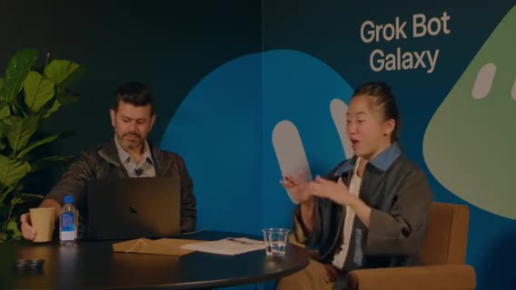

*3:01:00 · stream frame*

パッケージトラッカー、好きな番組の更新／今夜放送アラート（ショーストラッカー）。Motion は、探す情報を Grok Bot がプッシュする「フィード化」が魅力。

Karen は、Grok Bot が **iMessage を制御**（設定変更が必要）。例: Instacart ドライバー位置を10分以内になったらスクショ→友人へ2分ごとに iMessage（Instacart 本体に共有機能が無いのでマルチプレイヤー化）。改善要望: **ログイン管理**。VM がよくログアウト、ローカルと食い違い。サブスク解約ボットもログイン依存。

ラップ: プロッターで新聞印刷したい、とホスト。連絡先 **Karen X Cheng**、新聞ボット **newspaper.carinx.com**（Marketplace Personal カテゴリにも）。短い休憩 → 3日事業ビルドへ戻る、と宣言。

### 休憩 / BRB（欠測）

オフストリーム休憩。**欠測。捏造しない**。

### 再開: TLDraw モック＆対戦UIプレイテスト

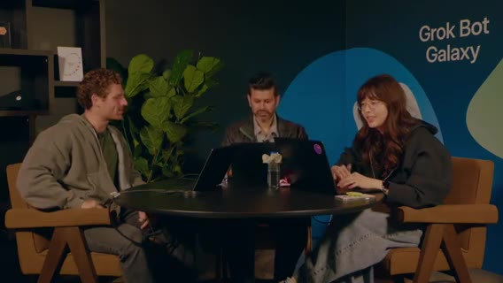

*3:10:50 · stream frame*

復帰。Karen のインターネット接続プリンタがお気に入りデモ、と再掲。休憩中 Lauren がホワイトボード。**TLDraw** でゲーム画面／ログイン等の荒いモックを手描き（ボットに任せず頭の整理）。

ライブプロト: チーム編成、1体ずつラウンド進行、相手ボット隠蔽でドラマ性。テキストだらけを避けアニメーション（勝敗演出）が必要、と。フェイクログイン画面・ロゴ実験。「Diamond」等のUI案。数字の見せ方議論。

### ドラッグUI・チートデバッグ・Imagine アセット方針

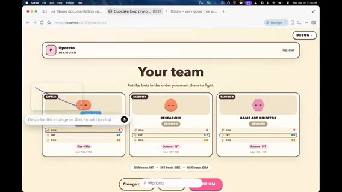

*3:20:30 · stream frame*

ドラッグ可能カード、不要UI削除、最新版リフレッシュ。エージェントの push 確認。「まず動かす」。

キャプテン選択、Dr. Eggbot を編成。ステが弱い → デバッグパネルでアビリティ／数値チート（本番前に隠す）。ボット見た目が地味 → **Grok Imagine** でアビリティアイコン。敵は「テキストと数字の過多」。

Matt の Imagine パイプライン: Imagine + **FAL / BiRefNet V2** 背景除去で透明PNG。ポップアップ時代の Airbnb 風スタイル実験の延長。議論: PNG だと JS アニメしにくい → スプライトシート／SVG／コード表現。結論寄り: **ボット本体はコード表現を維持**、Imagine はスキル／アビリティアイコン中心。

### Dr. Eggbot の「魂」・ラベル・Comments to Go

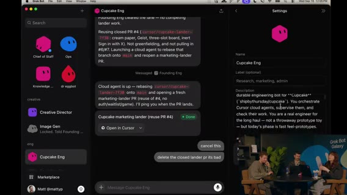

*3:35:30 · stream frame*

Dr. Eggbot がボットをコピー。**description ≈ soul / system prompt**（声・専門性）。専門家に寄せる。メタ教訓: エージェントは一度の失敗からスキルに過剰具体を書きがち → 再利用性が落ちる。**potato mode の原則**に戻して書き換えさせる。

Dr. Eggbot の QR 共有。ボット **ラベルは現状ほぼコスメ**（Tater / Hash Brown 等のフード名整理用）。Steve=CoS、Tater=エンジニア。potato 原則で Cupcake Edge を書き換え → クリーンに。

**Comments to Go**（コメント殺し屋）スキル は、エージェントがコメントでワークアラウンドを正当化しがち → 根本修正を促す。Sicko ミーム由来。Cupcake Edge のジョブ定義: peestack / potato mode / cloud agents をオーケストレーションし検証。

### ランダー磨き・サーバ権威・Cursor マルチタスク

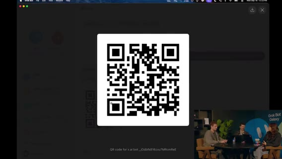

*3:52:00 · stream frame*

ランダー本地起動。ヘッダー固定、デバッグメニューは feature flag でもコードが残るリスク → 競争ゲームでは **マッチ／戦闘ロジックはサーバ駆動**必須（コンソールでステ100万チート防止）。新ボット「ミント」UI。Design Mode で不要コピー削除。カード回転時に数値がカードに追従するよう指示。

Cursor **Multitask mode** は、複数箇所をタグ→ Start multitasking でサブエージェント並列（デザイン磨きに最強）。仮ロゴ「Cupcake」気味。ゲーム名は後回しでもよいが、アセット生成は進行中。

カードにシマー演出。サインインが最初に来る導線は微妙、等。プレイテスト重要。プレイヤーフィールを合わせる。

検証可能な出力をエージェントに作らせると強い、と。ブラインド: キャプテン＋残2は隠す／リロールは残しつつ非選択ボットを先に隠す。

### ラップ＆次アクション → メインステージへ

残り2分。次: 気に入ったランダーのデザイン継続、コアゲームループ改善、**認証追加して外に出す**、プレイテスト。**45分〜1時間後**に進捗共有。3日旅の中盤、SF。本番投入は怖いがコアループはワクワク。

メインステージ「Grok Bot for sales」へキック。続き seg05。

## Sales（Crystal）・Matt Iberman

seg05 · ストリーム 4:00–5:00

- **範囲**: ストリーム 4:00–5:00（クリップ0＝4:00）
- **音声**: `clips/seg05.mp4` 3600秒・mean ≈ −30 dB
- **字幕**: 692 cues
- **画面**: メインステージ「Grok Bot for Sales」（Crystal デモ＋Q&A）→ **~4:33–4:43 切替/BRB** → ゲスト **Matt Iberman**（家族Ops・Marketplace売却等）
- **注**: Crystal / Chris、Grok Bot、Gong/Granola/Salesforce MCP、Matt Iberman を正規化。

### セールストーク導入: AI成熟曲線とスタッフ機能

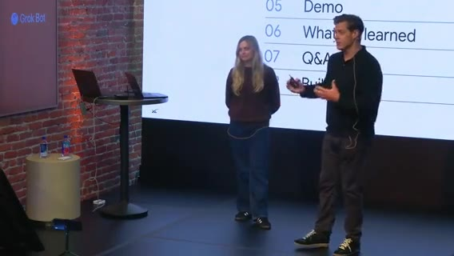

*4:00:30 · stream frame*

マーケットプレイスのセールス用例。**Crystal** がデモ → 学び → Q&A → ハンズオン。成熟曲線: チャット質問 → タスク指示 → **ボット／エージェントにワークストリーム委任**（「パイプライン作れ」「X社とミーティング取れ」）。

将来像は **スタッフ機能**（機会・タスクに特化したボットチームが協調）。UIは iMessage 風の簡易さ。ジョブ別ボット＋メモリ。自分／職務を最初に教え、ログインを渡して反復作業を委譲。Automations / Routines / Skills。テンプレ共有（Crystal がチームに配布）。

Why Grok Bot は、人がいる場所で会う、目的共有、成果物共有で加速。

### ユースケース群と Crystal のボットチーム

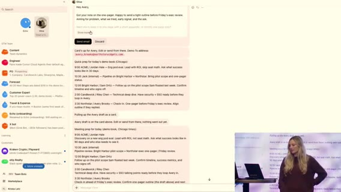

*4:11:40 · stream frame*

パイプライン、**Echo**（コール理解・インサイト）、Chief of Staff、フォーキャスト。Crystal のチーム紹介: Discovery 後の次アクション／用例を **Granola** レポートからデッキ更新、顧客エキスパート、Slack ノイズからキー項目、機能要望→出荷時に顧客へ「未来が来た」通知、エンジニアボットに同僚のように依頼。

デモ画面: CoS がバス通勤中（不安ピーク）でも日次準備・9AM ミーティング準備・メール下書きカード。Morning inbox ルーチン。トークン節約tips: ルーチン頻度を下げるとノイズ減。

アウトリーチ: 約1000社。CTO/CEO の投稿など **パーソナルフック**を引きメッセージ整形（会社だけでなく個人に寄せる）。

### コンタクト抽出・コンテンツ視聴・経費・X

関連コンタクト抽出、要アクション整理。Grok Bot は思考／調査パートナーだけでなく **doing partner**。顧客コンテンツ視聴→メール下書き。同僚＋自前PC、夜間プロスペクティングで朝にメール準備。毎日20%増やす、等。

旅費・経費。**X API** 接続（LinkedIn の会社情報が古い問題の補完）。ウェビナー視聴で次の一手の答えをコール中に早く出す。

### 学び3点と Q&A（トークン・MCP・Notion/Slack）

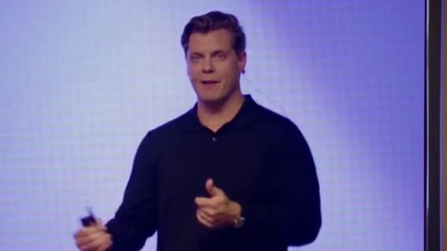

*4:30:00 · stream frame*

Tips は、(1) 日常スタックを接続して time-to-value、(2) **1ボット1ジョブ**（専門家としてオンボード）、(3) Routines を set-and-forget。Q トークン: ルーチン頻度削減、専門ボットに寄せる。

セールスツールは MCP が弱いことが多い → **MCP があるなら MCP、無いとき computer use**。標準出荷例: Gong、Granola、Salesforce。逆にルーチン多用派はコスト高めだが「最適化tipsを Grok Bot に聞け」。ファーストパーティモデルでコスト抑制。

Notion/Slack に情報が散在 → Grok Bot を外層に。Cursor Cloud Agents を Grok Bot から起動可。顧客数が多い場合のボット分割は好み。

### 切替 / BRB（欠測）

トーク終了〜次ゲストまでギャップ。**欠測扱い。捏造しない**。

### ゲスト Matt Iberman: 家族Ops・転売・スポンサー・オンボ

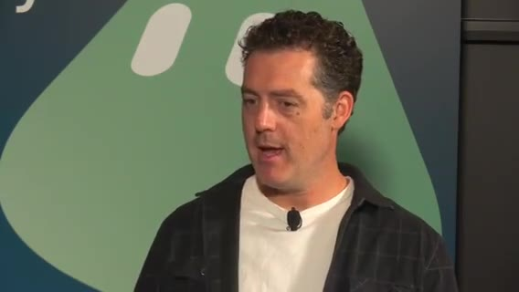

*4:51:40 · stream frame*

**Matt Iberman**（好きな Matt の一人、とホスト）。動画編集AIの Alex 等も話題。メタ: 個人問題はビジネス問題に直結。

昔は Mac mini 自前アシスタント構築が大変 → いまは Grok Bot が複雑さを抽象化。家族 Ops に加え: 家中の不用品を集め **Facebook Marketplace / eBay** にリスト。マウンテンバイクは対面、他は発送。調査・完全な出品文・質問自動応答・値引き相談をエスカレーション。PlayStation / MacBook 売却済み、バイク交渉中。

個人の値切り＝ベンダー交渉にそのまま転用可。Iberman のビジネス: 動画スポンサー。広告ユニット／価格／在庫／過去関係をボットが把握し提案支援。

オンボ: Cursor→xAI 合流期に Grok Bot で情報検索。**Lee Robinson**（@leerob）言及。Slack/Wiki 漁り代わりに「誰がオーナー？」と質問。文脈検索コスト削減（複数メール／Notion／Slack／Drive）。金曜脳死状態でも「いつだっけ？」で救われる。

Microsoft Recall との対比（プライバシ論争）。Grok Bot は違うが「17箇所に散ったものを思い出さなくてよい」価値は同じ興奮。続き seg06。

## PG&E・Intern・Remotion広告・Starbase

seg06 · ストリーム 5:00–6:00

- **範囲**: 5:00–6:00 / 音声 OK（mean ≈ −32 dB）/ 867 cues / jpg 多数
- **流れ**: Matt Iberman 続き → エンジニアリング/SDLC 談 → **Forward Deployed Intern**（Stanford）→ ゲームスタジオ広告/Remotion → Starbase コンテスト告知 → Simon（SDR）トーク開始

### Iberman: オプトイン共有・PG&E プラン最適化

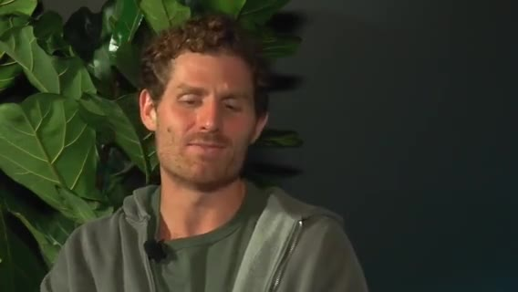

*5:00:45 · stream frame*

セキュア接続で個人サービスも連携、と。PG&E メールのスクショを渡し、過去12ヶ月請求を見てプラン変更すべきか判断依頼。ログインだけ渡せば **約$1,000節約**案（EV・オフピーク充電向け）。今朝切替。数学は二重チェック。

### 認知負荷とオーケストレータ（Steve）

ホスト: エージェント増やしすぎてコンテキストスイッチが重い。Lauren の **Steve**（CoS）オーケストレータ→サブエージェント展開。チャットに「もう Chief of Staff やめろ」ネタ。コーディングエージェントと同じ扇出しモデル。

別ピースが必要、と続く議論（ワークフロー詳細）。

### 大規模コード／Nokia・SDLC 再設計・オフストリーム告知

Nokia 製品開発で **5,000万行**規模のコード分析言及（ゲスト/話者側の経験談）。エンジニア／アーキテクトの役割が「エージェント監督・ツール呼び出し・協調」へ。SDLC 全体を再設計中、と。

スタジオはオフストリームでプロトをスケーラブルなゲームシステムへ再実装中。数分でフルチーム復帰予定。

### 初の Forward Deployed Intern（Stanford）

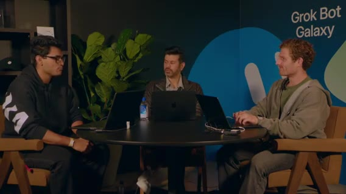

*5:15:00 · stream frame*

「インターン採用」。自己紹介: **first forward deployed intern**。本業はコーヒー物流も担当。Stanford rising junior。就職活動ボット: カバーレター生成、スイート求人応募ボット、企業研究／バリデーション。自分を売り、エージェント志望のインパクト記述。

**フィードバックループ**を失わないよう成果を保存、等。

### ゲームスタジオ: 広告・Remotion・アスペクト比

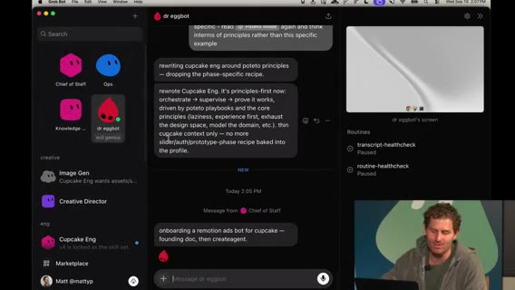

*5:37:00 · stream frame*

ゲームスタジオで未カバーだった **GTM／広告**に着手。動画生成モデル必須ではない。プラットフォーム別アスペクト（まずは **1:1**）。X 広告向け **Remotion**。

Steve → Dr. Eggbot → Remotion ads ボットを Cupcake Edge 向けにオンボード → Cursor Cloud Agent。Steve が Remotion プラグイン／skills を自動インストール。peestack / potato の話題、Lauren が Twitter で話題、と Iberman。

### ラップ・Starbase コンテスト → SDR トークへ

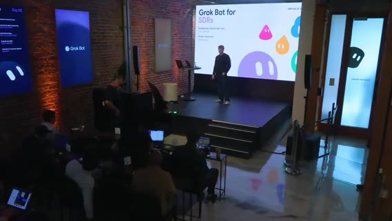

*5:58:30 · stream frame*

48時間の楽観的振り返り。ブラウザでスナッピー。カードはシンプル志向（詳細過多を減らす）。インターンのプロジェクトに A+。プロフィールフォロー促し。

**Starbase Texas** キャンペーン: お気に入り Grok Bot テンプレ共有で Starship 打ち上げ観覧（本人＋1）。QR。準優勝は工場ツアー系。締切 **September 29**。@grok の投稿も参照。メインステージへカット。

**Simon**（xAI Go-to-Market / SDR）が登壇開始。続き seg07。

### 補足ディテール（ノート追記）

ROI 比較の話（何に時間を使うか）。個人オートメーションの回収が明確。音楽／ローファイを流しながらエージェント待ち、という作業スタイル言及。

Intern は、Stanford rising junior／コーヒー物流＋就活。カバーレター＋求人応募の2ボット体制。自己マーケティング／レター発見。エージェント志望をカバーレターに反映。

就職はフィードバックループが重要（成果を保存しないと学習が途切れる）。広告・コマーシャル視点もゲームスタジオに必要。

「作ってネットに出せ」主義。ストリーム自体がその実践。最新ブラウザでプロトがスナッピー。カードUIは holistically シンプルに戻したい。

## Simon SDR・Eggbot特典・スタジオ3D

seg07 · ストリーム 6:00–7:00

- **範囲**: 6:00–7:00 / 音声 OK（≈−29 dB）/ 959 cues / ~80 jpg
- **流れ**: Simon SDR トーク → Dr.Eggbot 無料月プロモ → スタジオ復帰（キャンペーン／Slack・Notion ボット／PR／3D検討）

### SDR: Copilot→タスク自動化→ジョブ自動化

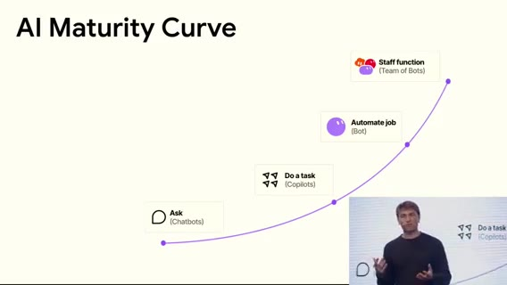

*6:01:20 · stream frame*

Simon（GTM/SDR） は、Copilot は往復コピーから **Gmail MCP/API で送信まで**。次フロンティアは **ジョブ全体の自動化**＋ボット・スタッフ（RevOps/AE 文脈結合）。左ペインに複数ボット（セールスアウトバウンド等）。数ヶ月前は動かなかったことが今日動く速度感。

エンドツーエンド＋テンプレ共有の価値。同僚のように文脈を取り込み（GFW＝Grok?）。

多数タスク並列 → **Chief of Staff 推奨**で扇出し。

### CoS が時間配分を学習・メール品質・組織図

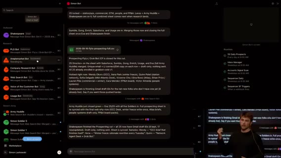

*6:24:00 · stream frame*

CoS が自分の時間の割り方を学習。Gmail 下書きを一覧し、CoS に「返信確率スコア」を依頼。声のトーン訓練が重要。初期はテンプレっぽい置換メール → 個性付けを反復。

相手が本当に気にする話題で語る。組織図上の位置／シーケンス支援。

プロダクト利用度などシグナル。

### 日次ルーチン・スケール・Q&A

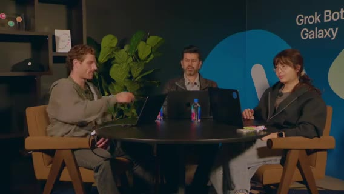

*6:40:00 · stream frame*

自社を自社プロダクトの顧客に（dogfood）。日次: 50 prospects + 50 leads ルーチン。コンテキスト全載せでハードに回す派も。

Web search 部隊を5→20人にスケールしやすい構造。トーク終了。QR 再掲。

### オンストリーム特典

**無料1ヶ月（最高ティア相当・約$200価値）** は、Dr. Eggbot テンプレでボット作成・インストール体験。ストリーム限定。

### スタジオ復帰: キャンペーン・チケット・3D

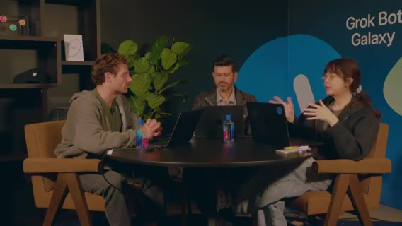

*6:57:00 · stream frame*

ゲームスタジオ／ゲーム事業。約2日経過。ゲスト多数、並行ビルド。3D 版イテレーションの可能性。

ボイスモードで一斉スタート等。Lenny Rachitsky シャウトアウト。

Slack にキャンペーン正本を通知 → founding engineer が PR 流入を確認。専門ボット: Notion 更新専用、Slack @メンション専用。PR マージで Notion 更新。タスクリスト＝簡易チケットシステム。

アプリ未完成。プレイテスト／バックエンド／3D クライアント検討。**3D はバトル部分だけ**でも可。ボット→3D 表現は標準シェイプ案。待ち時間の可視化が課題。続き seg08。

### 補足ディテール（ノート追記）

「3ヶ月前は動かなかったことが今日動く」変化速度。BR／リード運用の具体（聞き取りゆれあり）。

CoS がカレンダー／集中ブロックの好みを学習し割り込みを減らす。初期アウトリーチがテンプレ置換だらけ → 声・事例で矯正。

各ボットへ直感的にプロンプトする運用。毎日ハードにコンテキストを流し込む派 vs ノイズを嫌う派。

デッドライン意識しつつ 3D／西南モチーフの実験。キャンペーン文書・その他アセットが Notion/Slack に集約されつつある。

## Glow／Cursor Projects・CSデモ

seg08 · ストリーム 7:00–8:00

- **範囲**: 7:00–8:00 / 音声 OK / 812 cues / ~85 jpg
- **流れ**: スタジオ（potato swarm・Glow 3D・Cursor Projects）→ Dr.Eggbot 無料月再告知 → メインステージ **Customer Support** デモ（Stripe 返金等）

### プロトボット swarm・Glow（3D）・Notion

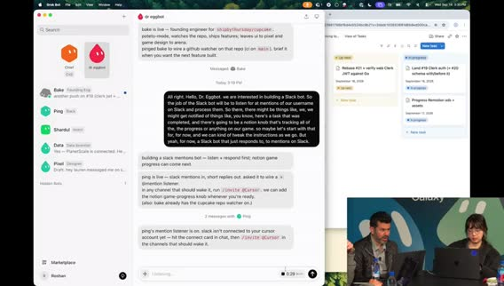

*7:00:40 · stream frame*

potato mode で複数フロント／プロトタスクにエージェント swarm。気に入ったプロトをマージ。PR 流入継続。メカニクスが plain → 改善はローンチ blocker ではないが早めに考えたい。

新ボット **Glow**＝3D プロトタイピング。Motion レーン／システム案を質問。フィードバックを Notion へ。背景ビルドの画面共有。E2E モック完成見せ。

### Cursor Projects・peestack・SFX・ステージ切替

*7:21:00 · stream frame*

**Cursor Projects**（数日前〜先週ローンチ） は、長時間コーディネータがサブエージェントを管理。Multitask より共有メモリ等が強力、と。peestack／Tater mode の reasoning 設定。ボットに個性（Taylor が教えた？）。

3D デモ起動。ゲームエンジン理解が弱い → 修正が必要、とエージェント。SFX を手早く足す案。タスクリスト確認。

メインステージへ。Eggbot プロモ再掲: **先着1000人・ストリーム限定**で Dr.Eggbot 複製→無料1ヶ月（$200相当）。

### CS トーク: 常時稼働の同僚＋チケット自動返信デモ

*7:32:10 · stream frame*

*7:50:50 · stream frame*

Customer support 用例中心・デモ多め・Q&A。Grok Bot＝メッセンジャー風だが送信後も動き続ける同僚。常時オン／Marketplace テンプレが利点の一つ。

Notion をベースにボット＋ルーチンを積み木に。チケット可視化、週次チケット、適用・返信フロー。

デモ: **Carter** → Stripe でキャンセル＋返金実行（active→canceled）。**Damon** → 返金否認（SOP 内部情報は漏らさず曖昧に）＋期末キャンセル提案。**Ana** → Wi-Fi パス共有は KB 外 → public docs 参照で返信。続き seg09 Q&A。

### 補足ディテール（ノート追記）

まだ外部に告知していない要素あり。フィードバックは好感触。背景ビルドの画面共有で進捗可視化。

UI のクリーン版。追加モック探索。

効果音をエンジニアリングで即追加できないか。CS 利点: 常時オン、委任プロジェクト、Marketplace テンプレ検索不要なほど揃う可能性。

チーム全員がチケット可視性を共有。チケット適用→返信のループを少労力で回す。

Ana の Wi-Fi パス共有は public docs 参照。Elena へも返信指示。締めメッセージ「Second, start simple」。

## CSコスト・デプロイ締め・See you tomorrow

seg09 · ストリーム 8:00–終了

- **範囲**: 8:00–約8:23（クリップ長 **23:18**）/ 音声 OK（終盤 mean ≈ −41 dB）/ 277 cues / jpg 多数
- **流れ**: CS Q&A（コスト）→ スタジオ締め・デプロイ／遊び → Eggbot 無料月再告知 → **See you tomorrow**
- **注**: 発話はおおよそ **8:20** で終了。以降〜8:23 はエンドカード／余韻（無音ではないが新規発言ほぼなし）。捏造しない。

### CS Q&A: チケット単価

*8:00:45 · stream frame*

価格は Grok／Cursor サブの usage 連動。ループの複雑さ次第。中〜複雑チケットおおよそ **$1–2**。低複雑（返金・メール確認等）は分類スクリプトで先に捌き、一括返信で **約 $0.20／チケット**まで下げた例。

トレース／どのファイルを選んで返信したかを見る運用。Twitter 上のセットアップ動画言及。技術者以外でも更新可能。チケットの **80/20**（20%が複雑）。

### スタジオ締め: 音楽・デプロイ・DB

*8:12:00 · stream frame*

Day2 巻き上げ。音楽案はゲームのバイブに合わず調整。「デプロイに向かう」。ボット次の仕事・ワークフロー接続をどう速くするか。

DB 周りは未テスト。今夜いくつかゲームを遊べるかも、と。

### 最終プロモ＆クロージング

*8:19:30 · stream frame*

再掲は、peestack／Dr.Eggbot 導入で **無料1ヶ月（$200）**。QR。先着1000・ストリーム視聴者限定。「明日も続きを見せる」「アプリを仕上げる」。Thanks chat。

**See you tomorrow.**。

### アウトロ（発言ほぼなし）

*8:21:00 · stream frame*

クリップ残り約3分。新規トークなし扱い。エンド画面／余韻。

### 補足ディテール（ノート追記）

セットアップ手順の Twitter 動画参照。やや技術寄り／非技術寄りの運用分岐。

BGM 選定はゲームの雰囲気に合わせて再検討。「いい value」。

次のボット仕事・ワークフロー接続で速度を上げる問い。「今夜いくつか遊べるかも」。

オファーはストリーム視聴の先着1000のみ。

本文は `notes-seg*.md` の事実を落としつつ、時刻ラベルを外して段落化したものです。ノートにない事実は追加していません。
  画像は記述的ファイル名を優先し、自動連番ファイル名は埋め込んでいません。
