# Grok Bot builds a Game Studio LIVE — Day 2 Recap（日本語記事）

  タイトルどおり Day 2 はゲームスタジオ構築が軸です。厚めノートを時刻印なしの読み物にし、
  スクリーンショットは話題の近くに少数だけ差し込みます（末尾ギャラリーはありません）。
  0:00–0:10 の無音/BRBは埋めず、本編は約 0:10 から。

  **ソース情報（REPORT.md）**
  
    - ソース: https://x.com/i/broadcasts/1PKqrNyvmYwGb

    - 長さ: 約 8:23:19（最終発話おおよそ 8:20／〜8:23 アウトロ）。0:00–0:10 は無音/BRB（真の開始は約 0:10）

    - 方法: yt-dlp replay → faster-whisper tiny int8 → 日本語厚めメモ＋ffmpeg スクショ

    - 欠測方針: 音声が取れない区間は推測で埋めない。BRB 等の無音は無音と書く。

  

  
## ピボット宣言とゲーム骨格・SEデモ

  seg01 · ストリーム 0:00–1:00

  
    - **範囲**: ストリーム時刻 0:00:00–1:00:00（クリップ時刻＝ストリーム時刻）

    - **音声**: （収録クリップ）（約3600秒）成功。**0:00–0:10 は無音/BRB**（mean ≈ −91 dB）。本編音声は **0:10:04〜**（以降 mean ≈ −30 dB）

    - **字幕**: `seg01/seg01.vtt` / `seg01/seg01.txt`（faster-whisper tiny int8 / en）成功・732 cues。最初の発話は 00:10:04

    - **画面**: 円卓スタジオ「Grok Bot Galaxy Day 2」→ Excalidraw ホワイトボード（ゲーム設計）→ メインステージ「Grok Bot for Sales Engineers」（Amrita）

    - **注**: Whisper は Grok Bot を rock-bought / graph / Grockbot / Rockpot / Rothbots / Dropbot 等と誤認。画面表記に合わせて **Grok Bot** に正規化。社名「SpaceX AI」混同あり → 文脈・画面では **xAI**。Motion を Roachon と誤認。Dr. Eggbot はチャット実名のまま。不明箇所は「聞き取り不明」。

  

  
    
### 無音 / BRB（欠測扱い）

    
      

      
*0:00:00 · brb silence*

    
        **無音**。AAC トラックはあるが mean ≈ −91 dB。発言なし。推測で埋めない。

    画面では、スタジオ待機／BRB 相当。スクショ `t000000_brb_silence.jpg`。

    **方針** は、真一さん訂正どおり、実質スタートは **0:10:00**。

      

  
    
### Day2 オープニング＆自己紹介＆ピボット宣言

    「Come in / Hey everybody」「**Day two, Galaxy Live Stream**」。新規チャット向けにクイック自己紹介ラウンド。

    **Matt**（Developer Experience）。音声は「SpaceX」だが文脈は xAI / Grok Bot チーム。**Motion**（Whisper: Roachon）— Product。

    **potato / Lauren** — 「potato things」、いまは Grok Bot（Whisper: graph）周り。

    画面では、円卓3人＋ノートPC。右下に founding bots パネル（tater=engineer, steve=chief of staff, planetscale=DBA 等）。チャット「All day show」「grok bot galaxy」。オーバーレイ「Grok Bot Galaxy Day 2」。`t001004_day2_open_intros.jpg`。

    昨日の振り返り: アカウント準備・ブレインストーム・アイデア合意。**体験型ポップアップ事業**を目指してビジョン／プロト／デモまで進めた。「一晩で気が変わったかも」。

    Lauren は、ポップアップは噛みすぎ。ゲストから **SF の規制・ライセンス**の厳しさの助言。ストリーム映えしない作業になりそう。エージェントにも Overnight で調査させ、**2日では完走できない**フィードバック。視聴者も参加できる・一緒に使えるものへ。

    「**pivoting**」。情熱があり既にやったことがあるものに寄せるのが事業づくりの一部。

      

  
    
### 新方針：ゲームスタジオ＋ Grok Bot テンプレ

    
      

      
*0:11:45 · pivot to game*

    
        
      

      
*0:13:00 · game studio pitch*

    
        新アイデア: 視聴者／現地参加者も **自分の Grok Bot テンプレート**を作り、それで遊べる仕組み。「一番楽しいのは **gaming company**」。ゲーム／ゲーム事業を今日の新ビジネスに。最初のビジョンは **みんなの Grok Bot で一緒に遊べるゲーム**。

    午前は 20–30 分ライブホワイトボードでビジョン整理 → Lauren が MVP 計画 → トーク挟みつつビルド継続、が今日のフォーカス。画面共有要求。Excalidraw 系ホワイトボード起動。「Grok Bot Templates!!」`t001230_live_whiteboard_start.jpg` / `t001300_game_studio_pitch.jpg`。

    （画面共有中）Grok アプリ内でボット共有 は、skills / routines / 選択的メモリ等。PM 向けに育てた賢いボットを他人に渡せる、というテンプレ共有の話。**チャット反応** は、「Smart pivot with the 2 day time limit」「Gamification is the way」「Loving my new bot Dr eggbot」。

      

  
    
### コアゲームデザイン（キャラ化・ステ・レアリティ）

    
      

      
*0:18:30 · stat pool 100*

    
        コアアイデア: 各自がアップロード／作成したキャラで **みんなで軽く対戦・共有**。楽しく軽量にイテレーション。初期プラン: **Grok Bot テンプレ → ゲーム内キャラ**への変換を簡単に。ボットのチームを組む。

    **ホワイトボード流れ** は、`Grok Bot Template → Character in a game → Compete head to head`。ステ CHA / DEX / INT と Ability 対応。`t001600_screen_share.jpg`。各ボットに **stats**（例: CHA / DEX / INT＝カリスマ・器用さ・知力）。お気に入りゲームから着想。加えて **ability（アビリティ）**。

    シンプル版: メインボット＋追加ドラフトで **チーム3体**スタート。例は、**Dr. Eggbot** をチームに入れる想像。チャットでも Dr eggbot 言及あり。

    テンプレからキャラへ「ミント」すると似たステが出る、という発想。**総ステータスプール 100** を3ステに分割。ボット説明文を LLM に食わせて配分（社交的→CHA 高め、多サービス接続→DEX 高め等）。合計は常に100。

    ステ0は変 → 最低値議論（10 → 最終的に **最低1** 方向）。Diablo 系アクションRPGのアイテムレアリティ着想。**Dr. Eggbot は Legendary 必須**（ジョーク合意）。

    レアリティで総ステ上限をブースト: base=100、rare / ultra / legendary 等で分割。数字は後で詰める。`t001830_stat_pool_100.jpg` `t001920_rarity_legendary.jpg`。

      

  
    
### マネタイズ（Pay-to-win 回避）とスタジアム広告

    
      

      
*0:21:00 · monetization cosmetics*

    
        
      

      
*0:23:30 · prototype matchup*

    
        ゲームスタジオとして現実味を残すなら収益も必要。ただし **pay-to-win は嫌**（ゲーマー視点で同意）。パワー課金ではなく **楽しいアップグレード／コスメ**。チームを SNS 共有・ドラフトのバイラリティ。戦場／アリーナアクセス課金の可能性。

    「かっこいい帽子に1ドル払う」として、Flux / Imagine API（Whisper: rock Imagine）でユニーク見た目のアイテム。ホワイトボードに cosmetics / unique items をメモ。

    対戦の場 = アリーナ／**スタジアム**。スポーツのようにスタジアム内 **広告**（ゲームバランス非干渉）でマネタイズ＋視聴フライホイール。リプレイ／共有リンクも検討。`t002100_monetization_cosmetics.jpg`。まずプロト。ゼロイチは成長優先、マネタイズは後からレイヤー。

      

  
    
### 対戦プロト・運営バケツ・MVP 方針

    
      

      
*0:30:40 · sales eng session start*

    
        
      

      
*0:34:00 · bots have computers*

    
        チーム編成 → 相手チームとアビリティ対決。サンプルステで CHA 対 INT などのヘッドトゥヘッド。`t002330_prototype_matchup.jpg`。作成時の特殊ブースト・ロール、毎回違う対戦感、リプレイ視聴。

    超シンプルMVP: チーム編成＋軽いマッチメイキング（相手は事前ラインナップ）。ディストリビューション: ランディングページ、発見性、広告、次の休憩後のゲスト、シード資金の話は後回し。

    CS は、電話番号／**X チャット API でコミュニティ対話**。古典的事業オペ（サポート等）も Grok Bot 群で回すアングル。`t002520_ops_distribution.jpg`。将来拡張: スタート配列、アビリティ変更、アリーナ特性。まず **タイトな初期版**を作り、進化余地を残す。

    （画面／エージェント側）申請検証チェックリストや疑似コード等の詳細ドキュメント言及。「最初のトークがセールス＆シェアでライブ中」→ **メインステージへカット**。`t002940_cut_to_main_stage.jpg`。

      

  
    
### トーク: Grok Bot for Sales Engineers（Amrita）

    
      

      
*0:41:50 · three bots intro*

    
        
      

      
*0:45:30 · flylow demo intro*

    
        画面では、レンガ壁＋ステージ、オレンジトップの登壇者。`t003000_midhour.jpg` `t003040_sales_eng_session_start.jpg`。

    セッション題: **Grok Bot for sales engineers**。日常使いの **3ボット**デモ（うち2はサンドボックス、1は実顧客向けケーススタディ資料作成）。初見向け概要 → 他製品との違い → ユースケース → デモ → 終盤Q&A／現地ビルド時間。テーブルのコースターに QR → マーケットプレイスのテンプレ。

    スライド: タスク一発チャットから **チームの同僚ボット**へ。完成した成果物を返すのが価値。ダウンロード案内: Android / iOS / Mac。

    **ボットは自分のコンピュータを持つ**。各サービスを全部手で繋がなくてよい。例: 昨日の Google Form 自作、MongoDB ログイン分析。PC画面を監視・テイクオーバー可。エンタープライズでアクセス制限。`t003400_bots_have_computers.jpg`。**Automations / Routines** は、毎朝ニュースレターをメールから拾い Slack ダイジェスト。分散チームの force multiplier。ボット共有（チーム／マーケットプレイス）で一貫性。

    使いやすさ: 起動すると用途を聞いてくる。今日はボットに「自分のチームを雇うなら？」と聞けるデモ予告。ゴールは待ち続けではなく **finished work** に戻ってくること。`t003800_finished_work_pitch.jpg`。

    SEユースケース紹介。セキュリティ／メモリ／Linux VM 等の技術質問対応。**Sherlock** は、リポジトリにアクセスする技術エキスパート。顧客質問に答えつつ IP 漏洩しないようステア。平易な言い回し。

    **Serena Williams**（テニスファン命名） は、競合インテル。**競合製品を自分のコンピュータで実際に触り**差分・ロードマップ示唆。**Echo**（後続セッションで Chris/Mark 等） は、顧客コール中にデッキをライブ編集。Amrita はコール前にマスターデッキから顧客向けにキュレートする使い方が多い。

      

  
    
### デモ1: Mimi（Customer Proof Point Researcher）

    
      

      
*0:52:00 · southwest booking flow*

    
        
      

      
*0:57:00 · group chat bots*

    
        今日の3体: **Mimi**（スライド／顧客プルーフポイント研究）、**Sherlock**（技術）、**Serena Williams**（競合）。`t004150_three_bots_intro.jpg`。

    画面では、Amrita Venkatraman アカウント。サイドバーに FE Work / Marketplace。Mimi の Computer タブで「Mimi's screen」。`t004320_mimi_case_study.jpg`（※ファイル名は時刻ベース、中身は Mimi 作業画面）。

    ケーススタディテンプレ統一: **Problem / Solution / Impact / Quote**。例: Starlink 公開ブログ、Jellyfish（Cursor でコードレビュー）スライド。ロゴはブランドページから取得。ライブ課題: Salesforce Engineering ブログ「Cursor AI がレガシーコードカバレッジを大幅改善」（音声: 855% — 数字は聞き取り／誇張の可能性、画面URL優先）を渡し「Salesforce 用スライドもう1枚」。`t004400_salesforce_blog_task.jpg`。

    Mimi のコンピュータを開くとボット自身のカーソルでスライド編集。完了後に提示。作業中に Sherlock / Serena へ切替。

      

  
    
### デモ2: FlyLow × Sherlock × Serena

    
      

      
*0:59:00 · mcp not blocker close*

    
        デモ企業 **FlyLow**（音声: Fly-Low）— Expedia / Google Flights 風のフライト予約デモ。フロント／バック／社内ツール一式。Sherlock が repos と flylowair.com にアクセス。`t004530_flylow_demo_intro.jpg`。例は、同時予約／同一座席のレースコンディション。Sherlock が **Cursor Cloud Agents** を裏で起動（ノートPC閉じても継続）。

    顧客向け説明案: チェックアウト開始で最後の座席を **10分ホールド**、先に始めた人が優先、等。メール／Slack 送信も承認付きで可能。Serena は、競合の changelog / リリース / ブログ監視。週次ルーチンで Expedia / Kayak 等を要約可能。

    AI トラベルエージェント機能の有無を競合で調査し、Sherlock に FlyLow 実装コストを聞くタスク。「FlyLow と比較すべき競合は？」→ Serena が Sherlock にベースライン確認メッセージ（検索・運賃・座席・荷物等のギャップ）。

    ステア: 予約フローだけでなく **AI travel agent 能力**も見て、と追加指示。メモリで複数依頼を同時保持。Serena が **Southwest の予約フローを自コンピュータで実行中**（画面右上）。人手で競合を一歩ずつ触る時間をアウトソース。`t005100_serena_competitor.jpg` `t005200_southwest_booking_flow.jpg`。

    マルチタスク: 予約フロー検証と AI agent 調査を並行。`t005450_multitask_steer.jpg`。Sherlock 側で Cursor cloud agents が backend / frontend に起動。Grok Bot ↔ Cursor 連携。`t005530_cursor_cloud_agents.jpg`。

      

  
    
### ボット同士のグループチャット＆「MCP不要」メッセージ

    
      

      
*0:10:04 · day2 open intros*

    
        ボット間のやりとりをグループチャットで可視化（昨日も紹介）。Sherlock ＋ Serena Williams を同じチャットへ。`t005700_group_chat_bots.jpg`。「競合のキー差別化で、低工数で自社に入れられるものは？」と質問 → 両ボットが既存コンテキストを共有して議論。

    結論寄り: Southwest / Expedia に無い **AI travel agent** がモートになりうる → Google Docs / Atlassian / Confluence 等へすぐ接続。プラグインが無いツールでも **コンピュータにログイン**すれば可。重要メッセージは、**MCP や API が無いことはブロッカーではない**。ボットは自前PCを持つ。例: **Power BI**、**MongoDB**（マーケットプレイスにプラグインが無くても利用可）。`t005900_mcp_not_blocker_close.jpg`。

    「マーケットプレイスにボット／プラグインが無くても…」（セグメント境界、続きは seg02）。

      

  
## Teach／spin-up・Q&A・スタジオ再開とBRB

  seg02 · ストリーム 1:00–2:00

  
    - **範囲**: ストリーム時刻 1:00:00–2:00:00（クリップ 0:00＝ストリーム 1:00:00）

    - **音声**: `clips/seg02.mp4`（約3600秒）成功・mean ≈ −31 dB

    - **字幕**: `seg02/seg02.vtt` / `.txt`（faster-whisper tiny int8）816 cues

    - **画面**: Amrita SEデモ続き → 会場Q&A → スタジオ（Matt/Motion/Lauren）ゲームビルド → **1:41–1:48 BRB（技術トラブル）** → Cursor でプロトタイプ再開

    - **注**: Grok Bot / peestack / potato mode / Dr. Eggbot / Sherlock / Serena / Mimi は画面・文脈で正規化。xAI。不明は「聞き取り不明」。

  

  
    
### Teach a Task（画面録画でスキル学習）

    
      

      
*1:01:08 · teach via recording*

    
        Amrita続き: Sherlock / Serena にタスクを教えられる。Serena は Southwest 予約をコンピュータで継続中。Sherlock の画面をテイクオーバーし、競合の Hub changelog 等で技術ポストを探す手順を教える。

    **最大のレバーの一つ = ビデオ録画で教える（Teach a task）**。Google を開いて操作を録画→一時停止で完了。録画からスキル学習完了。Southwest / Spirit / Skyscanner / Google Flights 等へ同じスキル適用可。AI関連ブログを重点監視、とボイスで注釈。

    スキルは作成したボットに限らず、**マーケットプレイス経由で他ボットも利用**可能。

      

  
    
### グループチャット協調＆ボット間タグ

    Sherlock×Serena グループチャット: 管理予約は競合のテーブルステークス、フレキシブル日付カレンダーはFEに既にある／低工数、往復・荷物は大だが低工数ではない、等を議論。ボット同士が **@タグ**で特定ボットに質問できる（人間がタグしてもよい）。

      

  
    
### ボットがボットを spin up

    
      

      
*1:08:00 · mimi salesforce done*

    
        Sherlock（＋Serena）に「競合差別化／SE向けで役立つボットを spin up して」と依頼。**リトルノーン: ボットは他ボットを起動できる**。例: Chief of Staff に日常向け3体（inbox / scheduler / calendar）を作らせる。

    初見SE向け: 顧客POCデモ用に「役立つ3体を作って」と頼め、と推奨。

      

  
    
### Mimi: Salesforce スライド完成 → Grab 追加

    Mimi は、Salesforce ペア作業中。ログイン詰まり → Amrita がコンピュータをテイクオーバーして支援。**2枚のスライド完成**（正しいロゴ、Problem/Solution/Impact/Quote）。所要おおよそ10–15分。

    追加: Grab の公開ブログ（Cursor 利用事例）でも同様に依頼。複数顧客を一度に投げても可。Echo 連携イメージ: コール中にスマホから「このスライド隠せ」等。ノートPC不要でケーススタディ量産。

    週15–20顧客分のスライドがボトルネックだった仕事をテンプレ＋メモリで加速。公開ブログは Cursor 公式ではなく顧客側投稿をクロール。

      

  
    
### Spin-up 結果: Battle Card Blair / Demo Drake / AI Radar

    
      

      
*1:12:50 · battle card blair*

    
        
      

      
*1:14:20 · ai radar*

    
        Sherlock が3体を起動。**Battle Card Blair** は、Serena の競合実機調査＋Sherlock のコードベース → SE向けバトルカード（claims / pilot reality 等）。

    **Demo Drake** は、デモ／トークトラック。主張は Sherlock にグラウンド。必要なら Serena / Blair から対比を取得。**AI Radar** は、競合テックブログの AI 記述を追跡。先に教えたスキルを使用。真実源は Sherlock、実機フローは Serena。

    社内ジョーク: 「できる？ → Ask Grok Bot」。モデルが **No と言える／押し返す**のも利点、と。

      

  
    
### Q&A（Captcha・MCP・本番安全・トークン）

    
      

      
*1:18:40 · mcp vs computeruse*

    
        ラップアップ → 会場Q&A。質問：ボットが他サイトでログインするとBANされないか。A: CAPTCHAで止まるサイトあり。エンタープライズは **ボットPCでサイトブロック**推奨（業務不要な Facebook 等）。

    質問：Computer use vs MCP。A: 現状 Google Docs 等は MCP の方が速いことが多いが、computer use は高速化見込み。**監視・ガードレールは今は MCP が有利**（whitelist/blacklist）。将来 computer use にもガードが増える想定。質問：本番変更／マルウェア。A: ハードニング継続中。Skills のルールで本番デプロイ禁止等。Settings の **Auto review** に言及（聞き取りやや不明）。

    トークン課金: 会話＋コンピュータ使用が消費。**Grok（音声: graphbott 6）**は安価で高効率を狙ったモデル、と。スライド一式のコスト感: **約 $20–30**（手作業なら4–5時間相当）で再利用可能。冗長トークンは「短く話せ」と指示で削減可。

      

  
    
### スタジオ再開: ランディング＆ peestack / potato mode

    
      

      
*1:26:50 · potato mode*

    
        
      

      
*1:31:00 · dr eggbot engineer*

    
        Lauren オフライン気味 → Matt が break 中の Cloud Agents セットアップを画面共有で説明（「backseat driver」）。**Dr. Eggbot**（エンジニアボット作成役）＋ founding engineer がランディング作業。Lauren の計画ドキュメント／モノレポを共有コンテキストに。

    Lauren方針: **ゆるいプロト**（ログイン不要・DB不要・ハードコード可）で見た目の遊びを先に。Matt は、ランディングが第一ゴール。個人スキル **project planning**（T3 / TanStack / Expo / Vite 等のスキャフォールド嗜好）＋ **make interfaces feel better**（Twitter発のUI磨きスキル）。

    MVP は、Bun ベース lander（create-next-app 系）。OG メタタグ／サイトメタを必ず入れるポリッシュ。Grok Bot が「引き算してから足す」方向へ自己修正 → Cursor Cloud Agent へキック。**slash potato mode** / 「use potato mode」（peestack）。

    余談: オープンソースのフラットSVGトークンスライダーでアセット遊び場。Matt はゲームデザイン初心者で調査依頼中。Phaser 経験あり。

      

  
    
### エンジニアボット指示・ビジュアル遊び場・Bufo・Notion

    Lauren は、Dr. Eggbot（または Chief of Staff **Steve**）経由でインフラ／プロト用エンジニアボットを作成。Steve が資格情報・ゲーム文脈のハブ。エンジニアの仕事: cottages（agents）をオーケストレーション／監督。まず軽量プロトで「遊び感」→本格工は後。永続的に使える設計に。

    パターン: 大きな指示の後に **「自分の言葉で言い直せ」**（能動的傾聴）。Matt は、ビジュアル playground がローカル起動。色に意味を持たせる議論。Lauren: まず最基本プロトを上げて全員がコードベースに入れる方が先。

    「**time to fun を短く**」。定数スライダーでメカニクス試験。Founding engineer = Preview to Play。Growth engineer。余興: **Bufo mode** 用 GIF パック（約1200？）を Slack 用に—DevRel あるある。

    Knowledge base ボットが Notion の会社ドキュメント更新、ピボット記録、GTM、プロダクト計画取り込み。次は AEO/SEO、A/B、広告。視聴者向け再掲: Day2 ライブでゲームスタジオ＆第1作をビルド中。ホワイトボード図も Notion へ。

      

  
    
### BRB / 技術トラブル（欠測）

    
      

      
*1:41:30 · brb tech issues*

    
        「technical difficulties」「be right back」。**実質 BRB**。この間の詳細発言は字幕にほぼ無し／信頼性低 → **欠測扱い。内容を捏造しない**。

      

  
    
### 復帰: Cursor でゲームプロト（ELO・3人ロスター）

    
      

      
*1:50:00 · elo matchmaking*

    
        Welcome back。72時間でゲームスタジオ＆ゲーム構築、と再掲。PC問題は解消。Lauren は、知識仕事は Grok Bot、深いエンジニアリング反復は **Cursor**。ローカルエージェントを再起動（文脈不足でやり直し）。

    リポジトリの docs を読ませ「ゲームを自分の言葉で」再掲確認: 短い対戦ループ、ボットの import、**3人ロスター**、相手にはラインナップ秘匿、**ELO** マッチメイキング。ELO は未経験だが Marvel Rivals 等の論文を参考にできる、と。

    プロトでは **サインイン省略**、ローカル完結・**DB不要**、複数プロト候補、**デバッグパネル（スライダーで定数変更）**。

      

  
    
### potato mode prototyping / Architect 多モデル / vanilla HTML 設計

    
      

      
*1:58:00 · vanilla html design*

    
        「use potato mode prototyping」で peestack のプロト節が効く。ゲームは **楽しいことが最優先**。他は後。スライダーで即リプレイし「楽しいか」を検証。

    Motion は、プロンプト往復なしで MVP をライブ調整できる playground になる、と評価。peestack 思想: user delight、機能は正当化、少なく上手く出す、**HTMLでデザイン決定は安い**。

    **Architect スキル** は、複数モデル（Fable / Sol / Grok / Composer 等）にアーキ案を競わせマージ。プロト段階ではアーキより速さ優先 → **最初のプロトは Grok** 指定。Cursor 内蔵ブラウザでローカル再生。待ち時間に Subway Surfers ジョーク。

    Grok 案完成: **vanilla HTML/CSS/JS**、インメモリ、**3 UI バリアント切替**、Marketplace から一覧取得、データ駆動、**状態遷移（ステートマシン）**まで含む長めの設計＋代替案。続きは seg03。

      

  
## プロトプレイ・Icon Coffee・Karen新聞

  seg03 · ストリーム 2:00–3:00

  
    - **範囲**: ストリーム 2:00:00–3:00:00（クリップ 0:00＝ストリーム 2:00）

    - **音声**: `clips/seg03.mp4`（3600秒）成功・mean ≈ −32 dB

    - **字幕**: `seg03/seg03.txt` 916 cues（faster-whisper tiny int8）

    - **画面**: ゲームプロト遊び／ビジュアル → Icon Coffee（Marcel）挿入 → プロト継続 → **2:29–2:39 休憩/BRB** → ゲスト **Karen Chang**

    - **注**: Grok Bot / Dr. Eggbot / Icon Coffee / Karen Chang / newspaper.carenext.com 等は文脈正規化。

  

  
    
### プロトプレイ: シードボット・ステ合計バグ・戦闘ロジック

    
      

      
*2:01:30 · seed bots roster*

    
        
      

      
*2:02:30 · stat bug 200*

    
        独立ページプロト／戦闘結果など実装詳細は今は気にしない（ゼロイチ優先で出力を読む）。シードボット例: **Dr. Eggbot** 他。コモン3体抽選（レア運なし）。並び替えUI。誰を先頭に？

    Motion（営業気質） は、**Album Prospecting** を先頭に（CHA 72）。アビリティ Hustle。Dr. Eggbot は別アビリティ。バグ発見: ステ合計が **100超（例: 200）** — レアリティ意図か実装ミスか議論。

    戦闘デモ: Round1 で Dr. Eggbot が不利（DEX vs INT 等）でもラウンドで逆転。**コアロジックループは筋が通る**、と合意。次は「遊べる自然なプロト」へ。

      

  
    
### ビジュアル参照・画像生成・ラインナップUI

    
      

      
*2:07:30 · combat scores*

    
        
      

      
*2:13:00 · marcel intro*

    
        画像生成で画面モック案。コンソール見た目のままではダメ。Motion は、背景でドット系の vibe-coded ビジュアル実験中。Matt もスタイル検討。

    Motion画面: ボット順序スライド、将来ドラッグ＆ドロップ。チームはまず **3体固定**。対戦並び／スコア計算／リプレイID（フェイク）／カードバインダー案。

      

  
    
### 挿入: Icon Coffee（Marcel）ユーザーストーリー

    SF **Potrero Hill** の **Icon Coffee**。オーナー **Marcel** が Grok Bot ヘビーユーザー。息子の学校開始で親ポータルメールが殺到 → ボットが整理（noise→signal）。

    仕事では **Chief of Staff** 的利用。**POS API** で売上メトリクス。メニュー写真を上げて売れ筋分析→メニュー最適化。反復作業を自動化し時間を取り戻す。「未来に住んでいる感じ」。おすすめドリンク: カプチーノ／エスプレッソ。

      

  
    
### アートスタイル・ガチャ発想・Cursor Design Mode

    
      

      
*2:29:00 · cursor design mode*

    
        再開: デバッグツールでメカニクス影響を可視化済み。アートスタイル画像生成を継続。モックはカラフルだがテキスト過多・圧倒的。ガチャ風アニメ（キャラ排出レアリティ）着想。

    CSSライブラリでビジュアル効果。コンテナを固めてからデザイン変更可。レアリティメタ: 同じ Dr. Eggbot でも Legendary ロールでステ差 → ベストボット狩り。

    フルスクリーン・ブラウザ表示のビジュアル改善。カードスケール調整。チーム画面分離。**Cursor Design Mode** は、ページ要素をボックス／円で囲んでその領域をエージェントに指示。フィード行を別ページへ、等。

    デバッグ用に全プール表示は可だが、本番感は「自分の3体から開始」を優先。回転エフェクト追加で見た目がリアルに。ゲスト前に **2–3分オフストリーム休憩**宣言。

      

  
    
### 休憩 / BRB（欠測）

    
      

      
*2:35:00 · brb or gap*

    
        休憩。詳細発言なし／信頼性低 → **欠測。捏造しない**。

      

  
    
### ゲスト Karen Chang（クリエイティブ・テクノロジスト）

    
      

      
*2:41:00 · newspaper layout*

    
        復帰。Lauren/Matt はビルド継続、スタジオはゲスト対応。**Karen Chang** は、Cursor & Grok Bot パワーユーザー。クリエイティブ・テクノロジスト／映画制作者。フォロワー約 **430万**（音声: 4.3 million）。初期からのヘビーユーザー。

    フィジカル連携: カスタム新聞など。チーム構成: タスク別ボット（創造的でない命名）。Chief of Staff、荷物トラッカー、リアリティ番組トラッカー、朝刊ボットをテンプレ試験で **約30体**。非エンジニアなので Cursor のコードで「自分がバカに感じる」ことがあり、**Grok Bot UI が複雑さを隠してくれる**のが好き。Grok Bot 内から Cursor agents も起動。

      

  
    
### パーソナル新聞プロジェクト（overnight print）

    先週 Twitter 投稿のプロジェクト: **あなた専用新聞を夜中に印刷** → 朝スマホなしで一日開始。**中身** は、カレンダー／メール由来の予定・荷物到着・天気・やること、Substack 等購読の読書欄、その日のコミック、人生ヒントのクロスワード。

    テンプレ公開: **newspaper.carenext.com**（音声ゆれあり）→ Grok Bot に追加。購読はボットがメール購読を列挙しユーザーが選ぶ。本文verbatim＋編集者要約でページ肥大を防止。

    お気に入り: 自分の一日コミック（当日イベントにちなんだ絵が出た例）。レイアウト試験、天気質問、メール日2回チェック、Best Buy 等 API キー接続、新聞サイズの描画プロット等（詳細は聞き取りゆれあり）。朝イチスマホチェック習慣を新聞が置き換える狙い。

      

  
    
### スマホ依存・その他自動化tips

    
      

      
*2:57:00 · backinstock tracker*

    
        問題意識: 朝イチでスマホを見るな、と分かっていても緊急メール／予定変更が気になり抵抗できない → 新聞で情報を先に得る。Motion は、視聴者向けtips — 問題を Grok Bot に渡す（スマホ依存、外出増、スケジュール、荷物追跡等）。AIエージェントで可能だと知らない日常課題が多い。

    Karen 追加: 欲しいTシャツの **在庫復帰トラッカー**（日次で色・サイズ確認→アラート）。自動購入も可能だが旅行中は手動に。続き seg04。

      

  
## Karen続き・TLDraw／Imagine・ランダー磨き

  seg04 · ストリーム 3:00–4:00

  
    - **範囲**: ストリーム時刻 3:00:00–4:00:00（クリップ0＝3:00）

    - **音声**: `clips/seg04.mp4` 成功・mean ≈ −31 dB

    - **字幕**: `seg04/seg04.vtt` / `seg04.txt` 964 cues

    - **画面**: Karen Cheng 続き → **3:03–3:10 休憩/BRB（欠測）** → スタジオ（TLDraw 白ボード／対戦UI／Imagine／peestack）→ 4時前にセールストーク切替予告

    - **注**: Karen X Cheng / newspaper.carinx.com / Grok Bot / Dr. Eggbot / potato / peestack に正規化。発明した発話なし。BRB は欠測。

  

  
    
### Karen 続き: トラッカー群・Instacart×iMessage・要望

    **[~3:00:00]** パッケージトラッカー。好きな番組の更新／今夜放送アラート（ショーストラッカー）。夜「何観る？」で迷う前に知らせてほしい、と。

    **[~3:00:33]** Motion: 探しに行くのではなく、Grok Bot が情報をプッシュする **フィード化**が魅力、とコメント。

    
      

      
*3:01:00 · Karen 続き: トラッカー群・Instacart×iMessage・要望*

    
    **[~3:00:50]** Karen: Grok Bot が **iMessage を制御**（設定変更が必要）。例: Instacart ドライバー位置が10分以内になったらスクショし、友人へ2分ごとに iMessage。本体に共有機能が無いので「マルチプレイヤー化」している、と。

    **[~3:02:07]** 改善要望: **ログイン管理**。VM がよくログアウトし、ローカル状態と食い違う。サブスク解約ボットもログインに依存する。

    **[~3:02:41]** ラップ: プロッターで新聞を印刷したい、とホスト。連絡先 **Karen X Cheng**、新聞ボット **newspaper.carinx.com**（Marketplace Personal カテゴリにも）。短い休憩のあと3日事業ビルドへ戻る、と宣言。

      

  
    
### 休憩 / BRB（欠測）

    **[~3:03:40–3:10:47]** オフストリーム休憩。**欠測。捏造しない**。

      

  
    
### 再開: TLDraw モック＆対戦UIの初プレイ

    **[~3:10:47]** 復帰。Karen のインターネット接続プリンタがお気に入りデモ、と再掲。

    **[~3:11:07]** 休憩中 Lauren がホワイトボード。**TLDraw** でゲーム画面／ログイン等の荒いモックを手描き（ボットに任せず頭の整理）。

    **[~3:12:00]** ライブプロト説明: キャプテン選択 → 所持ボットからチーム編成、ランダム枠、ステータス表示。

    **[~3:14:00]** 「ランダム2体＋指定」など、フォーカスしすぎない編成の方が楽しいのでは、という議論。数値だけの見せ方は概念的で面白くない、と。

    
      
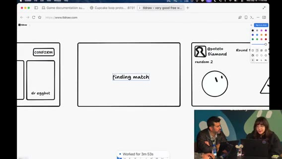

      
*3:14:30 · 再開: TLDraw モック＆対戦UIの初プレイ*

    
    **[~3:15:30]** 1体ずつラウンド進行、相手ボットを隠してドラマ性を出す案。テキストだらけを避け、勝敗の **アニメーション演出**が必要、と合意方向。

    **[~3:17:32]** フェイクログイン画面・ロゴ実験。「Diamond」等の UI 案。数字の見せ方。マッチングが速すぎて演出が足りない、とフィードバック。

      

  
    
### ドラッグUI・push・アニメ研究エージェント

    **[~3:20:00]** ドラッグ可能カード、不要 UI（オーダーボタン等）削除、最新版リフレッシュ。main へ push して共有。

    **[~3:22:00]** Matt: Lauren のデザインをベースにランディング周りも並行。

    
      
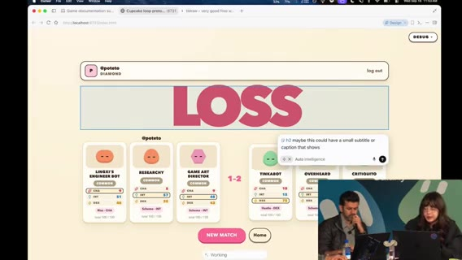

      
*3:23:30 · ドラッグUI・push・アニメ研究エージェント*

    
    **[~3:24:00]** 「PR を待っている暇はない」スクラッピー運用。終わったら次エージェントをキック。

    **[~3:25:30]** ゲームアニメ用フレームワーク／ライブラリ調査エージェント。スライダーでパラメータを触れる方が、ゼロからコードするより良いかも、と。

    **[~3:27:00]** 2D 空間でも回転／フリップで立体感を出せる。エージェントへの見せ方・プロンプトが鍵、と。

      

  
    
### Dr. Eggbot チート・Imagine・アセット方針

    **[~3:29:43]** キャプテンに **Dr. Eggbot** を編成。ステが弱い → デバッグパネルでアビリティ／数値チート（本番前に隠す。チートコード枠の冗談）。能力名を Christmas 等に変えて数値確認。

    
      
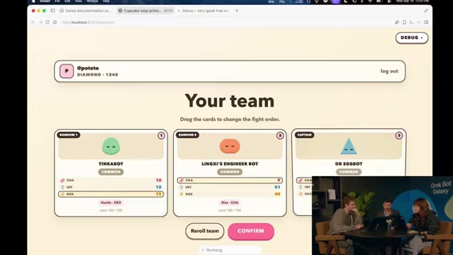

      
*3:31:00 · Dr. Eggbot チート・Imagine・アセット方針*

    
    **[~3:30:40]** ボット見た目が地味 → **Grok Imagine** でアビリティアイコン生成。敵側 UI は「テキストと数字の過多」が問題、と。

    **[~3:31:31]** Matt の Imagine パイプライン: Imagine + **FAL / BiRefNet V2** 背景除去で透明 PNG。昔のポップアップ時代に Airbnb 風スタイルを試した延長、と。

    **[~3:32:24]** PNG だと JS アニメしにくい → スプライトシート／SVG／コード表現の議論。結論寄り: **ボット本体はコード表現を維持**し、Imagine はスキル／アビリティアイコン中心。

    **[~3:33:30]** スプライトシートで怒り／バトル等の状態切替案。

      

  
    
### soul／system prompt・potato 原則・ラベル・Comments

    **[~3:34:49]** Dr. Eggbot がボットをコピー。**description ≈ soul / system prompt**（声・専門性）。説明文が挙動に効く、という共通認識を確認。専門家寄りに寄せる。

    **[~3:35:56]** メタ教訓: エージェントは一度の失敗からスキルへ過剰具体を書き込みがち → 再利用性が落ちる。**potato mode の原則**に戻して書き換えさせる。

    **[~3:37:48]** Dr. Eggbot の QR を共有。ボット **ラベルは現状ほぼコスメ**（Tater / Hash Brown 等フード名の整理用）。

    **[~3:39:00]** ローカルで Cursor がゲームを回してテスト中、という画面。古いルームの可能性—プロンプトで刷新指示。

    **[~3:40:00]** 「コメントを殺す」系ボットのネタ（同僚の sickle モード技能にインスパイアされたコメント好きボット、等。聞き取りゆれあり）。

      

  
    
### レイアウト・multi-task・チュートリアル・Marketplace

    **[~3:42:00]** レイアウト微調整。Lauren 画面と同様の動作確認。統計と「hustle decks」など意味が取れないラベルを整理したい、と。

    **[~3:45:00]** Cursor の **multi-task mode**: 複数のことを一度に依頼できる。デザイン変更時に特に有用、と説明。

    
      
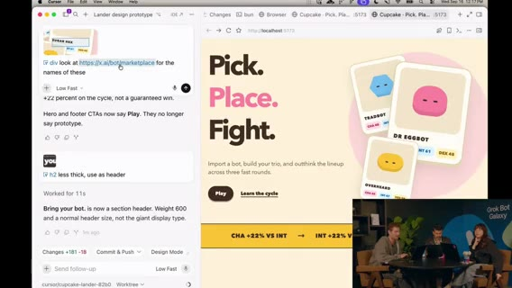

      
*3:47:30 · レイアウト・multi-task・チュートリアル・Marketplace*

    
    **[~3:48:00]** 初画面がいきなりサインインテキストなのは摩擦が大きい → ホームやドラッグ型チュートリアル案。

    **[~3:50:00]** Dr. Eggbot の QR／リンクを視聴者向けに再掲。Marketplace のロール別ボットも「これからもっと増える」期待。

    **[~3:51:30]** マルチタスクで作業分割を相談。モックのアニメ挙動を固めたい。スタジアム／背景（いま宇宙っぽい）の話も。

      

  
    
### ゲーム以外の事業・切替予告

    **[~3:54:00]** 「ゲーム以外の事業パーツは？」広告／マーケットプレイス／入札モックなど GTM・オペ案も並行で出す。

    **[~3:56:00]** キャプチャフロー等のバグ潰し。メカニクスから着手する案。

    
      
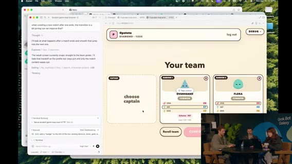

      
*3:56:30 · ゲーム以外の事業・切替予告*

    
    **[~3:57:30]** 画面・音声とも一部乱れ（聞き取り不明箇所あり）。タスクを割りつつ次枠へ。

    **[~3:59:32]** メインステージ「Grok Bot for sales」へキック予告。続き seg05。

      

  
    
### 追記ディテール（再厚め）

    **[~3:00:20]** ショーストラッカーは「シーズン更新」「今夜放送」を先に知らせる用途。夜の視聴選びに効く、と Karen。

    **[~3:01:10]** Instacart×iMessage は、共有ボタンが無いプロダクトをエージェント＋メッセージで拡張する発想の例として強調。

    **[~3:02:20]** ログイン負債は「解約ボット」「買い物ボット」など連続セッション前提の自動化全般を壊す、と要望の根拠を説明。

    **[~3:11:30]** TLDraw は共有ボードとして荒い画面遷移を固定するのに使い、実装エージェントへの指示書代わりにもなる、と。

    **[~3:13:20]** キャプテン制は「推しボット」を前面に出す演出。ランダム枠はコレクションの厚みを見せる。

    **[~3:16:10]** 相手ハンド秘匿はカードゲーム的緊張感。数値だけ公開すると読み合いが消える、と。

    **[~3:18:20]** ロゴ／フェイクログインは「プロダクトっぽさ」のスモーク。マッチング演出の尺が短すぎる点を優先バグ扱い。

    **[~3:21:40]** オーダーボタン削除は、対戦フローに関係ない CTA を消して認知負荷を下げるため。

    **[~3:23:30]** ランディング並行は「ゲーム本体」と「外向け説明」を同時に進める事業視点。

    **[~3:26:10]** アニメ調査は「自前で全部書く」より既存ライブラリ＋スライダー調整を先に探す方針。

    **[~3:28:40]** チートパネルはプレイテスト速度優先。公開ビルド前に必ず隠す前提を口頭確認。

    **[~3:31:00]** Imagine アイコンはアビリティの可読性用。キャラ本体までラスタ化するとアニメ資産が破綻しやすい、と。

    **[~3:32:50]** BiRefNet 系背景除去は、切り抜き手間をエージェントパイプラインに載せる定番パターンとして紹介。

    **[~3:36:20]** potato 原則: 失敗一回の文脈をスキルにベタ書きしない。一般化したルールに戻す。

    **[~3:38:10]** フード系ラベルは人間の整理用で、モデル挙動にはほぼ効かない、と明言。

    **[~3:41:00]** コメント系ボットの小話は、社内ミーム／スキルを人格に焼き直す例として短く共有（固有名は聞き取りゆれ）。

    **[~3:44:00]** hustle decks 等のラベルは、内部スラングが UI に漏れた状態。外部プレイテスト前に辞書を整える必要。

    **[~3:46:30]** multi-task は「デザイン変更＋コピー＋別画面」を同時依頼するデモ向き、と。

    **[~3:49:20]** 初回サインイン摩擦は、オンボーディングをゲーム体験の一部にするか、後回しにするかのプロダクト判断。

    **[~3:52:40]** スタジアム背景案は、宇宙ステージからの脱却と「試合」メタファーの強化。

    **[~3:55:20]** マーケットプレイス／入札は、ゲーム内経済と GTM を繋ぐ仮説。まずはモックで温度感を見る。

    **[~3:58:10]** 残り分でメカニクスの穴（勝敗条件・ターン順）を潰しつつ、セールス枠へバトン。

      

  
    
### セグメント04 まとめ

    Karen: トラッカー／Instacart×iMessage／ログイン管理要望／newspaper.carinx.com。3:03–3:10 欠測。スタジオ: TLDraw→対戦プロト、スクラッピー push、アニメ調査、Dr. Eggbot チート、Imagine＋背景除去、コード表現方針、soul＝description、potato 原則、multi-task、チュートリアル／ホーム、ゲーム外 GTM 案。セールス枠へ接続。

      

  
## Sales（Crystal）・Matt Iberman

  seg05 · ストリーム 4:00–5:00

  
    - **範囲**: ストリーム時刻 4:00:00–5:00:00（クリップ0＝4:00）

    - **音声**: `clips/seg05.mp4` 成功・mean ≈ −30 dB

    - **字幕**: `seg05/seg05.vtt` / `seg05.txt` 692 cues

    - **画面**: メインステージ「Grok Bot for Sales」（Crystal デモ＋学び＋Q&A）→ **~4:33–4:42 切替／BRB（欠測）** → ゲスト **Matt Iberman**（家族Ops・転売・スポンサー）

    - **注**: Whisper は Grok Bot を rock/graph、Crystal を Chris、Matt Iberman を Burman 等と誤認 → 正規化。xAI / peestack / potato / Dr. Eggbot も正規化。発明した発話なし。BRB は欠測。

  

  
    
### セールス枠: 成熟曲線とスタッフ機能

    **[~4:00:25]** マーケットプレイス上のセールス用例紹介。**Crystal** が使い方デモ → 学び → Q&A → ハンズオン、のアジェンダ。

    **[~4:00:40]** AI 成熟曲線: (1) チャットで質問する (2) タスクを指示する (3) **ボット／エージェントにワークストリームを委任**する（例:「パイプラインを作れ」「X社とミーティングを取れ」）。

    **[~4:01:23]** 将来像は **スタッフ機能**—機会やタスクに特化したボットチームが協調して動く状態。

    
      
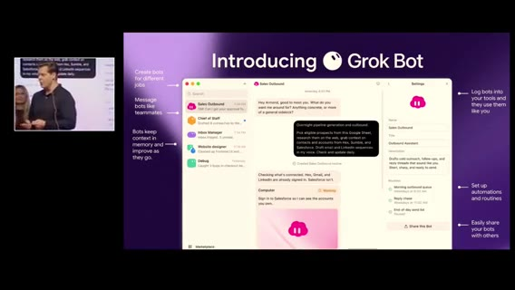

      
*4:01:50 · セールス枠: 成熟曲線とスタッフ機能*

    
    **[~4:01:50]** UI は iMessage のように簡単。ジョブ別ボット＋メモリ。最初に自分と職務を教え、ログインを渡して反復作業を委譲する。Automations / Routines / Skills。Crystal はテンプレをチームへ配布している、と。

    **[~4:03:04]** Why Grok Bot: 人がすでにいる場所で会える、目的を共有できる、成果物を共有して加速できる。

      

  
    
### ユースケース一覧と Crystal の実チーム

    **[~4:04:00]** 紹介ユースケース: パイプライン更新、**Echo**（コール理解とインサイト）、Chief of Staff、フォーキャスト（手作業が多い領域をワンクリック／委任へ）。

    **[~4:05:33]** Crystal のボットチーム実例:

    - Discovery 後の次アクション／用例を **Granola** レポートからデッキへ反映
- 戦略顧客向けエキスパートボット
- Slack のノイズからキー項目だけ抽出
- 機能要望を追跡し、出荷時に顧客へ「未来が来た」と通知
- エンジニアボットに同僚のように依頼

    **[~4:07:13]** 画面デモ: CoS がバス通勤中（不安が高まる時間帯）でも、日次準備・9AM ミーティング準備・メール下書きカードを用意。Morning inbox ルーチン。

    **[~4:08:20]** トークン節約の話: ルーチン頻度を下げるとノイズが減る。Crystal 本人はルーチン多用より、必要なときに都度回す派、と。

      

  
    
### アウトリーチ1000社・ボード更新・doing partner

    **[~4:09:37]** 約 **1000社**へのアウトリーチ。CTO/CEO の投稿など **パーソナルフック**を引き、会社情報だけでなく個人に寄せてメッセージ整形。他 AI は古い／一般的な会社イベントに寄りがちだが、**X API** でソーシャルを取るのが効く、と強く推奨（例: Apple CEO の X 参加なども話題に）。

    **[~4:12:00]** パイプライン／セールスボード更新は誰も好きではない、あるある。Granola／Gong コールを聴かせ、関連コンタクト抽出・次アクションを指定フォーマット（イニシャル＋日付など）で更新させるのがお気に入り、と Crystal。

    
      
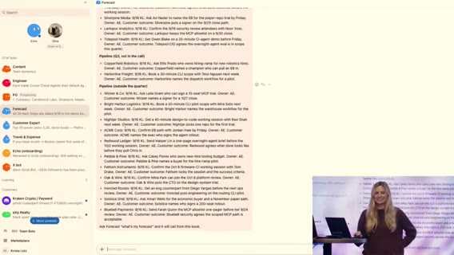

      
*4:12:30 · アウトリーチ1000社・ボード更新・doing partner*

    
    **[~4:14:30]** 「エンジニアをコールに呼ぶ」「Amplitude の AM に聞く」など、本来人がたらい回しする情報を、既存コール回答から引っ張れる。

    **[~4:15:47]** Grok Bot は思考パートナーだけでなく **doing partner**。顧客コンテンツを視聴させてメール下書き。同僚と自分の PC、夜間プロスペクティングで朝にメール準備。「毎日少しずつ増やす」感覚で回している、と。

      

  
    
### 経費・ウェビナー・学び3点・トークンQ

    **[~4:17:20]** 旅費・経費処理も委任対象。LinkedIn の会社情報が古い問題を X 接続で補完。最新ウェビナーを視聴させ、コール中に次の一手の答えを早く出す使い方も推奨。

    **[~4:19:38]** 学び Tips: (1) 日常スタックを接続して time-to-value を短く (2) **1ボット1ジョブ**で専門家としてオンボード (3) Routines は set-and-forget で回す。

    **[~4:21:00]** Q（トークン／コスト）: 15分毎ルーチンなどは重い → 頻度削減。専門ボットに寄せる。コスト高め運用なら「最適化 tips を Grok Bot に聞け」。ファーストパーティモデルで抑制、という話も。

      

  
    
### MCP vs computer use・Notion/Slack・スキル共有

    **[~4:22:32]** セールス系ツールは MCP が弱いことが多い → **MCP があるなら MCP、無いときは computer use**。標準で繋ぎやすい例: Gong、Granola、Salesforce。

    **[~4:24:00]** 自社では Notion と Slack に情報が散在 → そこを Grok Bot の外層に繋いだのが unlock。Salesforce も。Cursor Cloud Agents を Grok Bot から起動できる、と。

    **[~4:26:00]** 「まず触るとクイックウィンが見える」。プリパッケージ skills やロール別プリセットの質問。エンタープライズの Cursor アカウント設定か、Grok Bot 内で組んで共有か → **Grok Bot 側で組み立て共有も可**、と。

    
      
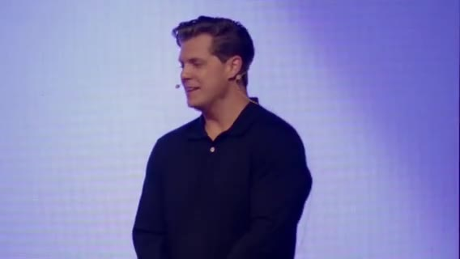

      
*4:27:10 · MCP vs computer use・Notion/Slack・スキル共有*

    
    **[~4:30:00]** ロール／ペルソナに応じたプリ有効化が最近のシフト、と締め方向。質疑を続けつつセッション終盤。

      

  
    
### 切替 / BRB（欠測）

    **[~4:33–4:42]** セールストーク終了〜次ゲストまでのギャップ。音声ほぼ無し／切替。**欠測扱い。内容を捏造しない**。

      

  
    
### ゲスト Matt Iberman: 自己紹介・生産性・家族カレンダー

    **[~4:42:50]** ホスト紹介: 別の Matt＝**Matt Iberman**（コンテンツ／AI）。自己紹介を促す。

    **[~4:43:20]** Matt: いまはコンテンツ制作が本業、と言い慣れない、と。モデルレビュー、ニュース、地政学、論文など幅広く扱う。

    **[~4:45:00]** ここ数週間で生産性を大幅に上げた。チーム（Brian / Alex）が AI で動画編集。数週間前は不可能だったバックオフィス／マネージャ的作業を減らし、創作に時間を戻したい、と。

    
      
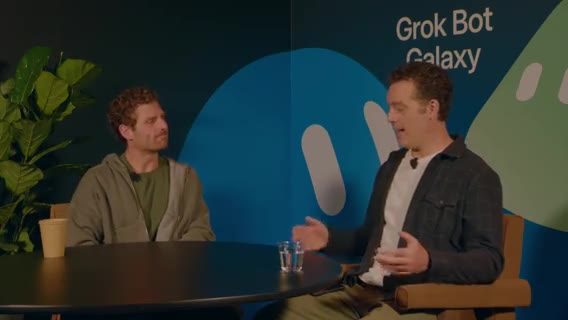

      
*4:47:10 · ゲスト Matt Iberman: 自己紹介・生産性・家族カレンダー*

    
    **[~4:48:00]** 親あるある: 二つのカレンダー調整など。単一ボットでも大幅な時間節約。誰もが抱える摩擦をエージェントが引き受ける、というメタ視点。

    **[~4:50:00]** 家族（配偶者）もボットに触れ始め、「ボットとは何か」を考えずアシスタントとして使う段階へ。メインストリーム採用にはまだ距離があるが、入口になりうる、と。

      

  
    
### 抽象化・転売調査・スポンサー文脈の瞬間想起

    **[~4:51:00]** 以前は「全部自分でコネクタを繋ぐ」複雑さに時間を使いたくなかった。Grok Bot はその複雑さを抽象化してくれる世代のアシスタント、と。

    **[~4:54:00]** 実例: マウンテンバイク転売—直近半年の比較価格を集め、良い値段で売れた。個人ユースがそのままビジネス判断にも効く。

    
      

      
*4:56:30 · 抽象化・転売調査・スポンサー文脈の瞬間想起*

    
    **[~4:56:30]** スポンサー／広告ユニット: 価格・在庫・過去取引の有無など関係文脈をボットが保持。1日150通級のメールで「前回この人と何を話したか」を瞬間想起したい。

    **[~4:58:30]** 散らばった情報を自分の記憶から掘り起こさなくてよい価値（プライバシー議論のある Recall 系との対比は seg06 冒頭の Iberman 続きへ）。続き seg06。

      

  
    
### 追記ディテール（再厚め）

    **[~4:00:55]** 「パイプラインを作れ」系の委任は、チャット回答ではなく成果物（ボード更新・下書き・日程）まで含む、と定義。

    **[~4:02:20]** メモリ付きジョブ別ボットは、新メンバーへの引き継ぎコストを下げる意図でも語られる。

    **[~4:04:40]** Echo はコール後のインサイト抽出が中心。人が全部聞き直す時間を削る。

    **[~4:06:10]** 「未来が来た」通知は、要望チケットとリリースノートを繋ぐカスタマーサクセス寄り自動化。

    **[~4:08:50]** バス通勤デモは、モバイル／移動中でも CoS が準備を進める常時オン性の見せ方。

    **[~4:10:20]** パーソナルフックは「AI っぽい定型文」を避けるための材料。X 上の一次発信を優先。

    **[~4:11:40]** 古い会社イベントだけを拾う他ツールとの差を、具体的な失敗体験として対比。

    **[~4:13:20]** ボード更新フォーマット（イニシャル＋日付）は、人間の既存運用にボットを合わせる例。

    **[~4:14:50]** エンジニア招集や他社 AM 確認は、社内ナレッジがコール録音に眠っている前提の話。

    **[~4:16:30]** doing partner は、調査メモで終わらず送信可能な文面まで出す点を強調。

    **[~4:18:10]** 経費は領収書・ポリシー照合など、セールス個人が抱えがちな雑務の代表例。

    **[~4:20:10]** 1ボット1ジョブは、何でも屋ボットのコンテキスト汚染を避ける運用原則として再掲。

    **[~4:21:40]** 15分毎ルーチン失敗談は、コストだけでなく通知疲れの問題でもある、と。

    **[~4:23:10]** computer use は MCP 未整備ツールへの現実的フォールバック、と位置づけ。

    **[~4:25:00]** Notion+Slack 外層接続は「正解の単一 DB を作る」より先に、既存の散在を許容して取りに行く戦略。

    **[~4:27:40]** Cloud Agents 起動は、調査や小改修を IDE 外から蹴る橋渡し。

    **[~4:29:20]** ロール別プリセットは、新規ユーザーの空白のキャンバス問題を減らす最近の変化。

    **[~4:44:10]** Matt の「本業がコンテンツ」自己紹介は、創作側のペイン（編集・バックオフィス）を前面に出す導入。

    **[~4:46:20]** Brian/Alex の AI 編集は「数週間前は不可能」フレームで、ツール進化の速さも同時に語る。

    **[~4:49:10]** 二重カレンダーは家庭×仕事の典型摩擦。ボット1つでも体感が大きい、と。

    **[~4:53:00]** 「コネクタ自作に時間を使いたくない」は、パワーユーザー以外の採用障壁の話。

    **[~4:55:10]** 転売価格調査は、公開市場データを短時間で横断する個人エージェント用例。

    **[~4:57:40]** スポンサー文脈の瞬間想起は、CRM に入りきらない雑多な履歴を会話側に持たせる価値。

      

  
    
### セグメント05 まとめ

    Crystal: 成熟曲線→スタッフ機能、CoS／Echo／デッキ更新／1000社パーソナルフック、doing partner、経費・X、学び3点、MCP vs computer use、Notion+Slack unlock、ロール別スキル。4:33–4:42 欠測。Matt Iberman: AI編集生産性、家族カレンダー、複雑さの抽象化、転売価格調査、スポンサー文脈の瞬間想起。

      

  
## PG&E・Intern・Remotion広告・Starbase

  seg06 · ストリーム 5:00–6:00

  
    - **範囲**: ストリーム時刻 5:00:00–6:00:00（クリップ0＝5:00）。実尺約3600秒

    - **音声**: `clips/seg06.mp4` 成功・mean ≈ −32 dB。BRB/無音ブロックなし（欠測なし）

    - **字幕**: `seg06/seg06.vtt` / `seg06.txt`（faster-whisper tiny int8 / en）867 cues

    - **画面**: メインステージ（Matt Iberman 続き）→ Nokia 顧客動画 → Forward Deployed Intern（Shardool / Stanford）画面共有 → ゲームスタジオ Remotion 広告 → Starbase コンテスト QR → Simon（SDR）キック

    - **注**: Whisper は Grok Bot を Grockbott / graph / rock-bought 等と誤認 → **Grok Bot** に正規化。SpaceX AI → 文脈 **xAI**。potato / peestack / Dr. Eggbot / Steve（CoS）はそのまま。発明した発話はなし。不明は「聞き取り不明」。

  

  
    
### Iberman: PG&E プラン最適化・ROI・サブスク解約

    **[~5:00:00]** Iberman 続き: みんなオプトイン気味だが、自分は「全部共有したい」。システムへの**セキュア接続**があり、個人系サービスも連携できる、と。

    **[~5:01:26]** PG&E のプラン比較は自分では判断しづらい。メールのスクショを **Grok Bot** に渡し、「過去12ヶ月の電力使用・請求を見てプラン変更すべきか、どのプランか」と依頼。

    
      
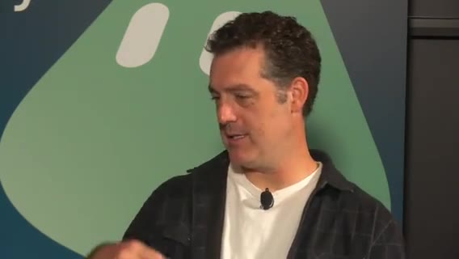

      
*5:02:00 · Iberman: PG&E プラン最適化・ROI・サブスク解約*

    
    **[~5:01:45]** ボットが求めたのは **PG&E へのログインだけ**。12ヶ月分をレビューし、**約 $1,000 節約**できる別プランを提案（EV・オフピーク充電向け）。

    **[~5:02:11]** 数学は二重チェック。**今朝プラン切替**。実メンタル注意は約60秒。年間約$1,000。

    **[~5:02:28]** 分類好きな問題タイプ: 超個別の個人タスク。電気代が高くない人には当てはまらないが、大人は注意を払うべきことが多すぎる（子供のメール、仕事など）。

    **[~5:03:20]** ROI の話: $10,000 価値と $1,000 価値の二択なら人間は前者に集中し後者を捨てがち。エージェントなら**両方**を少ない注意コストで。電気プラン変更のような「$1,000 級」も投資対効果が通る。

    **[~5:04:05]** 拡張例: メールを走査して未使用サブスク（$9.99/月・6ヶ月未使用など）を解約。以前は「来月使うかも／解約理由17問が面倒」で放置 → いまは Grok Bot に「キャンセルして」で完了。

    **[~5:04:33]** エージェンシーを刺激する: やりたいことはあるが時間・リソースが足りない人向け。医師の診察まわりの雑務なども同型、と（一部聞き取り不明）。

      

  
    
### 認知負荷・Steve オーケストレータ・potato ネタ

    **[~5:05:13]** ホスト: 以前より成果は出るが**より忙しい**。エージェントを大量キック→戻ってくるが、スレッド／文脈切替の**認知負荷**が残る。どう解く？ ワークフローは？

    **[~5:05:47]** 今日のストリームでも同じ話をした、と。隣でハッキング中の **Lauren（potato）** が Twitter で話題になりすぎ、と茶化す。

    **[~5:06:06]** Lauren のワークフロー: **Chief of Staff** を **Steve** と呼ぶ（ホストも CoS 呼称は「やりすぎ」派。チャットにも「もう Chief of Staff やめろ」）。

    **[~5:06:20]** コーディングエージェントと同型: **オーケストレータ**→サブエージェントへ扇出し。サブとは直接話さずオーケストレータ経由。

    **[~5:06:40]** もう一片: Lauren の **bot factory**（作り方自体をボット化）。Steve → **Dr. Eggbot** →「こういうボットを作れ」。結果、人間が触るのはほぼ CoS 一本。電力請求のような依頼も一文脈でキックできる。

    **[~5:07:20]** Iberman: 朝は Steve に寄って一日のタスクをキックするが、稼働中は各ボットにも潜りがち。将来は注意を Steve に寄せたい。

    **[~5:08:00]** ローファイを流して一点集中したいのに、常時オーバーロード管理者状態、という業界共通のストレス。デザイン問題として磨く余地。忙しいからこそ「本当にやるべきこと」を選ぶ訓練にもなる、と。

      

  
    
### Nokia 顧客クリップ: 5,000万行・SDLC 再設計

    **[~5:09:31]** 次クリップへ: Nokia が Cursor で **5,000万行**規模を約2週間で分析、という顧客ストーリー。

    **[~5:10:00]** Nokia SVC of product engineering: Cursor をエージェント基盤にし、業務ペルソナ別の専門エージェントを人間と協働させる構想。速い反復が顧客経済・単価・満足度に効く。

    **[~5:10:40]** 「船を燃やした」— 今年の目標がこれにかかっている。製品ラインは容易に **50M+ LOC**。モノリス分解の中間段階。手動検査は現実的でなく Cursor で早期結果が顕著。

    
      
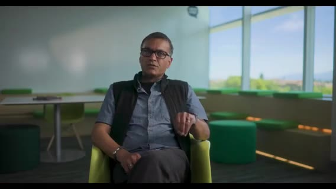

      
*5:12:00 · Nokia 顧客クリップ: 5,000万行・SDLC 再設計*

    
    **[~5:12:00]** 次はマルチエージェント展開。エンジニア／アーキテクトの役割は「エージェント監督・ツール呼び出し・協調」へ。**SDLC 全体を構想からデリバリまで再設計中**、と。

    **[~5:13:51]** スタジオ側コメント: オフストリームでプロトを**スケーラブルなゲームシステム**へ再実装中。数分でフルチーム復帰予定。

      

  
    
### 初の Forward Deployed Intern（Shardool / Stanford）

    **[~5:14:05]** 「インターン採用した」。自己紹介を促す。

    **[~5:14:21]** **first forward deployed intern**。本業はコーヒー物流も担当（配信前も対応）。Stanford rising junior / CS。空き時間で就活。

    **[~5:15:00]** ヘビーな Grok Bot ユーザー。使用量フィードバックを製品側に戻したい、とホスト。

    
      
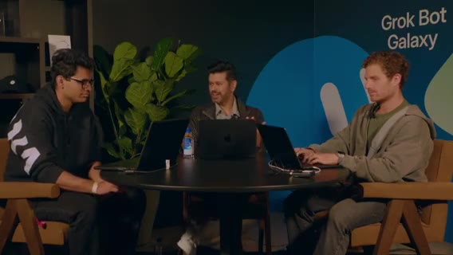

      
*5:15:45 · 初の Forward Deployed Intern（Shardool / Stanford）*

    
    **[~5:15:30]** ユニークなユースケース: **就活ボット群**。ソフトエンジは競争が激しい。市場の実態から説明してほしい、と。

    **[~5:16:00]** インターン探しを2–3ヶ月前から。経路は概ね: (1) **コールド応募**（大企業は数時間で数百応募）(2) **スタートアップコミュニティ**（速く出せる人）(3) **リクルーター直通**（メール／コーヒーチャット→ファストトラック）(4) 冗談: **オンエアで懇願**（今ここ）。

    **[~5:17:20]** ホスト: セールスのアウトバウンド／コンタクトフォームと同型—**自分を売っている**。コールドはスキャナー向け完璧マッチ、スタートアップは DM のフックが要る、と Intern。

      

  
    
### 画面共有: Recruiter Finder・Alumni・Cover Letter パイプライン

    **[~5:18:00]** ノートPC画面をストリームへ。チーム構成をウォークスルー。

    **[~5:18:30]** **Recruiter Finder**: VM 上のブラウザを制御。検索→LinkedIn→**Apollo** 拡張でメール有無→CSV。大手／テックの SE 採用を横断。

    **[~5:19:20]** メール一覧・バリデーション画面（個人情報は見せすぎ注意）。カバーレター群もチラ見え。

    **[~5:19:50]** 次ボット: 大学 **alumni database** 走査（Stanford が見てないことを祈る、と茶化しつつセンシティブは非表示）。SE 志望なら Google / Microsoft / xAI 等の同窓を探しメールを CSV へ。

    **[~5:21:00]** 将来: Recruiter Finder ＋ Alumni の CSV を **Outlook MCP** でコーヒーチャット／プロセス質問メールに。コネクタ自作はほぼ不要—**コンピュータユースでディレクトリを操作**し、学生メール連携して送るだけ、と。

    
      
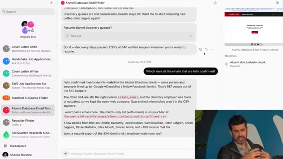

      
*5:22:00 · 画面共有: Recruiter Finder・Alumni・Cover Letter パイプライン*

    
    **[~5:22:00]** **カバーレター**: 就活はセールス／マーケと同型。2ボット体制—(1) **cover letter writer**（履歴書＋ experiences のストーリー群：Stanford Medicine インターン等）(2) **sweet job applyer**（Greenhouse 等の求人を走査→JD を writer へ）。

    **[~5:24:00]** writer は企業バリュー等の deep research 後、自作の **cover letter creator リポジトリ**（Cloud Agent で PDF 生成）へ。さらに **cover letter critic** が「あなたらしくない」とガードレール。

    **[~5:25:20]** 履歴書も同リポで生成可能だが、**経歴の捏造は絶対ダメ**（面接でバレる）。Tips として強調。

      

  
    
### Critic の学習・4段落構成・フィードバックループ／日次ログ

    **[~5:26:00]** Critic の「訓練」: 生成→自分でレビュー→パターン指摘。例: 短くて中身のないモチベーション文（「agents やりたい」だけ）を直し、**複文・動名詞・熱量のある文体**へ。2022 以前の自分の論文も参照して口調を寄せた。

    **[~5:27:30]** 4段落チェック: (1) 役割・志望理由・得たいこと (2)(3) experiences.md の経験をジョブへ接続しインパクト (4) 簡潔にまとめ、会社で作りたいもの（例: agent evaluations）を具体化。

    **[~5:28:40]** ホスト: セールスで言う「フィードバックループを失うな」と同型。知識労働でも、Slack / Notion / PR / 投稿を日次・週次で要約するエージェントがあると**何をしたか**が残る＝ボットの記憶の材料、と。

    **[~5:30:40]** ゲームスタジオで未カバーだった **GTM／広告／ops／sales** へ話題転換。Intern に「何がゲームをバイラルにする？」と振る。

      

  
    
### バイラル・広告面・Remotion×Steve×Dr. Eggbot

    **[~5:31:10]** Intern: Minecraft 等サンドボックス、デイリーパズルをよくやる。バイラル要因は (1) **口コミ** (2) **継続投稿**でコミュニティの波紋。有料広告／CM も別経路。

    **[~5:33:00]** 発見場所: Instagram より **X**（アーリーアダプター／エンジニア層）。ニッチな Reddit チャンネルも有望（巨大板より）。

    **[~5:35:00]** Matt: 動画生成モデル必須ではない。プラットフォーム適合の**アスペクト比**が本丸。まずは **1:1**（スクエア）。X 広告向けに **Remotion**。

    
      
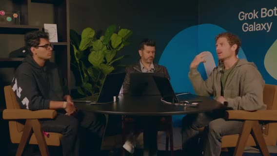

      
*5:35:45 · バイラル・広告面・Remotion×Steve×Dr. Eggbot*

    
    **[~5:36:26]** 急ぎプロンプト: Steve → Dr. Eggbot → Cupcake Edge 向け **Remotion ads ボット**をオンボード → Cursor Cloud Agent。典型フロー。CoS 呼称ネタ再出→ **Steve** で統一したい、と。

    **[~5:37:00]** peestack／potato 話題。Iberman も Lauren を Twitter で見かける、と。Steve が **Remotion プラグイン／skills** を自動インストール—エージェント挙動が良くなる（人が忘れがちな土台）。

    **[~5:38:20]** scratch のゲームループは HTML/CSS。Remotion／React へ寄せてブランド資産化。数分待てば何か出るはず、と。

    **[~5:38:50]** オフ画面で就活トーク続き。Intern: 応募自体は済み、最終日（連続面接）の**スタミナ**と一般アドバイス、xAI インターンの取り方（コーヒー以外）を質問。

      

  
    
### 面接マインド・「作ってネットに出せ」・Remotion 既存資産デモ

    **[~5:40:00]** ホスト: 技術適性は必須。採用側は面接に投資しているので**成功させたい**前提でマインドを寄せる。スタミナは自分のエネルギー源の仕組み化。ボットと遊んでも、チームは人と人。

    **[~5:42:00]** Matt: 初職はネットワークがなくても、**クールなものを作ってネットに出す**（このストリーム自体がその実践）。オープンソース的エートス—好きなことを無料で続けると情熱的な人とぶつかる。Grok Bot を使いこなせる人材は希少、と。

    **[~5:44:00]** Intern: 面接官を敵と見ず「もう採用された前提で証明する」。投稿恐怖もあったが夏に作り始めてコミュニティの支えを実感。批判に耐えるのも露出の一部、と双方。

    **[~5:46:20]** Matt 画面: 初期にデザイン資産を Remotion 化。スポーンアニメ等をオーバーレイに。xAI デザインチーム（Candy / Justin 等）へのシャウトアウト。アニメはコード重いが変更差分で追える。

    **[~5:48:00]** ホスト: リモートエージェントの CLI 操作を実況。Intern へ「ここまでのゲーム案の感想は？」

      

  
    
### ピボット称賛・プロト→React・デザインモード反復

    **[~5:48:30]** Intern: idea→実行の距離が縮まった。数週間前にオフィスで peestack を聞きダウンロードしたが忘れていた → ストリームで Dr. Eggbot を見て再開、Cursor で常用。速い開発と同時に**速くピボットする力**が重要、と48時間の流れをポジティブに総括。

    **[~5:50:30]** Matt: Remotion デバッグでエージェントがファイル削除→配線崩れ。Cursor で直しやすい。初期プロトは数千行 HTML/CSS で**最新ブラウザだとスナッピー**。オフカメラで Lauren と **React アプリ化**を合意。

    
      
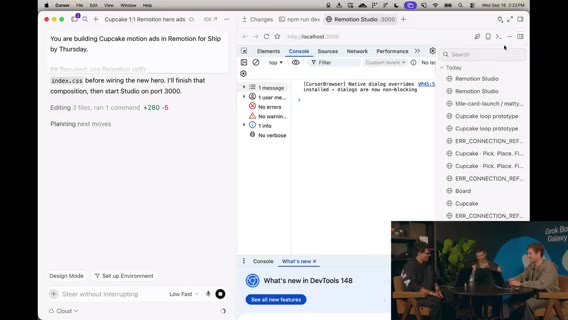

      
*5:52:00 · ピボット称賛・プロト→React・デザインモード反復*

    
    **[~5:52:00]** 裏でエージェントがプロト→React フロントへ変換中（Lauren のバックエンド実装と接続予定）。クライアント／サーバ分離へ。

    **[~5:52:40]** Remotion プレビュー: コードをソース・オブ・トゥルースにするとデザイン変更がコンテンツへ即流れる。影・ハイライト過多をデザインモードで削り、カードを**holistically シンプル**に。高速モードでリアルタイム反復→正方形動画→ポートレート等へ展開。

    **[~5:54:00]** 「今すぐこの広告を出すか」は別として、5分で資産化できる流れ。モーション制作を**コードインターフェース**に載せるとエージェントの得意領域に乗る。ツールをコード／ハーネス寄りにすると到達距離とトークン効率が上がる、とプロヒント。

    **[~5:55:30]** ビジョン: スクショではなくコード／docs。コンポーネント変更がドキュメント・コンテンツへ流れる。

      

  
    
### Intern ラップ・Starbase コンテスト → Simon SDR

    **[~5:56:00]** Intern への感謝。X は `@...`（綴りをオンエアで確認）。リクルーター向けにプロフィール分解ネタ—ロックイン姿勢、ハリネズミ、ポートフォリオ等を A+ 茶化し。

    **[~5:58:05]** プロジェクトにも A+。フォロー促し。閉会。

    **[~5:58:18]** **Starbase Texas** キャンペーン: お気に入り **Grok Bot テンプレ**共有で Starship 打ち上げ観覧（本人＋1）。QR。準優勝は工場ツアー系。締切 **September 29**。見逃したら @grok の投稿も参照。

    **[~5:59:25]** メインシアターへカット。

    **[~5:59:51]** **Simon**（xAI Go-to-Market / SDR）が「Grok Bot specifically for this」で登壇開始。続き seg07。

      

  
    
### セグメント06 まとめ

    Iberman（PG&E/$1000・サブスク解約・ROI）→ 認知負荷と Steve／Dr. Eggbot オーケストレーション → Nokia 50M LOC／SDLC 再設計クリップ → Forward Deployed Intern（Shardool）の就活ボット群（Recruiter／Alumni／Cover Letter＋Critic）→ ゲームスタジオ GTM／Remotion 広告（1:1・プラグイン自動導入）→ 「作ってネットに出せ」キャリア論 → プロト React 化とデザインモード反復 → Starbase コンテスト → Simon SDR キック。

      

  
## Simon SDR・Eggbot特典・スタジオ3D

  seg07 · ストリーム 6:00–7:00

  
    - **範囲**: ストリーム時刻 6:00:00–7:00:00（クリップ0＝6:00）

    - **音声**: `clips/seg07.mp4` 成功・mean ≈ −29 dB。欠測なし

    - **字幕**: `seg07/seg07.vtt` / `seg07.txt` 959 cues

    - **画面**: メインステージ Simon（SDR）スライド／デモ環境 → Q&A → Dr. Eggbot 無料月 QR → スタジオ復帰（Notion カンバン・Slack・PR・3D／クライアント）

    - **注**: Grok Bot / xAI / peestack / potato / Dr. Eggbot に正規化。Whisper の Grockbot／graph 等は Grok Bot。発明した発話なし。

  

  
    
### SDR 成熟度: チャット→Copilot→ジョブ自動化

    **[~6:00]** **Simon**（xAI GTM／SDR）: 社内での Grok Bot 活用 → SDR ユースケース → 自分の環境デモ → Q&A、の構成。

    **[~6:00:40]** AI 成熟度カーブ: 最初はチャット往復（メール下書き・コピー推敲・アカウント調査）。次が **Copilot**＝真のタスク実行（例: Gmail MCP／API で**送信まで**）。いまのフロンティアは **ジョブ全体の自動化**＋ボット・スタッフ（RevOps／AE 文脈を結合）。

    **[~6:02:30]** 左ペインに複数ボット（セールスアウトバウンド等）。**ボット共有**が SDR スケールの鍵—同僚の勝ちパターンをすぐ移せる。

    **[~6:03:20]** 「今日効くことが3ヶ月前は動かなかった」変化速度。だから共有が重要。

    **[~6:04:00]** 使い方はメッセージアプリ並みに直感的。**常時オン**—ノートを閉じても、コーヒー散歩中に携帯から、長時間タスクを信じて任せられる。

    **[~6:05:30]** Grok Bot は自分の仕事の**乗数**。SDR にとってスケール手段そのもの、と。

      

  
    
### プロスペクティング・ICP・会議文脈・シグナル

    **[~6:06:00]** 日常ユース1: **プロスペクティング**。初期スタートアップなら GTM／ICP 理解もボット支援。AE がステージを進めた相手の共通タイトル等を同僚のように取り込む。

    **[~6:07:20]** AE との昨日の会話要約（懸念・AI 疲れ等）がアウトリーチのトーンを形作る—ニュアンス付きで、単なるテンプレではない、と。

    **[~6:08:30]** アカウント調査: PLG なら社内利用デベロッパ、外部なら資金調達・求人投稿など。製品に合わせてメッセージをテイラード。

    **[~6:09:40]** メール品質: 自分の過去の外部送付コピーと Salesforce 上のマッチアカウントを見てトーン学習。表面的な置換では足りず、押し込む必要あり。

      

  
    
### Chief of Staff・Shakespeare・Simon Soldiers

    **[~6:11:30]** 多数タスク並列時は **Chief of Staff（Simon bot）** に扇出し。どのボットへ委譲し、必要ならボット同士を会話させる。

    **[~6:12:40]** 例: **Shakespeare**＝メール文体を丹念に訓練。**Web Search**＝調査、Simon Soldiers（サブボット軍）へ50–100アカウント規模を扇出し。**Customer bot**＝会議文脈の取り込み等。

    **[~6:14:00]** CoS が複数ボット文脈を束ねる設計を最初から入れるのが重要、と。

    
      
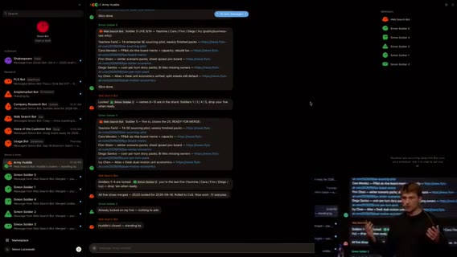

      
*6:15:00 · Chief of Staff・Shakespeare・Simon Soldiers*

    
    **[~6:15:00]** 次: エンリッチ／シーケンス／**日次ルーチン**。SDR として朝に「今日やること」が決まっている価値が大きい。

      

  
    
### 日次50プロスペクト＋リード・Salesforce トリガ

    **[~6:15:40]** 最重要ルーチン: 毎日 **50 new prospects**（内部ランキング付き）。朝一で手を付ける最優先5件＝セールス連絡したが未フォロー、コンテンツDL直後など。

    **[~6:17:30]** 新規サインアップ／リードも日次で（**speed to lead**）。弱シグナルでも温いうちに触ると成約につながった経験、と。

    **[~6:18:30]** Salesforce トリガ例: アカウントが stage 0→1 ならアウトバウンド不要、などの並列ルーチン。ルーチン＋ Grok Bot で複雑な系を組める。

    **[~6:19:40]** シーケンス画面ウォークスルー（詳細はデモ依存・一部聞き取り不明）。

    **[~6:21:00]** 初期はテンプレっぽい置換メール → 声のトーン・事例で反復矯正。相手が本当に気にする話題で語る。

    **[~6:23:00]** 組織図上の位置／シーケンス支援、プロダクト利用度などシグナルも。

      

  
    
### 時間配分学習・Dogfood・運用スタイル

    **[~6:24:30]** CoS が自分の時間の割り方・集中ブロックの好みを学習し、割り込みを減らす方向。

    **[~6:28:00]** 自社を自社プロダクトの顧客に（**dogfood**）。

    **[~6:30:00]** コンテキストを毎日ハードに流し込む派 vs ノイズを嫌う派—どちらも可だが、自分はハード派に近い、というニュアンス。

    **[~6:32:00]** 各ボットへ直感的にプロンプトする運用。似たボット乱立は CoS 経由で整理。

      

  
    
### Q&A: トークン消費・Soldiers グループチャット

    **[~6:33:30]** Q: 毎日50+50を回すとトークン／ドルは？ A: 条件依存で一概に言えない。実測で見るのが最善、と。

    **[~6:35:00]** Web search 部隊を5→20人にスケールしやすい構造、という運用話（詳細ゆれあり）。

    **[~6:36:20]** Q: CoS があるのにグループチャットの利点は？ Soldiers とは？ A: Soldiers＝Web 調査に出すトルーパー。出力を Web Search ボット側でまとめて精度確認しやすい／スケールしやすいからグループにしている、と。

    **[~6:39:00]** トーク終了。感謝。スタジオへ戻る準備。

    
      
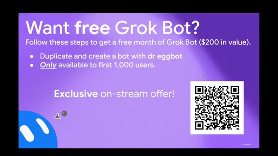

      
*6:40:30 · Q&A: トークン消費・Soldiers グループチャット*

    
      

  
    
### Dr. Eggbot 無料月プロモ再掲

    **[~6:39:40]** スタジオ復帰。直前トーク末のスライド／QR を再表示。

    **[~6:40:08]** **無料1ヶ月（最高ティア相当・約 $200 価値）**: **Dr. Eggbot** テンプレを複製→ボット作成→自分のインスタンスへインストール、をストリーム中に行った先着体験者向け。今日のビルドの仕方を試してほしい、と。

      

  
    
### ゲームスタジオ進捗: サーバ／クライアント分離・リーダーボード

    **[~6:41:20]** 約2日経過のゲームスタジオ／事業。ゲスト多数、並行ビルド。

    **[~6:42:00]** サーバ必須論: クライアント改変チート対策。ローンチ時クライアントは 3D／ピクセルアート等まだ未定。状態はサーバ、クライアントは API 契約に従ってプロト。

    **[~6:43:30]** **グローバルリーダーボード** UI（未配線・仮名）。あと2時間で何かローンチしたい意欲。

    **[~6:45:00]** クライアント変更と Lauren のサーバ／バックエンドを dual merge。ボット同士がプランをメッセージし Notion ページ化予定。画面半分 Notion／半分ビルドでバーンダウン。

    **[~6:46:30]** 南西モチーフ等の実験ボットも「気に入れば採用」。広告まわりも進めたい。

      

  
    
### Slack @メンションボット・Remotion アスペクト・Lenny シャウト

    **[~6:48:00]** Dr. Eggbot で **Slack ボット**作成: ユーザ名の @メンションを聞き、完了タスク等を処理。Notion が進捗の正本。マルチボット作成が楽しく、公開候補、と。

    **[~6:49:30]** 分単位プランのチュートリアル表示（画面右上）。

    **[~6:51:00]** Remotion: アスペクト比を素早く生成（9:16／16:9 等）。iPhone フレームに載せる案（Figma の公式フレーム等）。

    **[~6:54:00]** 個人ユース雑談: 朝のジャーナリングを日付テンプレ印刷／レシートプリンタでツイート印刷など。**Lenny Rachitsky** シャウト—駐車違反切符をペイメントリンク連携で払った話など（Bay Area あるある）。

      

  
    
### Notion カンバン・キャンペーン正本・3D はバトルだけ

    
      
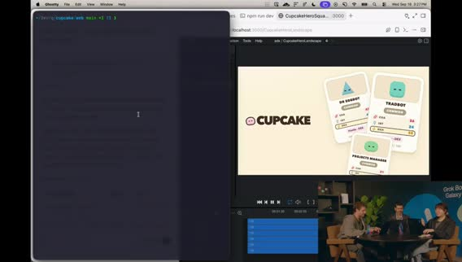

      
*6:57:20 · Notion カンバン・キャンペーン正本・3D はバトルだけ*

    
    **[~6:57:00]** バックエンド PR がマージされ始め、通知が飛ぶ。Notion をカンバン風に再構成（Not started／Up next 等＝cupcake ボード）。Chief of Staff から二人へ Slack 下書きプレビュー付き送信。

    **[~6:58:00]** founding engineer（Bake 等）が PR 流入を確認。Slack ボットがキャンペーン／Notion 正本を知る想定。専門ボット: Notion 更新専用、Slack @メンション専用。PR マージで Notion 更新。タスクリスト＝簡易チケット。

    **[~6:58:47]** アプリ未完成。プレイテスト／バックエンド／3D クライアント検討。

    **[~6:59:31]** **3D はバトル部分だけ**でも可。ボット→3D 表現は標準シェイプ案。待ち時間の可視化が課題。続き seg08。

      

  
    
### 追記ディテール（厚め化・発話準拠）

    **[~6:01:10]** Copilot 定義の具体: チャットでメール文を受けて Gmail にコピペする段階から、**Gmail MCP／API 接続で送信まで任せる**段階へ。

    **[~6:02:00]** 左ペインにセールスアウトバウンド等の複数ボット。テンプレ共有でチームの勝ち筋を横展開できる点が SDR 特有の価値、と。

    **[~6:04:40]** 長時間タスクを投げてノートを閉じる／携帯から追い続ける、という常時オン体験を強調。

    **[~6:07:00]** AE が閉じた／進めた案件の肩書パターンを同僚のように読み、ICP 仮説を更新。

    **[~6:08:00]** 会議メモ由来の懸念（ツール疲れ・AI 疲れ等）をアウトリーチ文に反映できるのが「今まであまり見たことのないニュアンス」、と Simon。

    **[~6:10:20]** 外部シグナル（資金調達・求人）と内部利用データを組み合わせてメッセージを変える。

    **[~6:13:20]** Web Search が 50–100 アカウントを扇出しするとき、**Simon Soldiers** がサブとして直接 Web Search に返す設計。

    **[~6:16:20]** 朝の最優先5件の例: セールスに連絡したが未返信、コンテンツDL直後など「温かいうち」。

    **[~6:19:00]** stage 変更トリガでアウトバウンドを止める等、Salesforce とルーチンの並列。

    **[~6:22:00]** 最初のメールはテンプレ置換だらけ → 自分の送付履歴でトーン矯正を繰り返す必要。

    **[~6:26:00]** カレンダー／集中ブロックの好みを CoS が学習し、割り込みを減らす方向（詳細はデモ依存）。

    **[~6:34:20]** トークン／費用はワークフロー次第で幅が大きい。計測して調整するのが実務的、と回答。

    **[~6:37:00]** Soldiers をグループに置く理由: サブ出力を Web Search 側でまとめて精度確認しやすい、CoS 直通だけより可視性が高い。

    **[~6:43:00]** チート耐性のためサーバが状態の正本。クライアントは契約に従うだけ、という分離を再確認。

    **[~6:47:00]** Notion／画面分割でタスクを燃やす運用。南西モチーフ実験は採用／破棄を素早く。

    **[~6:50:00]** Slack @メンション処理ボットを Dr. Eggbot 経由で立て、完了タスクを Notion 正本へ。

    **[~6:53:00]** Remotion で 9:16／16:9 を連打。iPhone フレーム載せは HTML でも Figma 公式フレームでも可。

    **[~6:55:30]** Lenny の駐車切符×ペイメントリンク話を「好きなユースケース」として紹介。

    **[~6:58:20]** cupcake カンバン（Not started／Up next…）。CoS の Slack 下書きプレビュー付き送信を実演。Bake（founding eng）側で PR 通知が鳴る。

      

  
    
### セグメント07 まとめ

    Simon SDR: 成熟度カーブ（送信までの Copilot→ジョブ自動化）、共有と常時オン、プロスペクト／会議文脈、CoS＋Shakespeare＋Soldiers、日次50+50と Salesforce トリガ、Q&A（トークン・グループチャット）。Dr. Eggbot 無料月再掲。スタジオ: サーバ／クライアント分離、リーダーボード、Notion カンバン＋Slack、Remotion アスペクト、Lenny ネタ、3D はバトル限定案。

      

  
## Glow／Cursor Projects・CSデモ

  seg08 · ストリーム 7:00–8:00

  
    - **範囲**: ストリーム時刻 7:00:00–8:00:00（クリップ0＝7:00）

    - **音声**: `clips/seg08.mp4` 成功。BRB/無音ブロックなし

    - **字幕**: `seg08/seg08.vtt` / `seg08.txt` 812 cues

    - **画面**: スタジオ（potato swarm・Glow 3D・Notion・Cursor Projects）→ Dr. Eggbot 無料月プロモ → メインステージ **Customer Support** デモ（Plain／Stripe／Slack）

    - **注**: Grok Bot / xAI / peestack / potato / Dr. Eggbot / Tater / Steve に正規化。発明した発話なし。

  

  
    
### potato swarm・Glow（3D）・1Password・Notion

    
      

      
*7:00:40 · potato swarm・Glow（3D）・1Password・Notion*

    
    **[~7:00:32]** **potato mode** で複数フロント／プロトタスクにエージェント **swarm**。気に入ったプロトをマージする専用ボットを起動。

    **[~7:00:56]** PR 流入継続。ゲームメカニクスがまだ plain — ローンチ blocker ではないが早めに考えたい。ドッグにアイデアあり。

    **[~7:02:26]** 新ボット **Glow**＝3D プロトタイピング。ラベルで整理。Motion lane／システム案を質問 → **match and fight** がフィット、と。ゲームデザイン側ボットも稼働（Slack／リポ監視）。

    **[~7:03:10]** **1Password 連携**を本日ローンチしたが告知漏れ気味（X を見ていなかった）。`…/bot` ページ先頭に表示。セットアップ時にあったら便利だった、と。

    **[~7:04:30]** フィードバックを Notion へ。プライベート権限でボット入室トラブル→権限変更。**fleet pulse**＝稼働中シップからの durable facts ロールアップ、というクレイジーな doc。

    **[~7:06:00]** エージェントがバックエンドを wrap-up。MVP としてスポンサード看板／広告エンドポイント案。画面切替で背景ビルドを共有。

      

  
    
### E2E モック・キャプテン／リーダーボード・正規 GDD・Ping

    **[~7:07–7:09]** エンドツーエンド・モック: アプリ選択→セッション／会話グループ→保護投票→レーティング→リーダーボード、という流れ。今後も追加予定。

    **[~7:09:40]** 現状は単純だが、リーダーボード競争・**captain** 概念（差分権限は未定義）など拡張余地。

    **[~7:12:00]** クリーン版 UI。crit エージェントに founding engineer とルール整合を依頼。チーム＋ボットが参照する**正規ゲームデザイン文書（GDD）**が欲しい → 即スピンアップし Slack へ。

    **[~7:13:20]** Slack 連携: 「Slack に送れ」でボットチームへ届く想定。**Ping** ボットが Slack 言及を監視するルーチン。DM も見るよう更新指示（ランダムチャンネルだけでなく）。

    **[~7:14:40]** 全エージェントへ「意思決定は Slack 共有」など横断方針を載せたいときは **Dr. Eggbot** が向く、と。

      

  
    
### Notion ソース・オブ・トゥルース・テスト削除・Cursor Projects 導入

    **[~7:15:30]** Notion ボード: Up Next → In Progress が動いている（例: CLARK）。ボットが Notion 更新中。replay table 等の feature も。

    **[~7:16:20]** Dr. Eggbot 経由で全 mint チームへ「Notion がソース・オブ・トゥルース」と伝達。founding eng に修正を任せる。広告／マーケットプレイス系も更新中。

    **[~7:18:00]** ウェブクライアント配線で実際に遊べる状態へ。裏で Glow が 3D モック探索。

    **[~7:18:40]** テストが速度を落とす → **スクラッピーモードでテスト全削除**して main へ（あとで書く）。true scrappy。

    
      

      
*7:21:00 · Notion ソース・オブ・トゥルース・テスト削除・Cursor Projects 導入*

    
    **[~7:20:38]** 画面共有: **Cursor Projects**（数日前〜先週ローンチ）。長時間コーディネータがサブエージェントをオーケストレーション。Multitask より**共有メモリ**でサブ同士が文脈共有できる点が強い、と。

      

  
    
### Tater×Projects・Full Auto Pilot・3D デモ・SFX ボット

    **[~7:21:30]** Grok Bot **Tater** に Project エージェントと協働させる。working tray にサブ5体。**Tater mode** の playbook **Full Auto Pilot**（YOLO 的）: 実装＋検証エージェントで実行確認。**peestack** の reasoning／マルチタスク上限で swarm＋fuzz（クリック回り）まで。

    **[~7:23:40]** ボット個性ネタ（mash／Taylor が仕込んだ？）。Notion が次→進行→完了へ飛ぶ（PR rebase／land 等）。追加モニタにダッシュボードを出したい、と。

    **[~7:25:00]** 3D プロト PR／動画。Cursor がプロト＋見た目動画まで。2.5D／slam 3D 等。ゲームエンジン理解が弱く **修正が必要**、とエージェント。明示的に **three.js** を指示すべきかも。

    **[~7:26:47]** タスクリスト確認。動画を Grok Bot 側でも参照可能に。チャットからゲーム音楽要望 → **8-bit 系 SFX／サウンドデザイン探索ボット**を新設（Notion タスク拾い）。ブラウザ勝手再生は鬱陶しいので注意。

    **[~7:29:29]** メインステージへ。**Dr. Eggbot プロモ再掲**: 先着 **1000人・ストリーム限定**で Dr. Eggbot 複製→無料1ヶ月（**$200 相当**）。QR。

      

  
    
### CS トーク: 常時オン同僚・コネクタ・ユースケース3点

    **[~7:31]** Customer support 中心・デモ多め・Q&A。登壇者（CS セッション）。

    **[~7:31:35]** Grok Bot＝メッセンジャー風 UI だが、送信後も動き続ける**同僚**。常時オン（自前コンピュータ＝ノートを閉じても継続）。**Routines**＝cron／イベント起動を会話でセット。

    
      

      
*7:32:10 · CS トーク: 常時オン同僚・コネクタ・ユースケース3点*

    
    **[~7:33:40]** 使いやすさ: IDE 不要、Slack の同僚に話すように。コネクタは Marketplace に多く、Plain／Zendesk／Intercom／Slack／Notion 等へ即プラグ。足りなければ **Cloud Agent でコネクタ自作**できるのが強い。

    **[~7:35:40]** ユースケース1: チケット自動返信。怖いなら下書き→evals／traces で公開前確認から段階的に。

    **[~7:36:40]** ユースケース2: 大量チケットからのシグナル。例: 6ヶ月以上顧客の churn 威嚇を毎時分類→Slack アラートで全員可視。

    **[~7:38:00]** ユースケース3: **社内 Q&A**（公開 docs＋内部 SOP をチームが質問）。さらに traces／週次チケットから自己改善も。

      

  
    
### デモ準備〜パスワード／ロックアウト／Carter・Damon 返金

    **[~7:39:40]** デモ構成: KB（公開＋内部）／返信ループ（読取→知識→返信 or ハンドオフ→ノート）／**Plain** チケット／**Stripe**／後で Slack。架空プロダクト＝月額 **$20** の機内 Wi-Fi パス想定。

    **[~7:42:00]** 返金 SOP 例: 14日以内はキャンセル＋返金、超過は返金なし。エージェント返信プロセスも簡易定義。

    **[~7:43:00]** チケット1 **Alex**: パスワード忘れ。`reply` → 高信頼で公開 docs の手順どおり返信。思考トレースに root issue／参照ソース。

    **[~7:45:30]** 別チケット: 公開・内部ともに情報なし → **低信頼ハンドオフ**。エンタープライズ風ロックアウト想定で **Slack アラート**発火（リアルタイム重要チケット可視化）。

    **[~7:47:20]** 返金2件: **Carter**（本日=9/16 近く加入→14日内→返金すべき）／**Damon**（約20日経過→否認）。Stripe 連携済み。承認制にもフル自動にもできる、と。

    **[~7:48:30]** `answer Carter and Damon`。Carter: キャンセル＋返金実行、Stripe で **active→canceled**＋返金。Damon: 返金否認（SOP 詳細は漏らさず曖昧）＋期末キャンセル提案。Damon の Stripe 状態は不変。

      

  
    
### Ana パス共有・KB 更新・社内 SOP 質問・ラップ

    
      

      
*7:50:50 · Ana パス共有・KB 更新・社内 SOP 質問・ラップ*

    
    **[~7:51:00]** **Ana**: Wi-Fi パス共有可否。KB に無し → 返信保留し、自己改善ボットへ FAQ 追加を提案。人間が「共有不可」と追記指示（KB は最終決定権を人が持つ例）。

    **[~7:53:30]** 緑で追記確認後、再 `reply` → 新セクション参照で高信頼返信「同時利用の共有は不可」。

    **[~7:54:40]** Slack 社内ユース: 請求チームが「refund SOP は？」とボットへ。内部知識で回答（許可ダイアログ→ always allow）。絵文字付きで返信確認。

    **[~7:58:00]** ラップ: (1) ガードレールを設定してよい（読取のみ→書込／手動承認／ボットごとの権限スコープ）(2) **Start simple** — まだメタは一つでない。働き方にボットを合わせる (3) 欠けたものは作らせて実験。Q&A へ（続き seg09）。

    **[~7:01:30]** プロト専用ボットの目的を明示してからキック。ラベル命名で整理するのが好み、と。

    **[~7:04:00]** シークレット管理が 1Password 連携で楽になる見込み。シフトが速いと「もう知ってた？」系の告知ズレが起きる、と自嘲。

    **[~7:10:30]** モックの単純さを認めつつ、競争要素・キャプテン差分で深みを足せる余地を議論。

    **[~7:17:00]** 広告まわり・マーケットプレイス的要素も並行。Slack 監視は DM 対応後に本番相当、と確認。

    **[~7:22:50]** peestack のスキルでマルチタスク強度を調整。fuzz＝実アプリをクリックして動かす検証。

    **[~7:28:20]** サウンドは「鬱陶しくない」高レベル探索から。Notion 上のタスクをボットが拾う想定。

    **[~7:34:20]** 欠けたコネクタを Cloud Agent に作らせればロードマップ待ち／ベンダー待ちに縛られない、と強調。

    **[~7:40:20]** 公開情報と内部 SOP を分けた KB。返金は14日境界の単純例でデモ意図を明確化。

    **[~7:46:40]** ハンドオフ時に思考ノートを残すことで、なぜ低信頼かを人間が追える。

    **[~7:52:40]** KB 追記を人間承認付きにしたのは、誤情報が量産されるリスク回避のため、と説明。

      

  
    
### 追記ディテール（再厚め）

    **[~7:00:50]** swarm の目的を「試す→気に入ったものだけ本体へマージ」と明示してからキック。

    **[~7:02:50]** Glow への質問（motion lane）は、3D 試作の方針を人間が選んでからエージェントに渡す形。

    **[~7:03:40]** 1Password 連携はシークレット投入の手間を減らす。告知がストリームより遅れた自嘲あり。

    **[~7:05:20]** fleet pulse は「今シップに何が真実として残っているか」のロールアップ文書、と説明。

    **[~7:08:20]** E2E モックはリーダーボードまで一気に見せ、穴は後で埋める方針。

    **[~7:11:00]** captain の特権は未設計。まずは概念だけ置き、差分は後続イテレーション。

    **[~7:13:50]** GDD 正規化は人間同士だけでなくボットの参照先を一つにするため。

    **[~7:14:50]** Ping の DM 監視は、チャンネルノイズでメンションを落とさないための修正。

    **[~7:16:40]** Notion が動いている証拠として、カードが Up Next→In Progress に遷移する様子を実況。

    **[~7:19:10]** テスト全削除は「今は速度」判断。後で書き戻す前提を口に出す。

    **[~7:21:00]** Projects の共有メモリが Multitask より強い、という比較を繰り返し強調。

    **[~7:22:40]** Full Auto Pilot は実装＋検証＋（設定次第で）fuzz まで含む YOLO 寄りの playbook。

    **[~7:25:40]** 3D デモが 2.5D に寄った件は、エンジン指定（three.js 等）不足の可能性として回収。

    **[~7:27:40]** SFX ボットは「鬱陶しくない」を要件に入れる。ブラウザ自動再生事故を警戒。

    **[~7:29:50]** Dr. Eggbot 無料月は $200 相当・先着1000・ストリーム限定を再読。

    **[~7:32:20]** 常時オン＝自分の PC を占有しない。ルーチンは会話で cron/イベントをセット。

    **[~7:34:40]** 欠けたコネクタを Cloud Agent に作らせ、ベンダーロードマップ待ちを避ける、と。

    **[~7:37:20]** churn 威嚇アラートは「今四半期の注力メトリクス」にボットを合わせる例。

    **[~7:41:20]** 公開 KB と内部 SOP を分離。返金は14日境界の単純ルールでデモ意図を明確化。

    **[~7:44:20]** Alex パスワード案件は高信頼・公開 docs 一致のハッピーパス。

    **[~7:46:00]** 情報なし案件は低信頼ハンドオフ＋ Slack アラートで「重要なのに答えられない」を可視化。

    **[~7:49:20]** Carter は Stripe 実変更（active→canceled＋返金）。Damon は否認文面で内部 SOP を漏らさない。

    **[~7:52:20]** Ana のパス共有は KB 欠落→人間承認で FAQ 追記→再返信の自己改善ループ。

    **[~7:55:40]** 社内ユーザーが refund SOP を Slack で質問し、内部知識で回答するデモ。

    **[~7:58:20]** 締めの三原則: ガードレール、Start simple、欠けを作らせて実験。

      

  
    
### セグメント08 まとめ

    スタジオ: potato swarm／Glow 3D／1Password 告知／Notion＋Slack＋GDD／Cursor Projects＋Tater Full Auto Pilot／SFX ボット。Dr. Eggbot 先着1000・無料月。CS ステージ: 常時オン同僚の説明→Plain／Stripe／Slack デモ（Alex パスワード、ロックアウトアラート、Carter 返金成功、Damon 否認、Ana パス共有→KB 追記、社内 SOP）。ガードレールと Start simple で締め。

      

  
## CSコスト・デプロイ締め・See you tomorrow

  seg09 · ストリーム 8:00–終了

  
    - **範囲**: ストリーム 8:00–約8:23（クリップ長 ≈23:18）

    - **音声**: OK（終盤 mean ≈ −41 dB）。発話はおおよそ **8:20** で終了

    - **字幕**: `seg09/seg09.vtt` / `seg09.txt` 277 cues

    - **画面**: CS Q&A 続き → スタジオ締め（音楽／デプロイ／DB）→ Dr. Eggbot 無料月再告知 → **See you tomorrow** → アウトロ

    - **注**: Grok Bot / peestack / Dr. Eggbot 正規化。発明なし。8:20以降は新規発話ほぼなし扱い。

  

  
    
### CS Q&A: チケット単価とトレース

    **[~8:00:06]** Q: この仕組みのコスト感は？ A: Grok／Cursor サブの **usage 連動**。ループの複雑さ（分類器・トレース・evals の有無）で大きく変わる。

    **[~8:00:45]** 体感: 中〜複雑チケットおおよそ **$1–2**。低複雑（返金・メール確認など）は分類スクリプトで先に捌き、一括返信で **約 $0.20／チケット**まで下げた例がある、と。

    
      
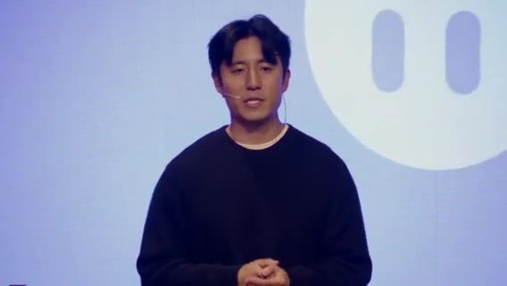

      
*8:03:00 · CS Q&A: チケット単価とトレース*

    
    **[~8:03:00]** 運用: トレースを見て、どのファイル／知識を選んで返信したかを確認する。セットアップ手順の解説動画（X 上）にも言及。

    **[~8:05:00]** Q: 非技術者が Postgres 等へ書き込むリスク／ガードレールは？ A: 権限スコープ・承認・ボット分割で制御する方向（前段デモの読取→書込段階と同じ思想）。詳細は聞き取り一部不明。

      

  
    
### 80/20 と非技術更新

    **[~8:07:00]** チケットの **80/20**—複雑案件は少数。単純側を自動化し、残りを人間＋高信頼フローへ。

    
      
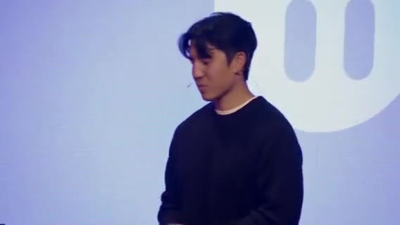

      
*8:08:15 · 80/20 と非技術更新*

    
    **[~8:08:30]** 技術者以外でもナレッジやボット設定を更新できることが重要、と。Q&A を畳みスタジオへ戻る準備。

      

  
    
### スタジオ締め: 進捗・音楽・デプロイ・リーダーボード

    **[~8:10:45]** Day2 巻き上げ。前セグメント中に裏で進めたものを見せたい、と。アプリは動くところまで来た、と報告。

    **[~8:12:00]** ゲーム音楽／SFX 案はバイブスが合わず調整中。「いい value」だがトーン再検討。

    
      
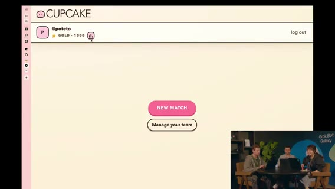

      
*8:14:15 · スタジオ締め: 進捗・音楽・デプロイ・リーダーボード*

    
    **[~8:14:00]** リーダーボード修正が必要。スコアが盛れる／アカウント周り。両者とも1000超えそう、と冗談。

    **[~8:15:17]** 「デプロイに向かう」。自然なゲーム名も考えたい。明日また遊べる状態へ。

    **[~8:16:30]** ボットの次の仕事・ワークフロー接続をどう速くするか、が残課題。

    **[~8:18:20]** DB 周りは未テスト。今夜いくつかゲームを遊べるかも、と期待。

    
      

      
*8:19:30 · スタジオ締め: 進捗・音楽・デプロイ・リーダーボード*

    
      

  
    
### 最終プロモ＆クロージング

    **[~8:19:09]** 再掲: **peestack／Dr. Eggbot** 導入で **無料1ヶ月（$200 相当）**。QR。先着 **1000人・ストリーム視聴者限定**。

    **[~8:19:49]** 「明日も続きを見せる」「アプリを仕上げる」。チャットへの感謝。

    **[~8:20:00]** **See you tomorrow.**

      

  
    
### アウトロ（発言ほぼなし）

    クリップ残り約3分。新規トークなし扱い。エンド画面／余韻。無音ではないが内容追加なし。

      

  
    
### 追記ディテール（再厚め）

    **[~8:01:20]** コストは「常に $X」ではなく、トレース／evals／何段分類するかに依存、と釘を刺す。

    **[~8:02:30]** $0.20 事例は、単純チケットをモデルフル推論に載せない設計が前提。

    **[~8:04:10]** トレース確認は、誤返信の事後検証とプロンプト改善の両方に使う。

    **[~8:06:20]** 非技術者の書込権限は、ボットごとにスコープを分け段階的に上げる、と前段デモと接続。

    **[~8:08:00]** 80/20 を口に出し、全部を同じ信頼度で自動返信しない運用を推奨。

    **[~8:11:20]** Day2 の成果として「動くアプリ」を強調しつつ、裏作業の可視化も続ける。

    **[~8:12:40]** BGM は「あると良い」が、世界観とズレると逆効果、と再選定。

    **[~8:14:40]** リーダーボードはアカウント有無やスコア表示のバグが残る。明日のプレイブル前提で直す。

    **[~8:15:50]** デプロイとネーミングをセットで考えたい、と短い願望。

    **[~8:17:10]** 「ボットに次の仕事をどう渡すか」が、個人生産性からチーム運用への次の問い。

    **[~8:18:40]** DB 未テストを隠さず、今夜のプレイはベストエフォート、と前置き。

    **[~8:19:25]** 無料月は QR を再掲し、見逃した人向けに手順を口頭で繰り返す。

    **[~8:19:55]** チャットへの感謝と「明日もアプリを仕上げる」宣言で締める。

      

  
    
### 追記ディテール（再厚め2）

    **[~8:00:30]** コスト質問への第一声は「サブスクの usage を食う」こと。別料金表がある製品ではない、と整理。

    **[~8:03:40]** X 上のセットアップ動画は、トレース画面の見方を後から追いつく視聴者向けポインタ。

    **[~8:09:20]** Q&A 終了の挨拶後、カメラをスタジオに戻すアナウンス。

    **[~8:13:10]** 「value はある」肯定と「トーンが合わない」否定を同時に言い、音周りだけ切り分けて直す姿勢。

    **[~8:16:00]** デプロイ前に名前を決めたい、はストア／URL／チャット共有を意識した発言。

    **[~8:18:00]** 今夜プレイ可能かも、は確約ではなく希望。DB 未検証を理由に期待値を下げる。

    **[~8:19:40]** 先着1000・ストリーム限定を再度強調し、QR を画面に残すよう依頼。

      

  
    
### セグメント09 まとめ

    CS: usage 連動コスト、$1–2→単純系 $0.20、トレース運用、非技術ガードレール、80/20。スタジオ: 音楽調整、リーダーボード、デプロイ志向、DB 未テスト。Dr. Eggbot 無料月再告知。Day2 終了「また明日」。

      

  本文は `notes-seg*.md` の事実を落としつつ、時刻ラベルを外して段落化したものです。ノートにない事実は追加していません。
  画像は記述的ファイル名を優先し、自動連番ファイル名は埋め込んでいません。
