# Building a company in 3 days - launching today! — Day 3 Recap（日本語記事）

ライブストリームの厚めノートを、時刻印を外した読み物として時系列でまとめたものです。スクリーンショットは話題の近くに少数だけ差し込みます（末尾ギャラリーはありません）。

## ソース情報（REPORT.md）

- ソース: https://x.com/i/broadcasts/1YGNrbXEeazGw
- タイトル: Building a company in 3 days - launching today!
- 長さ: 約 7:58:21。0:00–≈0:09:55 は無音/BRB countdown（本編発話は ≈0:09:56〜）
- 方法: yt-dlp replay → faster-whisper tiny int8 → 日本語厚めメモ＋ffmpeg スクショ
- 欠測方針: 音声が取れない区間は推測で埋めない。BRB 等の無音は無音と書く。

## 開幕・工場・Marketing Ops（Matthew）

seg01 · ストリーム 0:00–1:00

- **範囲**: ストリーム時刻 0:00:00–1:00:00（クリップ時刻＝ストリーム時刻）
- **音声**: （収録クリップ）（3600.07秒）成功
- **字幕**: `seg01/seg01.vtt` / `seg01/seg01.txt`（faster-whisper tiny int8 / en）成功・538 cues。最初の発話は **00:09:56**
- **画面**: countdown「Grok Bot Galaxy」→ 円卓スタジオ Day3 開幕 → ゲーム工場デモ（Bake/Play 等）→ **Be right back** → メインステージ「Grok Bot for Marketing Operations」（Matthew）
- **注**: Whisper は Grok Bot を Grock-Bogg / Grockbot / graph bot / Brockbot / Rothbot 等と誤認。画面表記に合わせて **Grok Bot** に正規化。社名「SpaceX AI」混同あり → 文脈・画面では **xAI**。potato=Lauren、Motion（Whisper: Rootian/Rochan）、peestack（P-FAC / potato mode スキル群）。不明箇所は「聞き取り不明」。

### 無音 / BRB（countdown）

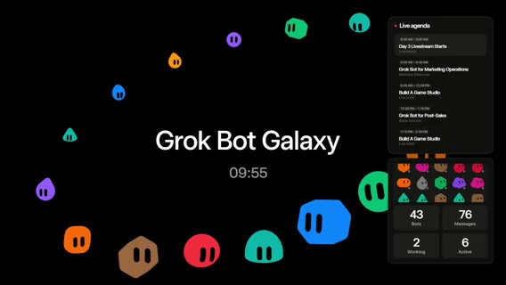

**無音**。AAC ステレオはあるが mean ≈ **−91 dB**。発言なし。推測で埋めない。

画面では、「Grok Bot Galaxy」中央タイトル＋**countdown**（t=0 で約 09:55、t=60 で 08:55、t=150 で 07:25…）。右に **Live agenda**（Day 3 Livestream Starts / Grok Bot for Marketing Operations / Build A Game Studio / Grok Bot for Post-Sales）。下に Cupcake Eng 等の founding bots パネル。

**方針** は、Day2 冒頭と同様、実質スタートは **≈0:09:56**。

### Day3 開幕・自己紹介・新規ユーザー1ヶ月無料

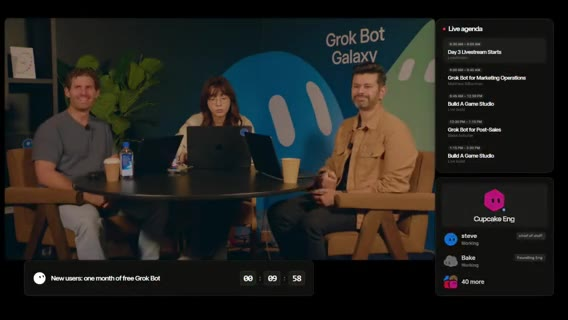

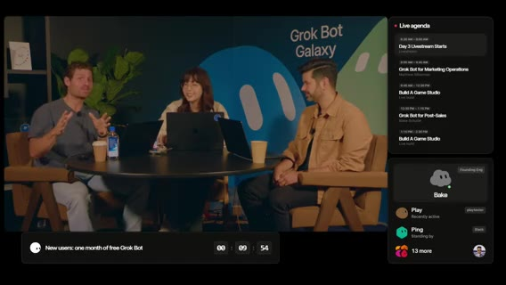

「We're back for **day three**」「today we're **shipping our company**」初めての視聴者向け: **72時間で会社を作る** / **Grok Bot Galaxy** イベント（SF）

自己紹介ラウンド:

1. **Matt** — Developer Experience（音声は SpaceX AI → **xAI**）
2. **potato / Lauren** — Grok Bot 周り（Whisper: Patito / graph）
3. **Motion**（Whisper: Rootian）— Product on Grok Bot。

画面では、円卓3人。右 Live agenda。下バナー「New users: one month of free Grok Bot」＋タイマー。

昨夜 Lauren が **software factory** をセットアップ。その前に告知。**新規ユーザー向けプロモ** は、次の約10分以内にサインアップすると **Grok Bot 1ヶ月無料**。アカウント未所持者向け。タイマーが下に表示。

条件の骨子は、Grok Bot をダウンロード → アカウント作成 → **recurring task（定期タスク）を1つ設定**。potato が例をツイート予定: メール巡回、GitHub issues 監視、Slack 確認など「時間を食う作業」の自動化。

QR / 画面共有で「one free month」。新規アカウントのみ。過去2日視聴していても未登録なら対象、という説明。クレジット込みでかなり太い無料枠。**約 $200 相当 / 最高ティアの1ヶ月**（発言どおり）

残り約9分。その時間で昨夜の進捗も話す方針。

### ゲームスタジオ宣言・工場の仕組み・Potato Mode

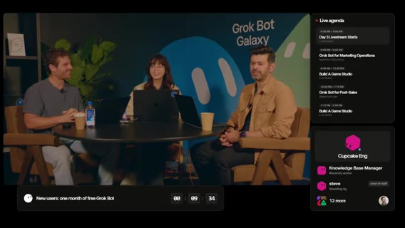

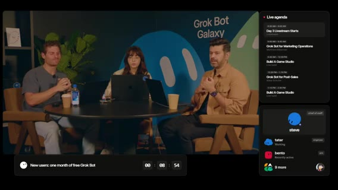

本題: **ゲームスタジオを立ち上げ、今日最初のゲームをローンチ**する。数時間以内。「army of Grok Bots」でゲームを構築。昨日午後から **software factory** を組んだ。

Matt の工場コピーは Lauren の bot templates に触発。Lauren（＋Motion） は、昨夜ゲームメカニクスと polish をブレインストーム。最初は **1v1 じゃんけん＋Elo＋リーダーボード**だったが、遊んでみて面白くなかった。

好きな他ゲームのメカニクスに着想してプラン再設計。Motion と **Cloud agents** で計画。**peestack / P-FAC** は、Lauren 個人のスキルセット（Cursor プラグイン＋Motion プラグイン、聞き取り）。その中のスキル **Potato Mode**。

Potato Mode は、ボットをより厳密に・他ボット／エージェントのオーケストレーションを上手くする教え込み。`/potato mode` ＋「full auto pilot this plan」→ 計画を小さなフェーズに分解 → ミニ工場: PR 実装エージェント、検証エージェント（アプリ起動・fuzz／クリックテスト・バグ発見）→ 信頼が十分ならマージ／フルオートパイロットで auto-merge。

一晩で **100本超の PR**。クローズ済みは **〜170** 前後（発言ゆれ 145→170）。UI リデザイン、バックエンド強化、セキュリティ／負荷対策など。

### Play ボット（QA）・Routines・「工場」の意味

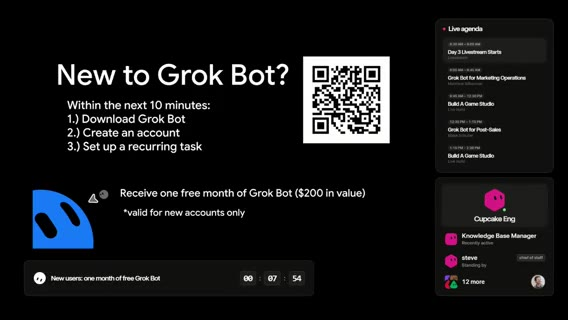

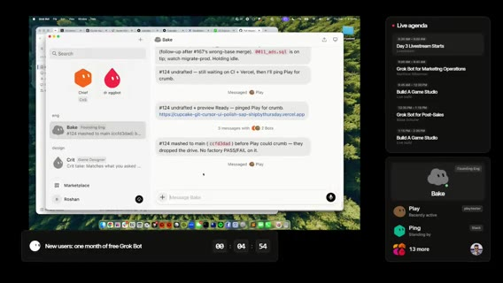

デモ: PR #124（UI）をマージした直後のボット間通信。ボット **Play** = playtester / QA。昨日いたインターンは今日いないので QA ボットが PR を見る。

**subscription / recurring task / イベント応答** は、CI が緑の PR を見たら自動でプレイテスト、UI を end-to-end で操作、ゲームエンジン理解に基づくフィードバック。

画面では、Grok Bot アプリ「Bake」（Founding Eng）のチャット、PR #124 mashed to main、Play が playtester。Live agenda＋無料タイマー。

Lauren は、「factory」という語は好きではないが、自動化の近い比喩。エンジニアでなくても反復タスクは多い（メール忌避など）Grok Bot に inbox / Slack / GH PRs を教えれば自動化できる、と推す。

プロモ残り約2分20秒の再告知（アカウント＋recurring task）Matt の要約: software factory の本質は **エージェントが自分で回せるフィードバックループ**。人手の UI クリック・検証・ログ確認を減らし、正しいコンテキストを渡す。ソフト開発だけでなくメールやビジネスオペにも同じ。**会社を AI で作る**＝人間ワークフローを分解し、エージェントがやるべき部分を切り出す（スパム除去・下書きは可、送信判断は人間、等）

### ゲーム UI 初披露（コードネーム Cupcake）

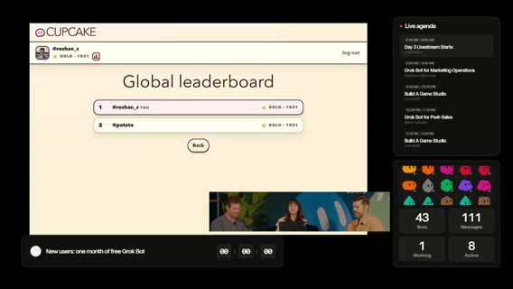

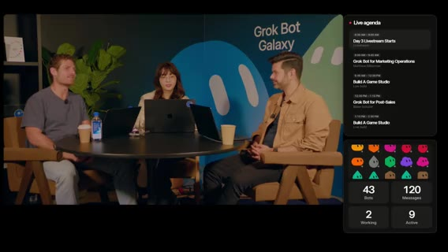

プロモ残り約1分。並行して Matt が UI polish 用ボットを追加起動。ゲーム UI を見せるか議論（スクロール問題など「恥ずかしくないなら」）

**コードネーム Cupcake**。正式名はローンチ時に発表予定。「stay tuned」**Login with X（Twitter）** 動作。グローバルリーダーボード。

ゲーム画面共有（カード／対戦／リーダーボード系 UI。細部は画面依存）。スポンサーシップフォームがメインに残っていて後で移す必要あり、とコメント。「mid-game に捕まえた感じ」として、工場がまだ磨き中だが動き続けている。

画面では、付近。

### ティア／競技・ロードマップ・Steve・遷移前

視聴者にも **platinum tier** などを競えるチャンスを、という言及（ゲーム内ランク／チャレンジ、聞き取りやや不明瞭）ゲーム知識とオフカメラ作業のつなぎ。音楽ボットは未優先だが **Suno** でトラック生成済み。「annoying nice」な音楽にする約束。

今日はローンチして終わりではなく、アプリを継続更新。昨夜オーディオデザイン、3D プロト（アニメ／キャラ）もボットが試作。チャットに UI polish / メカニクス案を求む。

本番の Live agenda と画面上の bots を紹介。**Steve** = chief of staff ボット（ショー運営）。Cupcake 関連ボット。Lauren も自分の chief of staff を Steve に改名した話で笑い。最初のトークまで約3分 — **Grok Bot for Marketing Operations**。今日はゲームスタジオ立ち上げ＆初ゲーム公開日。視聴者プレイ→フィードバック→自動 feature factory へ。

Login with X でエラー報告。サーバ側ログを見て Grok Bot に渡す、というリアルタイムデバッグ。「Grok Bot に渡せる仕事に本質的な上限はない」方向の話の途中で音声が途切れる。

### 無音 / Be right back（ステージ移動）

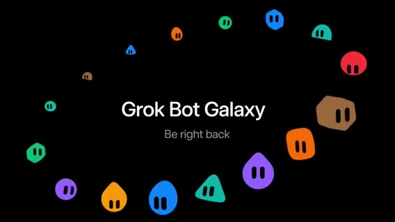

**無音**（mean ≈ −91 dB）。約 **5分57秒**。発言なし。捏造しない。

画面では、「Grok Bot Galaxy / **Be right back**」＋キャラクターリング。

**文脈（画面・前後のみ）** は、円卓からメインステージ（Marketing Ops トーク）への移動想定。音声は欠測。

### Matthew — Grok Bot for Marketing Operations 開幕

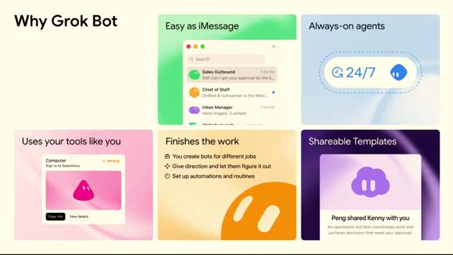

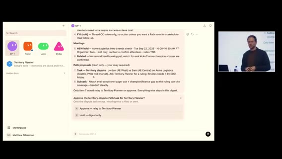

発話再開。モデル改善で「より真になる」前提の続きから。**always-on agents** — ノートPCを閉じても止まらない。自然言語でボットに話し、権限を把握し、夜通し価値を出す、という「Why Grok Bot」の流れ。

画面では、スライド「Why Grok Bot」— Easy as iMessage / Always-on agents / Uses your tools like you / Finishes the work / Shareable Templates。

登壇者は xAI 内部の **revops / marops** での Grok Bot の使い方を共有（アジェンダ上の名前: Matthew。Whisper 姓名ゆれあり → 画面 Live agenda「Matthew … Marketing Operations」に合わせる）会場挙手: revops/marops、GTM engineering / systems。

キーメッセージは、**rules だけでなく tools を建てられる**。キャンペーン設定チェックリストを配るだけでなく、ルールを守る内部アプリ／インフラを作れる。マーケ／セールスが「ゲーム」をプレイし、ops がそのゲームをデザインする。デモ前に自分のボット軍団を紹介（音楽ガジェット由来の名前）:

1. **OP1** — synthesizer メタファー / Chief of Staff 的に仕事を回す。
2. **Fisher** — 全 inbox 受信（email / calendar / SMS / Slack）
3. **Juno** — PM ボット（要件・コーナーケース）
4. **Owned**（Whisper: owned）— engineer ボット（CRM・DWH・内部ツールコードベース）

### デモ1: Self-completing task list

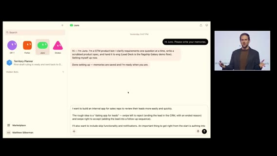

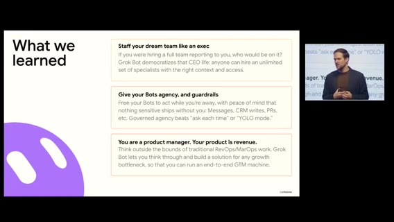

**self-completing task list**。生産性オタクとして半十年、revops の本質はステークホルダー管理＋優先度判断。

ボットが全 inbox を監視し、実タスク vs FYI を蒸留。デモ中も Fisher が 9:04 の定期ルーチンで inbox を吸い、**OP1** に email/calendar/work chat のサマリーをプロアクティブ送信。

通知オフでも重要だけ浮上 → コンテキストスイッチ削減。ボットはメッセージ単体だけでなく Slack スレッド全体を読み、「相手が何を求めているか」を蒸留。

Fisher＋OP1 がタスク化 → 例: AE 間の **territory dispute** → **territory planning bot** へリレー（ROE・CRM 文脈付き）→ 成果物の第一草稿まで。人間は検証・最終化。「本当にチームがいる」として、監視・蒸留・専門ボットへの委譲・監督。

### デモ2: 「リードのマッチングアプリ」（社内）

社内の **dating app for leads**（比喩）。マーケ→セールスのハンドオフが古典的に壊れる問題（リード放置、フィードバック欠如）AE が自分のリードだけ見て、左スワイプで end（理由必須→CRM 正しい書き戻し）、右スワイプでフォローアップシーケンスへ。ops は SLA 説教ではなく「ゲーム」を設計する。

Juno（PM）に「内部アプリ案＋CRM 双方向が最重要」と依頼。従来 AI はすぐコードに走りプロンプト不安を生む。**Grok Bot は良いフォローアップ質問**をする（フィルタ、accept 時の CRM フィールド変更の有無、オフライン操作の確認など）

例は、accept 時は CRM フィールドを変えない — 実ステータス変更は「レップが連絡した瞬間」で既存オートメーションがある、と人間が深く考え直す。Juno が仕様を起草し、促されず **Owned（eng）へハンドオフ**してビルド開始。「チームが end-to-end で動く」感。

完成 UI デモ（モックデータ） は、カードにリード情報、左 end / 右 sequence、流入経路など。アイデア→実装は約2週間、うちライブビルド実質 **約10時間**。残りは導入・フィードバック。採用後リード review 率が急上昇。AE もマーケも高品質フィードバックを好む。

会場挙手: AI なしで同等プロダクトを作れる人はほぼ片手。AI／このデモ後は多くの手が上がる。

### 教訓スライド → Q&A へ

教訓:

1. **フルチームを雇えるなら誰を入れるか** — Grok Bot は「CEO 的な雇い方」を民主化。無制限に専門家を文脈付きで雇える。
2. **ボットを信頼しつつガードレール** — 権限を把握したうえで大きなタスクを任せ、出荷前に必ず戻す（CRM 書き込み、PR 等）。
3. **ルール屋ではなく PM** — プロダクトは **revenue growth**。Dreamforce 週という文脈で、GTM のボトルネックを見つけて潰すのが仕事。人間関係・信頼・要件蒸留のあと、実際に建つ。

本編終了、質疑へ。

### Q&A（WhatsApp / コネクタ / 1Password）

質問は、WhatsApp をマーケ用途で Grok Bot と連携するには？登壇者: ネイティブ WhatsApp コネクタの有無は断言せず。個人的には **Beeper** のようなメガチャットをボットのコンピュータに入れて、アプリを人間同様に使う手がある（ネイティブ連携がなくても可）

別質問: Meta / Google 広告などネイティブ認証が切れる問題。ロードマップは？詳細ロードマップは話せないが、**昨日発表の 1Password 連携**: パスワードボルトをボットと共有 → トークン／ログイン切れを監視するルーチン → 必要ならボルト経由で再認証、というパターン。

質問者の夢: 広告モニタ→予算増減→新規広告作成のループ。登壇者: revops 的には元来「システム／プロセス／ワークフロー理解」が仕事。その傾向を AI に載せると自動化になる。複雑な仕事の分解が鍵、と締めに入り **1:00:00** でセグメント境界。

## Q&A・BRB・Thursday Arena ローンチ

seg02 · ストリーム 1:00–2:00

- **範囲**: ストリーム時刻 1:00:00–2:00:00（クリップ＝ストリーム−1h）
- **音声**: `clips/seg02.mp4`（3600.07秒）成功。全体 mean は発話帯で ≈−30〜−34 dB
- **字幕**: `seg02/seg02.txt` / `.vtt`（faster-whisper tiny int8）**1012 cues**
- **画面**: Marketing Ops Q&A 続き → BRB → 円卓「Build A Game Studio」再開 → 本番デプロイ／リーダーボード／**Thursday Arena** 名公開 → ローンチダッシュボード
- **注**: Grok Bot / xAI / potato / Motion / peestack / Clerk（Whisper: CLERG）/ Vercel / PlanetScale / Thursday Arena を正規化。

### Q&A続き：仕事の分解・ボットと人間の関係・職の価値

前セグメント末の続き。複雑な仕事はチャンクに分解（例: 広告プラットフォームログイン→分析、レポートDL、他データと照合…）。非AI世界でも詳細手順を書ける人ほどボット化しやすく、専門ボットをタンデムで回せる。質問は、ボットが進化するならマーケスタックの何が先に消えるか。ボットと人間の関係は？

登壇者: **鏡（mirror）**。思考パートナーとしての Q&A で、ボットが自分の見落としを突く → 自分が深く考える → またボットに返す。「AI をプロンプトする」だけでなく **AI がこちらをプロンプトする**。消えるスタックは断定しにくい。複雑なツールのボタン知識は残るが、コーディングと同様に参入障壁は下がる。ゲートキーパーとしての価値は減り、**高次の思考・システム直観・taste** が残る。メニューマスター志望者は少ないが、面倒な作業が思考を遅らせ深める効果は AI と同様にある。ボタン配線・インテグレーション作業は減る方向。

### マルチプレイヤー／Tesla／Juno テンプレ／セールス反応

質問は、各自が自分の Grok Bot を持ち同じプロジェクトを進めるとき、エージェント同士の調和はどう考えるか。ボットが個人の思考を学習するが個人最適に閉じる問題。登壇者: 会社として先走りはできないが、**まもなくこれに応える面白いもの**が出る、と示唆。ホスト側も「みんな multiplayer を待っている」と茶化す。

会場 は、「Grok Bot on Tesla？」→ 答えられない／親も Tesla 持ちで同じ質問が来る、と笑い。Max は、**Juno テンプレ**は？ → 今日見せたボットは後でテンプレとして共有できるよう手配する。

セールスの反応は？ → **大好き**。通勤電車で左右スワイプしてリード処理、隣席には何のアプリか分からない。数週間で lead review rate が記録更新。5タブ・多数メニューより圧倒的に良い。ジョークとして、「人生に別のデーティングアプリは要らない」→「でもこれはデートが成立するとお金になるデーティングアプリ」。signal→SQL のコマンドセンターへ拡張余地。**Grok Bot** のおかげで積み上げ続けられる。

### 人間が残すべき仕事・Starship チャレンジ告知・トーク終了

最後の質問: AI ができても **人間がオーナーであるべきタスク**は？関係・信頼・問題解決。4歳で revops/marops を知る人はいないし、今日100%説明できる人も会場で挙がらない——人間が作った概念。肩書きやツールに依存せず、関係を築き問題を解くことが常に仕事。

画面でチャレンジ発表: X で「なくてはならない Grok Bot」を共有 → 当選者＋ゲストが **Starbase（Texas）で Starship 打ち上げ観覧**のチャンス。応募: **@grok** と **@bot** をフォロー → チャレンジ投稿を **quote** → ボット説明＋共有テンプレリンク。QR あり。「good luck」。感謝でトーク終了。

### BRB／低音量（発話キューなし）

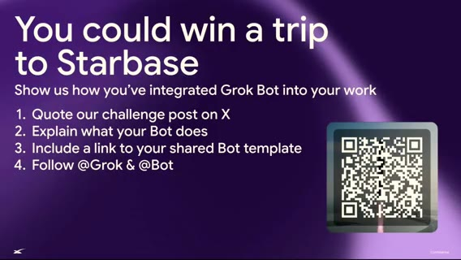

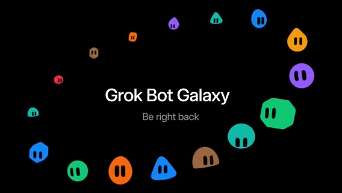

一瞬「Okay, we're back.」のあと、Whisper cues が途切れ **≈1:21:04** までギャップ（約10分）**音声** は、区間の mean は ≈−40〜−45 dB（完全無音の −91 dB ではない）。環境音／BGM の可能性。**明確な発話キューなし → 内容は捏造しない**。

画面では、Be right back 系／ステージ切替想定。 等。

### Welcome back：カードバトル・工場・Clerk／DNS／ドメイン未公開

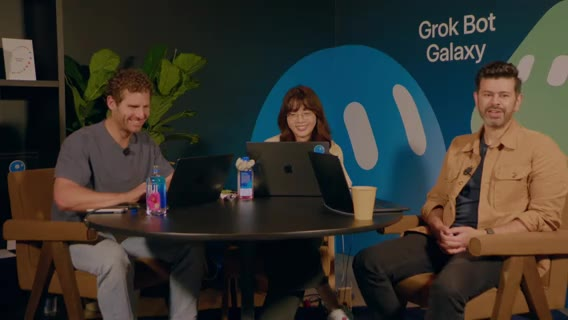

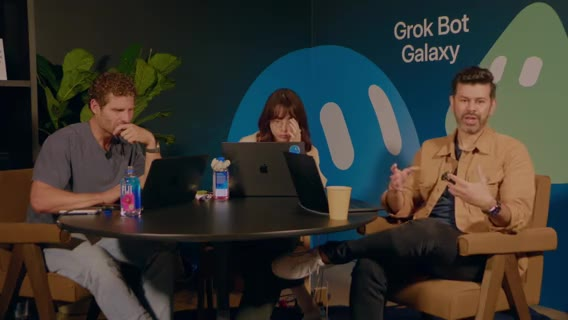

「Welcome back」。Day3、ゲームスタジオ＆初ゲームをデプロイ中。Grok Bot でゼロから事業／ゲーム。クライアント／Web secrets 管理中——本番シークレットは配信に出さない。

ゲームは **card battle 系**。UI polish パス進行中（「期待値を下げて」と茶化しつつ改善中）SF の Grok Bot Galaxy 会場。下りでトーク、上りでスタジオ。日中カットイン多数／ゲスト可能性。午後はマネタイズ・マーケ／レベニューの xAI メンバーも予定。

目標: アプリを live → プレイ中フィードバックをアプリ内へ → play test → **embarrassed なら ship** の古典に従い今日中に反復。工場: 自動バグ修正・自動プレイテスト・自動 PR レビュー。本番バグ検知 → Cloud agent に PR → Play tester がエンジン通し → CI と合わせて承認。Grok Bot × GitHub。

**Clerk** で Login with X。Elo／リーダーボード／practice mode。今はドメイン・DNS・CORS の詰め。「It's always DNS」スタック: Clerk（認証）＋ **Vercel**（ホスティング／preview を playtester が叩く）＋本番 hardening（DB・ingress・セキュリティ）

**ドメイン名はあるがまだ非公開**。まもなく名前公開。**PlanetScale** で負荷試験済み。

### Ops スタック・フィードバック triage・コンテキスト管理

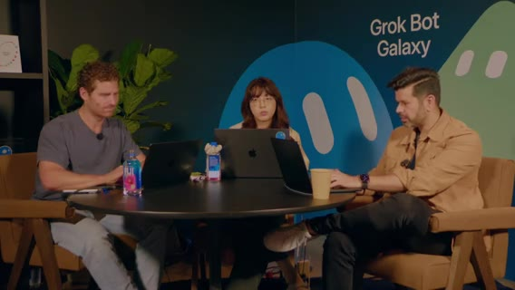

Slack（バグ報告チャンネル等）の ops スタック。ボットが人間より速くツールを使う。xAI 内部でも issue 投稿 → triage ボットが再現・ログ・担当提案。（以降）エンジニアリング作業の節約、接続作業としてのソフト開発、コンテキスト管理の話が続く。工場の「何をボットに覚えさせるか」が品質を左右。

コンテキスト管理の具体・クリーンアップ項目の列挙（UI 粗・バグ・文言）。画面共有で工場／PR 状況。

### ゲーム内コンテンツ・経済・手動プレイテスト案

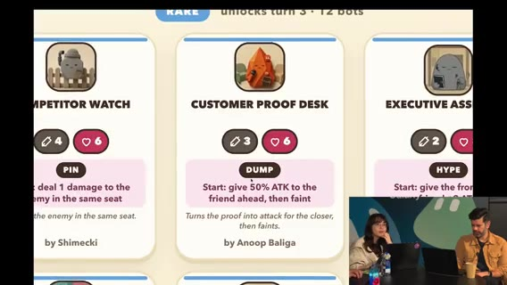

自チームのランキング／スポット表示の確認。writing bot など役割ボットが稼働。

デザイン／バランス議論（カード売却でゴールド等の経済）「売るとゴールド1」系ルールの言及。

fuzz／ステップバイステップ体験ウォークスルー。人間も一斉に入って手動プレイテストする案。気に入った bot template を作ってくれれば、という視聴者向け呼びかけ。

### 経緯振り返り・**Thursday Arena** 名公開・公式アカウント注意

Day1 遅く〜Day2 初めにアイデア確定、という振り返り。**正式名公開** は、ゲームスタジオ／ゲームの公式は **@ThursdayArena**（X）と **thursdayarena.com** のみ。それ以外は公式ではない、と明言。

フォロー促進がサイドクエスト。Lauren: Apple 絵文字 PNG 化ツール（emojis.…）でカップケーキ絵文字を仮プロフィールに。favicon / OG / SEO・AEO はこれから。

### リーダーボード急成長・Launch pulse ルーチン

リーダーボードに **96人** → すぐ増加。サインイン動作確認。Motion は、ローンチ用ダッシュボードをボットに依頼中。**15分ごと Launch pulse**（サインアップ、practice 数、practice→本番アカウント転換ファネル等）。xAI 内部ローンチでも同手法。

実況: Motion 1位、Ben J. Bush 2位、Lauren 順位下降… 更新頻度を1分にしたい話。フォロワー **225**。同時接続数も欲しい。「まだ落ちていない」ことに感心。Ben が1位に。リーダーボード賞の話は近日。ユーザー数急増の声。

### peestack で無査読マージ・Go／PlanetScale・型安全

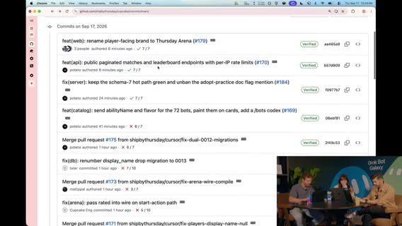

昨夜工場フル回転。**Potato Mode + peestack** で「巨大な X 群衆に耐える性能」を指示。**コードは一切見ていない**と正直告白——それでも耐えている。ユーザーほぼ **500**。バックエンドは **Go** の serverless（Whisper: herself→**Vercel functions** 文脈）。DB は **PlanetScale**。

FE/BE の型同期問題。REST。応答を **Zod**（Whisper: pod）でパースしネットワーク越しの型安全を担保する現実的アプローチ。理想設計にはまだ時間不足だった、と。thursdayarena.com への QR 要求 → もう出ている。

### ローンチメトリクス・Hockey stick・ゼロイチの見方

Motion 画面: Grok Bot 上の founding eng が issue を聴き続けている。ローンチ指標はダッシュボードサイトよりボットに聞いた方が速い。**Hockey stick** チャート登場。practice sessions **600超**。practice→Sign in with X 転換などファネル。Sign-in with X **400** 超（既に過小表示の示唆）。「funding 取りに行こう」ジョーク。

ファネル離脱、リテンション、将来のマネタイズ指標の話。Lauren→Motion: PM として何を見る？ → ゼロイチではマネタイズ前なので **Bay Area Growth Machine** 的に「人が遊んでいるか・楽しんでいるか・入れ続けられるか」が最優先、と **2:00** 境界へ。

### 補足：デプロイ細部・工場・コンテキスト

Clerk 開発者アカウントで Login with X。Elo・リーダーボード・practice mode。ドメイン／DNS／CORS の本番詰め。「It's always DNS／sometimes CORS」

Vercel preview URL を playtester が叩く流れ。本番は DB・ingress・セキュリティ hardening。PlanetScale 負荷試験。ゲームストア用 DB 群。

Slack バグ報告チャンネルにリアルタイム流入。ボットが triage（再現・ログ・担当提案）し人間より速い。コンテキスト管理・プロンプト差分・品質低下リスク（3人＋多エージェント）。工場が「何を覚えているか」が品質を決める。

自チーム順位確認、writing bot、カード経済（売却でゴールド）のバランス議論。人間一斉プレイテスト／fuzz の提案。気に入った bot template 募集。

### 補足追記

Thursday Arena 名公開は Day3 最大のマイルストーン。公式チャネル限定の注意が以降繰り返し。peestack+Potato Mode 無査読マージでも負荷に耐えた、が技術的正直さのハイライト。

Go serverless + PlanetScale + Zod 型ガードが「工場の土台」

## 工場運用・Cal Day・Growth（Vincent）

seg03 · ストリーム 2:00–3:00

- **範囲**: 2:00:00–3:00:00（クリップ＝ストリーム−2h）
- **音声**: `clips/seg03.mp4`（3600s）成功。発話帯 mean≈−28〜−35 dB
- **字幕**: `seg03/seg03.txt`（971 cues）。**≈2:38:09–2:44:19** は cues 欠落（音量は残存 ≈−30〜−36 dB → Whisper/VAD 欠測。捏造しない）
- **画面**: ライブビルド／メトリクス → フィードバック→工場ループ → ゲスト（Cal Day）→ **Vincent（Growth）** と Thursday Arena 成長プレイブック
- **注**: Grok Bot / xAI / peestack / Potato Mode / Thursday Arena / Clerk / Vercel / PlanetScale / Dr.Eggbot 正規化。

### ゼロイチ指標・マッチメイク／Elo の不調

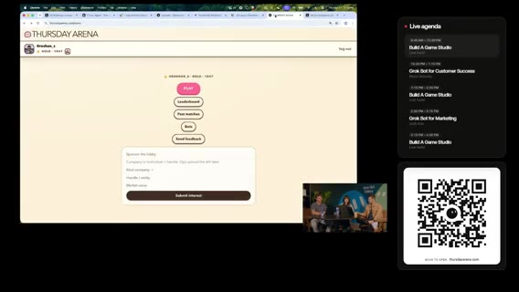

前セグメント続き。プレレベニューなので収益より **engagement / retention**。ファネル完走・再訪。将来は中小ビジネス成長支援も視野、だが今はコーヒー代もまだ。ゲームメカニクスが最重要。自分たちも大量にプレイして感触を取る。

現状は **loss heavy**。AI マッチメイクが怪しい可能性。相手プールから消える／スナップショット不整合の疑い。上位ほどポイントが取りにくい設計の言及。Elo 表示バグ候補。

Ghost Players / AI players / unknown の内訳。勝敗は負け過多。

### データ接続・プラグイン・リーダーボード実況・フィードバック導線

ボットが情報を集約できる話。プラグインがあれば何でも、なければエージェントに直接指せる。自分の順位（27位など）をどう上げるか実況。

Lauren のフィードバックループ論に接続。外側データ→内側エンジニアリングループ。視聴者向けの面白い参加導線を追加作業中。

**Steve**（chief of staff）経由で、ユーザーフィードバックを受ける **Slack チャンネル**のリンクを案内。チャット勢への感謝。Slack にフィードバック送ってほしい。

### フィードバック監査・フィルタ・優先度・OG

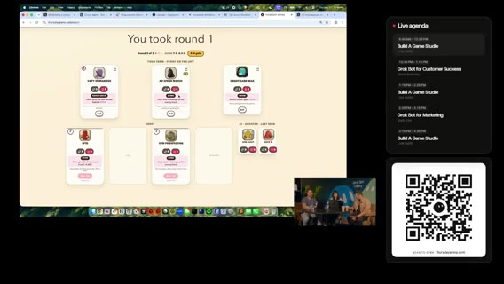

フィードバックを監査済み。バグ／要望／感想が混在。サーバ側で **profanity** 等フィルタ。

Elo 関連の報告も混ざる。優先度の付け方を議論（Motion↔Lauren）「Oh no」系のライブインシデント反応（詳細は画面依存）

Twitter にリンクを貼ったときの **OG／プレビュー**がどう出るか確認中。

### 工場エンジン再説明・triage・verification swarm

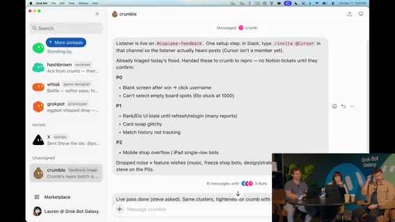

今朝話したコーディング・エンジン／工場の再掲。3人＋複数エージェント＋異なるプロンプトでの協調。ボット作成を担当するメタボット的な役割。

triage ワークフロー: 確認済みバグ用。peestack 上のスキル名の説明。

**verification swarms** は、swarm スキルが Cursor 上で多数の **Cloud agents** を spawn。各エージェントが別マシンでゲームを起動しクリック／**fuzz**（パワーユーザー的にエッジケースを潰す）。人間のクリック労働を減らしつつ、人間 fuzz も併用。Vercel / PlanetScale / Slack フィードバックを Grok Bot に接続 → 外側ループと内側（実装）ループが噛み合うと、理論上 **バグが自動修正されゲームが継続改善**。Dr.Eggbot に設計相談した言及（聞き取り）

エージェントシステムのセットアップに時間を投資するレバレッジ。ボット同士の役割が見える状態が強い。

### 番組案内・公式ドメイン再掲・ゲスト Cal Day 導入

番組アップデート: 約 11am PT。ゼロから事業／ゲームスタジオ。**thursdayarena.com** と **@ThursdayArena** のみが公式。ゲスト **Cal Day** — Northeastern の product/engineering 系 SVC（肩書き Whisper ゆれ）。大規模コードベースの手動検査は困難 → Cursor で早期結果、という話の導入。

エージェント監督＝アーキテクト、ツールを呼び大規模協働、という論点。同趣旨の続き。

### 字幕欠測（音量あり）

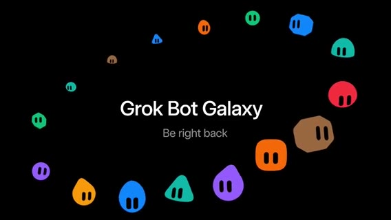

**事実** は、cues が約 **370秒** 途切れる。volumedetect は mean≈−30〜−36 dB で完全無音ではない。**方針** は、Cal Day トークの続き／Q&A／切替の可能性が高いが、**内容は推測で書かない**。画面フレーム `t0238*_gap.jpg` 等を参照。

発話キュー再開。

### Motion 再導入・Vincent（Growth）参加・初手アイデア

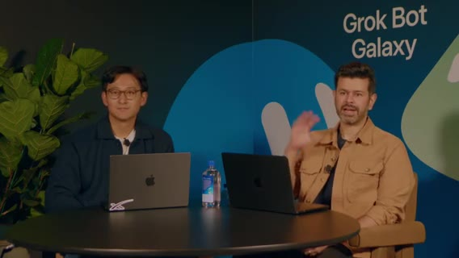

Motion（X: 音声 Roation → **Motion**） は、3日目。火曜は物理ポップアップ案 → ゲームスタジオへピボット。今朝 **thursdayarena.com** ローンチ。ゲスト **Vincent** — growth チーム（所属名 Whisper「Smith's」ゆれ → 文脈上 xAI／関連プロダクト成長。確定できず「Growth の Vincent」と記す）

Growth とは？ PLG ではライフサイクル・ナッジ。セールス寄りなら大量メール／LinkedIn。文脈依存。Thursday Arena はサインアップ型で PLG に近い。

ゲーム画面共有（UI 未完成を謝罪）。Vincent から 15–20分でビジネス化インサイトを引き出すセッション。「growth versus dream」

Login with X → リーダーボード。Motion は順位下降中（一時1位→35位付近）Vincent 第一声: リーダーボード入り直後に **シェア用ポップアップ**（アーケードのネーム入れ感覚／X ハンドル）

Motion が **growth ボット「Vincent」** を作り、Notion に成長アイデアをログ／プレイブック化開始。

### シェア導線・対戦体験・カード希少性

試合終了→リーダーボード→ X にシェアして自慢、の導線をプレイブックに記録。対戦: 相手に能力があり、バトルが進行。**3ラウンド制**。ラウンド間で戦略（ボット／カード購入）

例は、デザイン critique ボット（Manuel／デザインチーム作）などカード。uncommon 等のティア／希少性。Vincent は、カードをシェアしたら別カードがもらえる、等の **viral growth mechanic**。即プレイブックへ。

### Notion プレイブック・自動 DM・アウトバウンドの注意

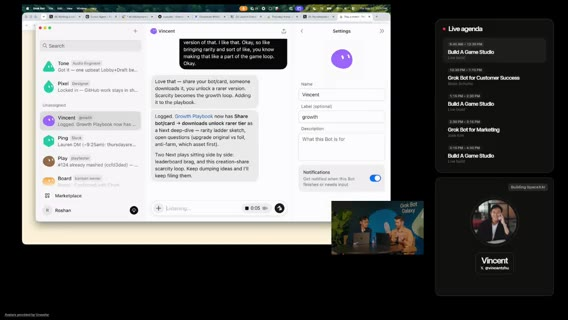

Notion ドキュメントを開いてアイデア蓄積。自動 DM の案（詳細は文脈依存）

成長施策の Continuations（アウトバウンド、通知、スパム回避）アウトバウンドで大事なのはスパムに見せないこと。Lauren: 購読解除されないと圧倒される、と共感。

セグメント境界（3:00）へ。Growth セッション継続想定。

### 補足：フィードバック運用の詳細

Motion が作ったばかりのボットにフィードバック閲覧を指示。ゲームプレイ系 vs 実バグの多数派を把握。Matt 画面で生フィードバック。自分のプレイテストで「cannot buy new」等を発見し自分でも issue 化。

バグ修正大量。Slack に集約。チャット勢への感謝。ネットの自由記述は危険 → サーバ側 **profanity** フィルタ、**xAI モデル**での追加防御、**rate limiting**。

負荷でサーバを潰さないよう注意しつつフィードバック閲覧。例は、「金を買えるようにして play-to-win／収益化」要望、Elo 関連、バグ／要望／感想の混在。

Lauren は、社内でも類似プロセス。フィードバックをカテゴリ分けして俯瞰。モバイルレイアウト問題が先。AI-only／ランクマッチ問題も。新機能欲と安定性のトレードオフ。光る新機能より **美しい体験を執拗に磨く**。バグはフィードバックのごく一部、と優しいチャットに感謝。

ジョークとして、potato 配列ギフト／「Elon が X の新サブスクかも」として、—感謝。OG タグ／SEO preview。リンク共有時にちゃんと見える V1 OG 画像。ビジネスの基本メタ整備。

### 補足：Cal Day（Northeastern）ビデオトーク

11:15 に Vincent（マネタイズ／成長）。その前に本番向けビデオ挿入。バグ修正は継続、フィードバック歓迎。玩具ではなく事業にする話へ。

**Cal Day**（Northeastern、product/engineering 系リーダー） は、Cursor をエージェント・プラットフォームとして使い、職務ごとに特化したエージェントを「席にいる人間」のパートナーに。高速イテレーション → 顧客経済性（ユニットコスト・満足度）。レジリエンス／信頼性／セキュリティは「速くやる」だけでは足りない領域もある、と。

「船を焼いた」として、—今年の計画がこれに懸かる。プロダクトは **50M+ 行**規模。モノリス分解の途上。手動検査は絶望的 → Cursor 初期分析が驚異的。従来なら専門家十数人・数ヶ月を、**2人で数週間**級に。顧客影響欠陥の RCA も巨大コーパスに対して加速。

次は multi-agent 配備／オーケストレーション。エンジニア／アーキテクトは **エージェント監督**へ。SDLC 全体を再設計中。「Welcome back」のあと cues が細り、**2:44:19** まで欠測（ビデオ残り／切替。音量あり）

### 補足：Growth セッションの肉付け

「プロダクトはある。事業にはまだなっていない」として、Vincent から 15–20 分で成長インサイト。Notion の growth playbook に逐次追記する運用そのものがデモ。

試合後シェア → 友達をブランドする CTA。カード1枚シェアで別カード獲得、希少性×バイラル。

Notion 継続更新、自動 DM 案、アウトバウンドはスパム化しない設計が鍵。Lauren は購読解除疲れに共感。

## Growth続き・Mattと事業成長

seg04 · ストリーム 3:00–4:00

- **範囲**: 3:00–4:00（クリップ＝ストリーム−3h）
- **音声**: `clips/seg04.mp4`（3600s）成功。発話帯 ≈−28〜−33 dB
- **字幕**: 1256 cues。ギャップ **≈3:16:41–3:23:08**（低音量≈−40〜−48dB、発話キュー薄／欠。捏造しない）および短ギャップあり
- **画面**: Vincent Growth 続き → プロモ告知 → BRB → Thursday Arena 再導入＋Matt（マーケ／収益）→ ゲーム歩き＋マネタイズ／アウトバウンド構想
- **注**: Grok Bot / xAI / Thursday Arena / Vincent Zhu（Whisper: Jube 等）/ potato / Motion 正規化。リンクは音声どおり **x.ai/bot**（聞き取り）。

### アウトバウンド／メール・ゲーム類型・Growth リスト化

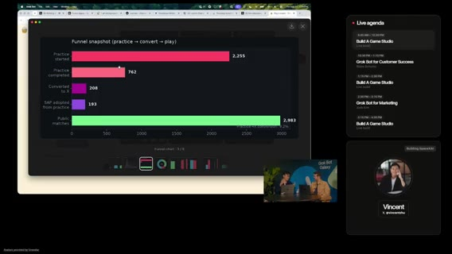

前セグメント末のスパム疲れ続き。Lauren: 件名フックより **差出人名／ベンダー名**で開封判断しがち → 「誰を知っているか」が鍵。potato 名義メールで信頼を借りる案。ボットに専用メールを持たせる話。

成長メカニクスの類型: **match-3（Candy Crush 系）** など他ジャンル参照、広告枠の見せ方。マーケ／成長プランへ戻る。

### Growth 施策のスタックランク・ボットオンボード

ライブで Growth 施策を **レバレッジ高→低**にスタックランク。エージェントにも優先度付けさせ、人間と不一致なら議論。Vincent に「過去に効いた growth」を質問。マーケ vs growth の境界は会社依存。

Growth は初見画面・メール文面など「初めて見る人」視点の仕事が多い。スプレッドシート／スライド等の primitive。ボットを会社のやり方にオンボードする時間がレバレッジ（話し方・進め方を教える）

### ダブルプロモ（無料枠）・公式再掲・Vincent 締め

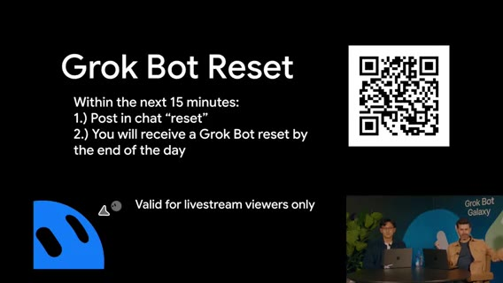

プロモ2本。ゲームのトップオブファネル＋ Grok Bot 新規。**x.ai/bot**（聞き取り） は、新規が次の15分でサインアップすると特典（午前の1ヶ月無料と同系統の再告知）。「無料配布は最強の growth の一つ」「心を勝つ」

Growth＝自分がユーザーならどう扱われたいか。QR 同一コードで案内。

公式は **thursdayarena.com** / **@ThursdayArena** のみ（音声ゆれ多数 → 画面・既出表記に正規化）会場 は、Dreamforce 至近、下階メインステージ、上階スタジオ。

Vincent（X: Vincent Zhu 系）に感謝、growth アイデア実装へ。フォロー誘導。Vincent 退出。

### 低音量／キュー薄（BRB 相当）

音量は完全無音ではないが Whisper cues が薄い。ステージ切替／待機の可能性。**内容捏造なし**。「We are building Thursday Arena」で再開。

### 再導入・Matt 参加・自動化で事業成長へ

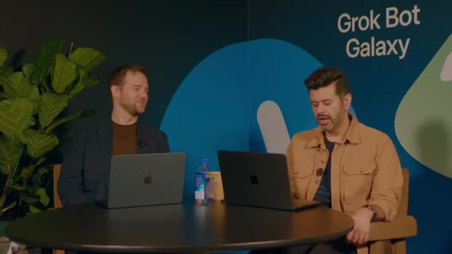

Motion は、Day3、Grok Bot Galaxy＠Dreamforce 隣。ゲストをすぐ紹介。成長ボット／自動化で事業を伸ばす話へ。これまで開発ループ中心だったのを、同じ手法で **grow the business**。

Grok Bot で事業全体を組んでいること、auto-build / auto-improve エンジンの再掲。

### Matt にゲーム披露・Platinum・Professor X 比喩

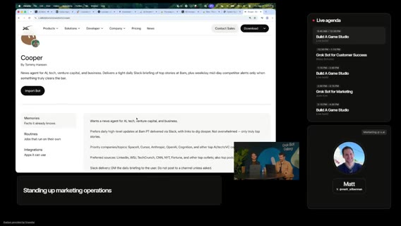

Matt（午前メインステージの Marketing Ops 文脈の人物と同一系統／収益・マーケ）にゲームを見せる。裏で UI／バグ修正も進行中のはず。**Thursday Arena** / thursdayarena.com。Login with X or practice。

**Platinum tier** 到達者 **9人**に Congrats。Lauren の **Inbot** テンプレ（inbox 管理）。チューニングして自分用に、と案内。

Growth 思考: **X-Men / Professor X** 比喩（椅子に座り全体を見る＝コンテキストを握るボット／オペレータ像、聞き取りに基づく）

### ボット追加手順・他ゲーム参照・広告／メール

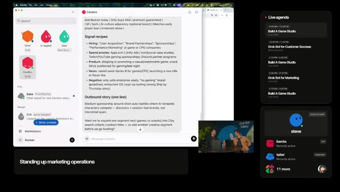

チームに新ボットを足すときの原則（誰の仕事か→どう委任か）他インディー／カジュアルゲームの学び。概念が多く学習コストがある。

すぐ **広告（画面スペース販売）** 案に寄る。インプレッションを示して「ライフの一部をシェアして」と営業。コールドメール案: 「短時間でヒットしたゲームを作った」実績をフックに。

単純な「広告載せませんか」でも動くことはあるが、ターゲットの信号／データを集めて解像度を上げた方が強い。

### データ／ボット軍団・3,000 matches・パートナーシップ

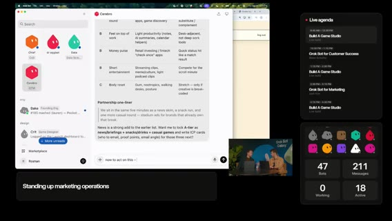

本番数時間で **3,000 matches 超**。誰のためのプロダクトか（ペルソナ）。会議の合間に遊ぶ層など隣接興味。テンプレでシミュレート可能、と。

「ただのボットの群れ」ではなく、文脈を回すチーム。残り約6分で次の話題へ。

Apple 系マーケット？（聞き取りゆれ）でメール送信 → Grok Bot が受信箱を監視して広告主の反応を拾う、というオフストリーム実験案。パートナーシップ／マーケ motion を回したい。

### メインステージ接続・エージェントチームとしての Grok Bot

Matt の午前トーク（revenue / marketing options）へ接続。多くのチームを巻き込むユースケースに興奮。

「これが Grok Bot。エージェントのチームとして動く」と締めに入り **4:00** 境界。

### 補足：Growth 深掘り

potato ブランドでメール信頼を得る／ボットにワーキングメールを持たせる具体。実在の勤務先メールとボット運用の境界（聞き取りやや不明瞭だが「公式感」の話）

ゲーム内に広告や他要素を出せるジャンル比較（match-3 等）スタックランク後にエージェントへ投げ、人間の直感と突き合わせるライブ手法そのものがデモ。

Vincent は、growth で「出さなきゃいけない数字」のプレッシャー。マーケ寄り制作物 vs growth の実験速度。初見の画面／メールで「何が伝わるか」。オンボーディング文脈。

会社で物事を進める作法をボットに教える＝オンボード投資。話し方・進め方を揃えると後が楽。

### 補足：プロモ運用の言い回し

午前にも新規ユーザープロモをやったことのリマインド。「無料で配る」は心を掴む growth。どう扱われたいか＝プロダクト原則。

Slack 言及は誤認の可能性あり。公式は X の @ThursdayArena と thursdayarena.com（画面・既出に合わせる）Vincent への実装フォロー約束。X ハンドル案内（Vincent Zhu）

### 補足：Matt セッション序盤

Motion 自己紹介（product @ xAI）。すぐゲスト。auto-building / auto-improving のエンジンを事業成長側にも転用したい、が今日のテーマ。

裏でボットがバグ修正しているかも、と期待しつつウォークスルー。practice でも Login with X でも可。今回はログインしてランキングに乗る。

Inbot テンプレ共有・視聴者が自分用にチューニング可能。Professor X の椅子＝全体俯瞰のメタファーで「成長オペを見る席」を説明（音声に基づく）

誰のジョブかを決めてからボット化、の手順。新ボット追加時のチェックリスト的な話し方。

### 補足：マネタイズ具体・規模感

グッズ／アリーナ・マーチ案が自然に出る。画面広告枠販売が第一候補として浮上。インプレッション数を見せて営業。

コールドメールの型: 実績数字（短時間ヒット）→ 広告／提携の打診。ターゲット解像度をデータで上げる（「絵を高解像度に」比喩）

**3,000+ matches**（数時間）。社会証明に使える。隣接興味（会議の合間に遊ぶ層が他に何を好むか）

ペルソナ理解が意思決定を導く。テンプレでシミュレーション。送信後、受信箱監視ボットで「食いつき」を拾うクローズドループ。オフストリームで試す合意。

午前の Matt 本編（revops/marops）と接続し、エージェント・チームとしての Grok Bot を再強調して時間切れ。

### 補足追記

Growth／マネタイズ議論はスタックランク→エージェント優先度→人間の味付け、が一日の方法論の縮図。Platinum 9名・3,000 matches・コールドメール／広告枠は後続時間の実装バックログに直結。

BRB（3:16–3:23）は Vincent 退出→Matt セッション準備の切替。

### 補足メモ

Vincent Growth セッションでは施策のスタックランクとエージェント優先度付けがライブで並走した。無料プロモ（x.ai/bot）と Thursday Arena 公式チャネル再掲がトップオブファネル。3:16–3:23 のキュー薄帯は Vincent 退出後の切替。3:23 以降は Matt とゲーム歩き＋広告／コールドメール／3,000 matches の社会証明。

Platinum tier 9名・Inbot テンプレ・Professor X 比喩は「成長オペを俯瞰する席」の説明装置。パートナーシップ実験はオフストリーム継続予定として閉じた。

## Post-Sales（Blake）・円卓メトリクス

seg05 · ストリーム 4:00–5:00

- **範囲**: 4:00–5:00（クリップ＝ストリーム−4h） / `clips/seg05.mp4`（3600s）
- **字幕**: 1011 cues。**≈4:46:34–4:53:21 無音/BRB**（mean≈−91 dB）。捏造なし
- **画面**: メインステージ「Grok Bot for Post-Sales」**Blake** → BRB → 円卓（Thursday Arena メトリクス）
- **注**: Blake / Gus / Wally / Frankie / Scout / Trudy / Harbor / Granola / Flylow / Grok Bot / xAI 正規化。

### Post-Sales と Blake の一日 OS

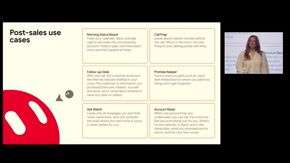

ボットは仮想コンピュータを持ち、作業完了・スクショ／録画・ポッドキャスト等まで可能。「空が限界」。難しいのは **何を終わらせたいか** を考えること。**Post-sales** 本編。Blake = **AI deployment manager**：成約後に顧客が xAI プラットフォームで ROI／成功を見るまで伴走。メール・Slack・Teams・会議が山積み——同職の視聴者には馴染み深い、と。

スライドは氷山の一角。詳細は声かけて、と。**Morning Status Board** は、毎日同じ時刻に起きて Grok Bot を見る。当日の会議、昨夜のやり残し、セットアップ。

**Call prep**（15–20分前 ping） は、誰が出るか、肩書き、前回の会話、その後に出た新機能、持ち出す提案、アンロックが必要なもの。ノート漁り不要。**Follow-up desk**（本日ライブ） は、1日の大半が会議でも、コール終了直後に **Granola** トランスクリプト→文脈→返信下書き→必要資料。人間は確認して送る。

**Promise keeper** は、「やると言ったこと」を監視。**Ask watch** は、自分が依頼した相手の未返信を深淵から救い出す。

今日ウォークスルーする、と予告。少し緊張気味の自己開示。

### Gus チーム・Scout・接続・Flylow デモ仕込み

**Gus = best friend / chief of staff**。基本 Gus にだけ話す。Gus が 1–2 人規模の専門ボットを回す。

**Wally** は声／専門タスクを知る。**Trudy** は本当に必要なとき。セットアップ時は絵文字等で人格を足すのもあり。

**Scout** = internal radar。アカウント単位でもチームを持つイメージ。

Grok Bot はシンプル。Gmail / Calendar / Slack 等に接続。画面を見て学ぶモードも。「今忙しい」設定でデモ開始。

Gus に「internal learnings call に代わりに入って」→ 「hey everybody, this is Gus, Blake's bot」自社（デモ文脈）**Flylow** のブランディング更新ネタも仕込み。

### Harbor ポストコール・下書きのみ・チャンピオン

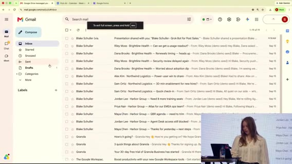

Post-call follow-ups が post-sales の肝。アカウント **Harbor**。「Harbor のコール終わった」だけでポストコールパック起動。

今日デモ中だと Grok Bot に事前共有済み、というメタ。Gus に足りない専門性は **Wally / Frankie** へリレー（Harbor 担当）

Harbor post-call pack ready。**下書きだけ欲しい**ルール（勝手に送らない）文体が自分っぽい、と確認。

Alex へ「Harbor と話した」更新。来週 new champions ミーティング。

複数アカウント展開。「where we at with Harbor?」の短い発話で Gus が文脈理解。

### 軽口・SSO フォロー・同僚投資・学習ループ

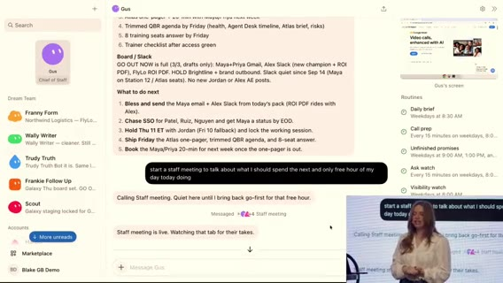

「How do you organize a space party?」など軽めのデモ。作業中に takes タブを見せる。

Harbor の **SSO** 案件。フォロー文「protect the cap」「今すぐ出す」「余裕があれば SSO」。Scout が同意し会話が続く。送信完了。

**Grok Bot への投資≒同僚／直属への投資**。差分を Wally に戻しルール更新——継続学習。

「自分が圧倒されるポイント」を Gus に教えたプロンプト。

### Q&A：VM・マネジメント限界・sprawl・router・幻覚・aha

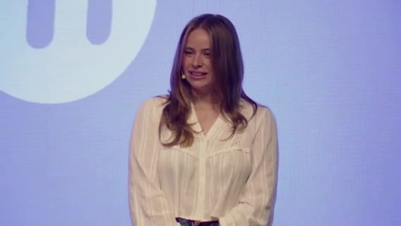

他ソフトも？ → 多くの場合 VM に直接インストール可。人と話す時間が好き——その時間を守るために後処理をボットへ。

良いマネージャと同様、一度に見られる範囲には限界。委任と信頼を段階拡大。テンプレ磨き／移行時の参照残り／**bot sprawl**。

Grok Bot をエージェントの **router** に？ → 未観測だが興味。トレース可能性。何が終わったかの分析を頼む。

巨大プロンプトの hallucination？ → Grok Bot ではあまり感じない。まず蒸留してから深掘り。最大 aha: **内部会議への代理参加**。「複数の場所にいる」感覚。時間がない問題と同系統でトーク終了。

### 無音 / BRB

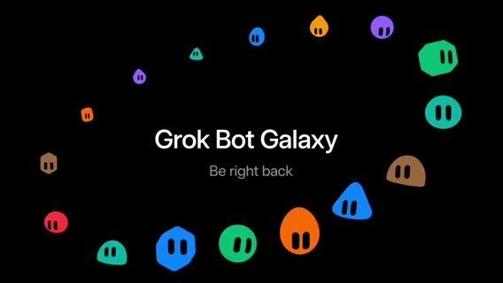

mean≈−91 dB。ステージ切替。発言なし。

### 円卓：1000 users / 3500 practice / ファネル議論

復帰。10am がピーク。ボット要約: **1000+ users**、**3500 practice**、勝率 **47%**（エンジン調整余地）ファネルは今は急がない理由: サインイン強制の強い理由がまだ弱い／practice でも楽しい／計測定義（practice 中の Login with X）を疑う必要。次ウェーブで signed-in 向けエンゲージを厚くする。

サインアップ／practice 開始の時系列。growth グラフに驚き。ゲームデザイン／3D／グラフィックボット稼働。

プレイ中ユーザー **ティッカー**を配信中に追加。改善デモ要求で 5:00 へ。

## オートバトラー磨き・大企業・Dan

seg06 · ストリーム 5:00–6:00

- **範囲**: 5:00–6:00 / 935 cues / 音声OK（終盤やや静か）
- **画面**: Thursday Arena プレイ実況・工場／Potato Mode・ボイスエージェント・マネタイズ・ゲスト Dan → Marketing へ
- **注**: auto-battler / Potato Mode / peestack / Vincent / Dan / Grok Bot / Thursday Arena 正規化。

### モバイル・ティッカー・オートバトラー解説

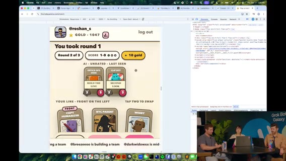

「本当に mobile friendly」。ダメならフィードバックを。UI 大量改修。ボタン配置の残り課題。下部ティッカー好評。

「このゲーム何？」→ **auto-battler** に着地。ボットチームをドラフトし、相手チームとマッチ。各ボットに能力／ステータス。

順序付きラインナップ（例: 3体）。相手並びに対向。残存が多い側がラウンド勝利。ターンごとにアビリティが順に解決。

対戦前に相手の数値（例 3/5 と 3/3）が見える。自カード能力が見えにくい UI 課題 → エンジニアに相談。

### 試合・SFX・シェア勝ち・Potato Mode 修正

現行ラインナップで試合。SFX／疑似バトル音楽を戻したい。午前の Vincent（Growth）会話を想起。

Cloud agent + **Potato Mode**: 勝利シェア機能を実装せよ、と指示。ロビーカード配置も修正中。

ティッカーがボタンを隠すバグ → 修正依頼。結果画面も。

Potato Mode で inspect→fix。「コードを書く前に調査」を明示。エージェントが画面を歩きスクショでバグ特定——コード未経験者にも楽しい、と。

### Feedback ボタン・xAI ボイスエージェント

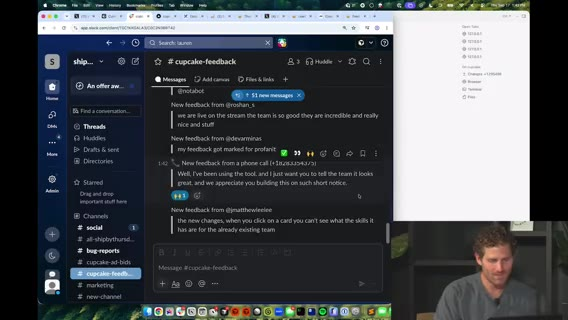

ホームの **Send feedback**。バグや要望を送って、と。確認できれば自動修正まで。**xAI voice agents** の遊び。電話応答エージェントを GUI で素早くデプロイできるデモ。モデレーション同様のガードレール。

視聴者の温かい言葉をボイス経由で受け、チームへ転送された、という実演。

### 大企業オペ・エスカレーション・自ボット投入

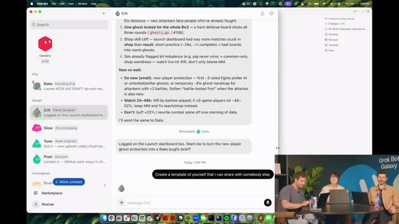

自動化で少人数が大企業のように回る。ユーザー代理行動／escalate issue ツール構想。

チャンネル命名、プラン作成支援。Lauren が社内プロダクトでも同種セットアップ。

**自分の Grok Bot をゲームにインポート**する案。UI polish エージェント稼働。Cursor で並行作業。

### デザイン知識・ヒューマンタッチ・課金摩擦・カード＝実ボット

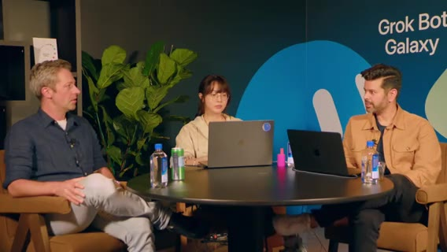

ベース UI／Radix 等の語彙があると指示が楽。**human touch** も残す、と。

小さな課金（例 $10 パック）でも決済・メール・プロビジョニングが面倒。エージェントを回しても最後に手動が残る問題。practice のカードは実在 Grok Bot キャラがモチーフ。動作 OK。

### GTM ボット・計画の言い直し・Dan・UVP

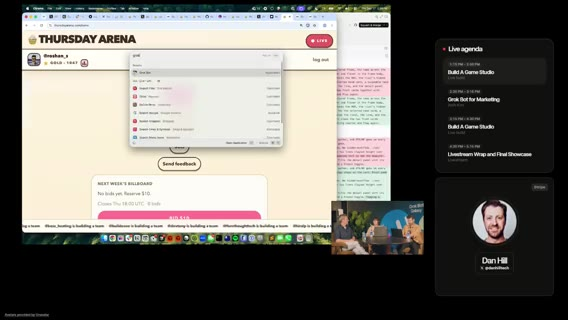

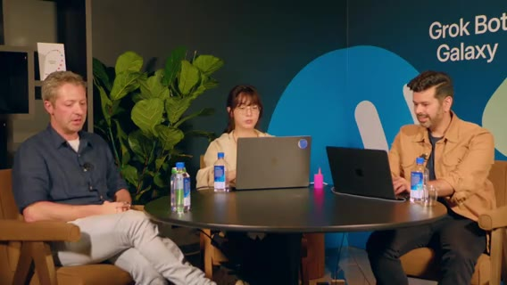

GTM／マネタイズアイデア記録ボット。公式ボットのフィーチャー、ロールアウト中機能のティーズ。

エージェントに **計画を自分の言葉で言い直させる**（Lauren の技）有料マルチチーム戦など。

ゲスト **Dan**（X ハンドル画面表示）。工場が回っている様子。コンシューマ／UVP の話で締め、次の Marketing 本編へ橋渡し。

## Josh Marketing・円卓復帰

seg07 · ストリーム 6:00–7:00

- **範囲**: 6:00–7:00 / 1384 cues（高密度）/ 音声OK
- **画面**: Dan 締め → **Josh Kim — Grok Bot for Marketing** → Q&A → 円卓復帰
- **注**: Josh Kim / Grok Bot / xAI / MCP / Thursday Arena 正規化。

### カットオーバー

Dan の 3JS／テンプレ話の流れ。X ハンドルを画面に出しフォロー誘導。Dreamforce 隣メインステージへ。**Josh Kim**「Grok Bot for Marketing」。戻ってきて続き、と予告。

### Josh：thought → doing、ジョブ単位ボット

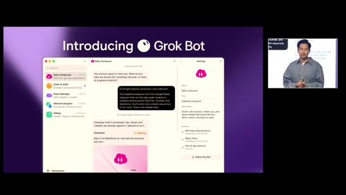

Josh Kim。xAI マーケでの使い方と、視聴者がチームで始める方法。多くの人の AI は 1–2 チャットを **thought partner**（質問・戦略・コピー）に留まる。**doing partner** ではない。

汎用／特化エージェントの台頭。Grok Bot でマーケが実際に仕事を進められる。**always-on 非同期チームメイト**。自動化だけでなく **ボットのチーム**にやらせる。

ジョブごとに個別ボット。使い続けるほど自分の働き方にカスタムされる。MCP 等でツール接続し、人間と同じようにツールを使える点が独自。他ツールとの違い／シンプルさ。

### エンドツーエンド・キャンペーン・職能ボット

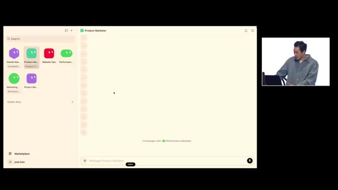

ゼロからエンドツーエンドでマーケキャンペーンをローンチするデモ。舞台裏の多さ。従来は人が職能間でパスする。

Josh のマーケ「チーム」: プロダクトマーケ、Web ops、パフォーマンス、アナリスト、PM 等（全部自分で作ったわけではない、と正直）ホームページをピン留めし、市場理解から開始。

Market researcher が競合サイト／ポジショニングを見る。**dictator prompt**（一気に指示）も使用。一人のボットと深くやる／職能ボットに渡すハイブリッド。

「新機能キャンペーンを出す」型の依頼。Market researcher 完了 → Product marketer へ。複数マーケ面（2–3 surfaces）。ボット間コラボ開始。

### 分析引き継ぎ・LP・本番シップ

Market researcher の分析を次ボットが掴んだ、と実況。ポジショニング／パッケージングの議論。

LP 反映・ランディング公開の流れ。シェルキャンペーン開始。進捗モニタ継続指示。

マーケサイトへ新 LP をシップ。本番シップまで行ける、と強調。

### 運用・単一接点・原則・Thank you

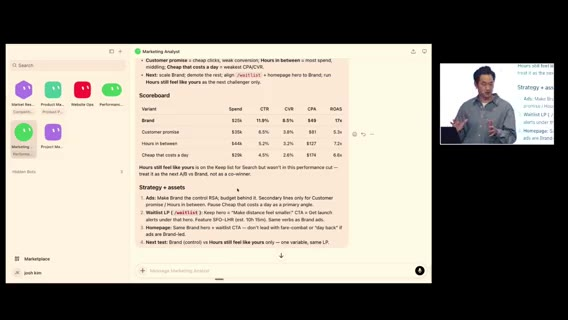

成果物のコピー利用、今週すでに出したキャンペーンの続きをアナリストへ、ボット内でキャンペーン構築。そのボットを唯一の接点にする。

学びの振り返り。任せる／監督する原則の再掲。Thank you / 拍手。

### Q&A

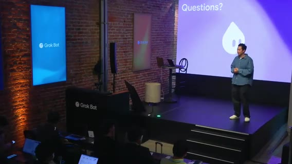

王国の鍵は渡さない——権限。最大ブロッカーは？

ただの別 LLM 扱いするな。イニシアチブをグループチャットで回す比喩／簡単導入。

Grok Bot ↔ grok CLI？企業アルファ／機密漏洩の garanty は？

クールな反応で Q&A 終盤。

### 円卓復帰

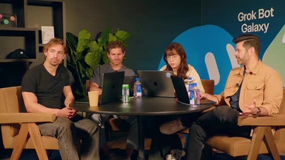

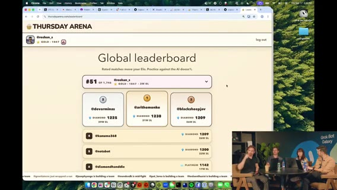

新機能を大量実装中。今日の作業の説明、サインアップ／Sign in with X。

反応と軽い挨拶で 7:00 へ。

## 最終時間・工場デモ・クロージング

seg08 · ストリーム 7:00–終了

- **範囲**: 7:00–end（≈3501s）/ 1201 cues
- **欠測**: **≈7:18:13–7:28:30** 低音量・キュー薄（≈−38〜−40 dB）。後で「10分休憩」と説明。捏造なし
- **画面**: プレイ／インポート・工場・最終ラップ・メトリクス・Dr.Eggbot・クロージング
- **注**: Dr.Eggbot / Eric / Grok Bot / Thursday Arena / potato / Motion 正規化。

### ボット増殖・Import・ドラフト実況

気が散りやすい、という個人的導入。当初1ボット → PM ボット等が spawn。Notion 連携の話。

Eric 説明のボットを URL から **Import**。ゲーム内ボットは実在 Grok Bot がモデル。能力例（最前列+2攻撃等）。コモンはトークンコスト。

インセクト等のカードがプールからランダム。強いカード／パワーアップ（りんご購入等）頻出バグ報告あり。

スロットへドラッグ。トークン残7。意図的に速くシップ（バグも出るが速さ優先だった）

「勝つ」実況。再戦。見た目とクリック先の不一致バグ等。

### 音楽・ティッカー有料化ネタ・ボイス・工場

Spotify。広告ティッカー案。

課金で特別色、等。下部ティッカーがお気に入り機能の一つ。

xAI ボイスエージェント利用。Matt のプロダクション画面。修正をスピンアップ中。

Cursor プロジェクト。UI リフレッシュ。

loop ボット＝エンジニアリング寄り。探索をスクショ／動画付きで X 投稿するボット案。

以降キューが細り休憩帯へ。

### 休憩／キュー薄

低音量。発話キューほぼなし。最終時間宣言で再開。

### 最終時間・$200 クレジット・工場デモ

Day3 最終時間。ゼロから事業を Grok Bot で。強く締めたい。チャット向けプロモ: 当日中 **$200 相当 Grok Bot クレジット**（聞き取り）。熱いうちに。

「これで会社が建つ」「ちょうど10分休憩した」

Lauren は、アニメ改善を Matt に見せ PR 予定。フィードバック監視→ Cursor cloud agents。静的な過去マッチ等の repro／テスト後マージ。API キー露出に注意、と実況。

### ラップ・tutorial・学び・unship

一日ラップアップ用にボットへ指示。**Dr.Eggbot**（ボット作成ボット）のディシプリン。

プレイ **tutorial** がようやく。フィードバック取得システム全体。

人に届くものを作る／パートナーシップ／セールスの必要性。「どう仕事を終わらせるか」が強力。

次を速くシップすると同時に、何を **unship** するか。コアループに集中できてきた。最終質問へ。

### 最終メトリクス・Dr.Eggbot・Thanks

**最終メトリクス**。サインアップ感謝。あと数分。

@grok 等。potato は、**Dr.Eggbot** にボット作成を任せてきた振り返り。

ゲームスタジオが「それなりに」建った。マネタイズ要素の最終チェック。

Thanks。オーナーシップの軽いやり取り。「theoretical leadership」ジョークで終盤（≈7:58:21）

